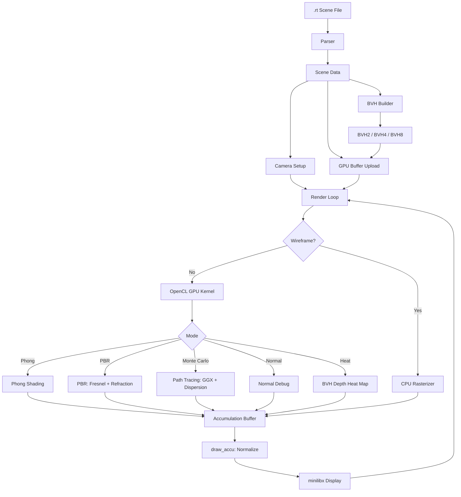

# miniRT — GPU Ray Tracer & Real-Time Scene Editor

**miniRT** is a real-time GPU-accelerated ray tracing engine written entirely
in C with OpenCL. What started as the standard 42 School graphics project
(a minimal CPU ray tracer with Phong shading and a handful of primitives)
grew into something far closer to a miniature Blender than a homework
assignment: a full scene editor with UI, font rendering, real-time selection
and editing, import/export, multiple BVH acceleration structures, and six
rendering modes — all in pure C with no external rendering libraries.

The engine parses `.rt` scene files (a custom format), loads Wavefront
`.obj` meshes with `.mtl` material libraries, supports PBR textures (diffuse,
normal, roughness, ambient occlusion, opacity, metalness), and renders on the
GPU via OpenCL with progressive accumulation for noise reduction. The CPU
side handles scene parsing, BVH construction, an interactive UI layer with
font rendering and selection, and a wireframe debug visualizer.

---

## Architecture



---

## The Original Subject

The 42 School **miniRT** project brief calls for a minimal CPU-based ray
tracer rendering spheres, planes, and cylinders with **Phong shading**
(ambient + diffuse + specular). Scenes are defined in a `.rt` text format
(camera, ambient light, point lights, primitives with material references).
The windowing library is **minilibx** (a simplified X11 wrapper). The subject
explicitly forbids GPU acceleration, external rendering libraries, and
advanced shading models.

---

## How Far We Went

This implementation went far beyond the base subject in nearly every
dimension:

- **OpenCL GPU acceleration** — All ray tracing runs on the GPU. The CPU
  handles only scene parsing, BVH construction, and the wireframe debug view.
- **6 render modes** — Wireframe (CPU), Phong, PBR, Monte Carlo path tracing,
  normal debug, and BVH heat map (all GPU).
- **PBR** — Cook-Torrance microfacet BRDF, Schlick Fresnel, GGX normal
  distribution, metallic/roughness workflow with texture maps.
- **Monte Carlo path tracing** — Importance-sampled GGX, multi-bounce rays,
  chromatic dispersion (wavelength-dependent IOR), progressive accumulation.
- **Multiple BVH types** — Not just SAH: a sphere-based BVH (hierarchical
  sphere merging) and an AABB BVH with SAH (Surface Area Heuristic, 16-bin
  partitioning). Both support BVH2, BVH4, and BVH8 branching factors with
  stackless (BVH2) and stack-based (BVH4/8) GPU traversal.
- **Full BVH debug visualization** — Toggle BVH bounding box overlays, adjust
  displayed depth, cycle color palettes, and switch between BVH modes in
  real time.
- **OBJ + MTL loading** — Wavefront `.obj` meshes with `.mtl` materials,
  triangulated faces, vertex normals, UV coordinates, and full PBR texture
  maps.
- **Scene import & export** — Parse `.rt` files into the engine and export
  them back out. Round-trip your scenes.
- **UI and real-time editing** — An in-engine UI layer with font rendering
  (TTF via a custom font renderer), selection, and real-time parameter
  editing — all in C, all on minilibx.
- **Interactive 6-DOF camera** — WASD + Space/Shift + QE roll + mouse look,
  with depth-of-field (thin lens aperture and focal distance — one feature
  among many, not the headline).
- **Sanitizers & profiling** — AddressSanitizer, LeakSanitizer, UBSan, gprof
  profiling, and debug/inspection builds — all selectable via make targets.

---

## Prerequisites

| Dependency | Notes |
|---|---|
| OpenCL (1.2+, target 3.0) | `libOpenCL.so.1` — GPU runtime |
| X11 development headers | Windowing via minilibx |
| libXtst (XTEST extension) | Mouse confinement / input |
| Xrandr | Display resolution detection |
| gcc (12 or 14) | Or compatible C compiler |
| GNU Make | Build system |

On Debian/Ubuntu:

```bash
sudo apt install mesa-opencl-icd opencl-headers libxtst-dev libxext-dev \
                 libx11-dev libxrandr-dev gcc-12 make
```

---

## Quick Start

```bash
# Clone the repository
git clone <repository-url> minirt
cd minirt

# Initialize and update all submodules
git submodule init
git submodule sync
git submodule update --remote

# Build (default: no optimization)
make

# Or build with optimizations
make fast

# Run a scene
./MiniRT asset/scenes/template.rt
```

A window opens showing the scene. Use the keyboard and mouse to explore.

### Testing Assets

A dedicated repository containing maps, assets, and test scenes for miniRT
is available at:

**https://github.com/ketodin/minirt-assets**

Clone it alongside the project for additional scenes and models.

---

## Render Modes

| Mode | Key | Description |
|------|-----|-------------|
| **Wireframe** | `1` | CPU rasterized debug view — BVH boxes, object outlines, light positions |
| **Phong** | `2` | GPU Phong shading (ambient + diffuse + specular + emissive + shadows) |
| **PBR** | `3` | GPU physically based rendering (Fresnel, reflection, refraction, bounces) |
| **Monte Carlo** | `4` | GPU path tracing (GGX sampling, chromatic dispersion, progressive accumulation) |
| **Normal Debug** | `-` | GPU normal visualization (surface normals mapped to RGB) |
| **Heat Map** | `=` | GPU BVH traversal depth heat map (10 color palettes) |

---

## Key Bindings

### Camera

| Key | Action |
|-----|--------|
| `W` / `S` | Move forward / backward |
| `A` / `D` | Move left / right |
| `Space` / `Shift` | Move up / down |
| `Q` / `E` | Roll left / right |
| `Ctrl` (held) | Double movement speed |
| Mouse | Yaw / pitch look |
| `K` | Toggle mouse focus (confine pointer) |

### Depth of Field

| Key | Action |
|-----|--------|
| `T` / `G` | Increase / decrease focus distance |
| `Y` / `H` | Increase / decrease lens radius (aperture) |

### Render Mode

| Key | Action |
|-----|--------|
| `1` – `4` | Switch render mode (wireframe, Phong, PBR, Monte Carlo) |
| `-` / `=` | Switch to normal debug / heat map mode |

### BVH Debug

| Key | Action |
|-----|--------|
| `V` | Toggle BVH debug overlay (bounding box visualization) |
| `Up` / `Down` | Increase / decrease displayed BVH depth |
| `Left` / `Right` | Switch BVH mode (sphere BVH / AABB SAH BVH) |
| `C` | Cycle BVH color palette offset |

### Export

| Key | Action |
|-----|--------|
| `F11` | Export current scene to `.rt` file |
| `F12` | Export current frame to PPM screenshot |

---

## Screenshots

> Place rendered screenshots and GIFs in the `screenshots/` folder.

| Render Mode | Preview |
|---|---|
| Wireframe |  |
| Phong |  |
| PBR |  |
| Monte Carlo |  |
| Normal Debug |  |
| Heat Map |  |

---

## Build Options

| Flag | Default | Description |
|------|---------|-------------|
| `WIDTH` | 500 | Window width (or `MAX_WIDTH` if `FULLSCREEN=1`) |
| `HEIGHT` | 500 | Window height (or `MAX_HEIGHT` if `FULLSCREEN=1`) |
| `FULLSCREEN` | 0 | Use full screen resolution (detected via `xrandr`) |
| `RESIZEABLE` | 0 | Allow window resize |
| `WINDOWLESS` | 0 | Headless (no window) mode |
| `PERF` | 0 | Performance mode flag (passed to submodules) |
| `NPROC` | auto | Number of CPU cores for parallel work (`$(nproc)`) |
| `VERBOSE` | 0 | Show compile commands in build output |
| `CL_TARGET_OPENCL_VERSION` | 300 | OpenCL target version macro passed to the compiler |
| `DEBUG_LVL` | 0 | Tiered debug level — see below |
| `FAST` | auto | Set by `make fast`; adds `-Ofast -march=native -mtune=native -msse3` |

### Debug Levels (`DEBUG_LVL`)

The build system uses a **tiered debug level** that controls which submodules
compile with debug symbols. Each submodule has its own threshold — when
`DEBUG_LVL` is greater than or equal to a submodule's threshold, that
submodule compiles with `DEBUG=1` (which enables debug build messages, debug
symbols, and any submodule-specific debug code paths).

| `DEBUG_LVL` | Debugs | Threshold |
|-------------|--------|-----------|
| `0` | Nothing (release build) | — |
| `1` | All submodules | `make debug` sets this |
| `2` | + mlx_wrapper | `DEBUG_MLXW = 2` |
| `3` | + font_renderer | `DEBUG_FTRDR = 3` |
| `4` | + mlxui | `DEBUG_MLXUI = 4` |
| `5` | + miniRT itself (the main binary) | `DEBUG_MINIRT = 5` |

So `make debug` (which sets `DEBUG_LVL=1`) enables debug mode in **every**
submodule at once. For more targeted debugging, set `DEBUG_LVL` to a specific
level — e.g. `make DEBUG_LVL=3` to debug libft, mlx_wrapper, and
font_renderer but not mlxui or the main binary.

The `DEBUG` macro is also passed as `-D DEBUG=0` or `-D DEBUG=1` to the C
compiler, so source code can use `#if DEBUG` guards for debug-only code
paths. Additionally, the build output changes: in debug mode, build messages
are printed in yellow with a warning prefix instead of the normal purple.

### Sanitizer Targets

For memory and undefined-behavior debugging, use the sanitizer targets
instead. These compile with `-g3 -O1` and the appropriate `-fsanitize=`
flags, then print the required `ASAN_OPTIONS` / `LSAN_OPTIONS` / `UBSAN_OPTIONS`
environment variables at the end of the build so you can export them before
running:

```bash
make san-mem    # AddressSanitizer (heap/stack overflow, use-after-free)
make san-leak   # LeakSanitizer (memory leak detection + ASan)
make san-ub     # Undefined Behavior Sanitizer (all UB checks)
```

The build output will show the exact `export` command to run before launching
the binary. See `make help` for the full sanitizer option strings.

### Other Build Modes

| Target | Flags | Use case |
|--------|-------|----------|
| `all` | `-Wall -Werror -Wextra -std=gnu11` | Default build |
| `fast` | + `-Ofast -march=native -mtune=native -msse3` | Optimized build |
| `inspect` | + `-g3` (no optimization) | LLDB/gdb debugging |
| `profile` | + `-g3 -pg` | gprof profiling |
| `debug` | `DEBUG_LVL=1`, `-g3` | Debug symbols in all submodules |

Run `make help` for the complete list.

---

## Documentation

Full documentation — architecture, data structures, mathematical formulas
(LaTeX), build system reference, render mode deep dives, BVH construction,
OpenCL integration, camera model, material system, and asset catalog — is
in the [`documentation/`](documentation/) folder.

---

## Authors

- **Aubry Richard Jaurel** — [jaubry--](https://github.com/jaubry--) (42 Lyon)
- **Bellissant Pablo** — [pabellis](https://github.com/pabellis) (42 Lyon)

Built at 42 School Lyon, France.
