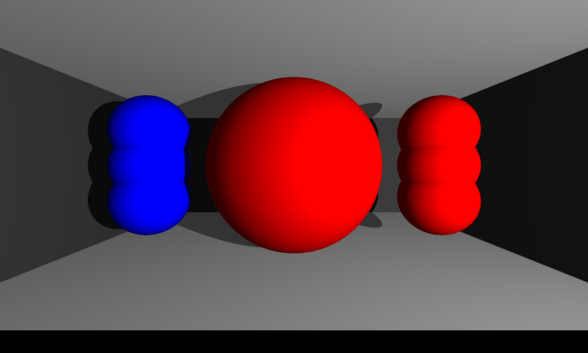
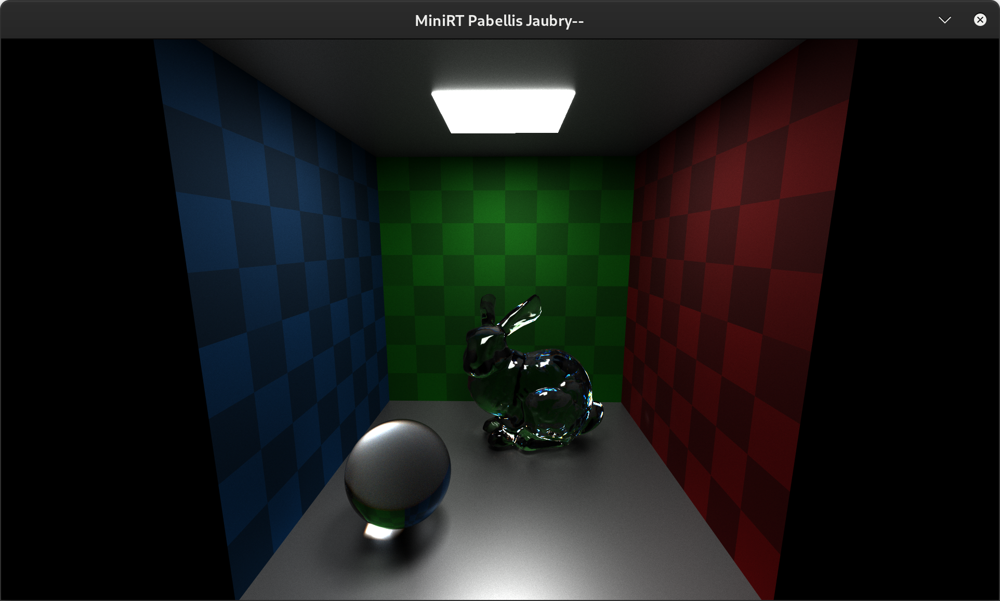
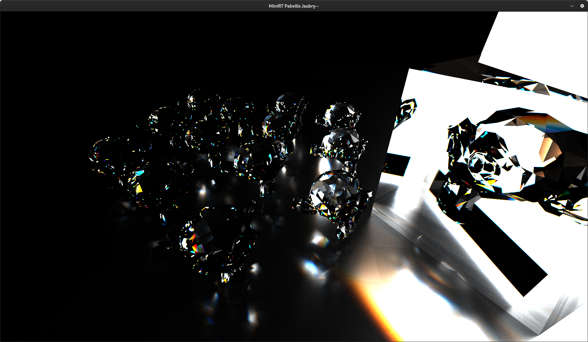
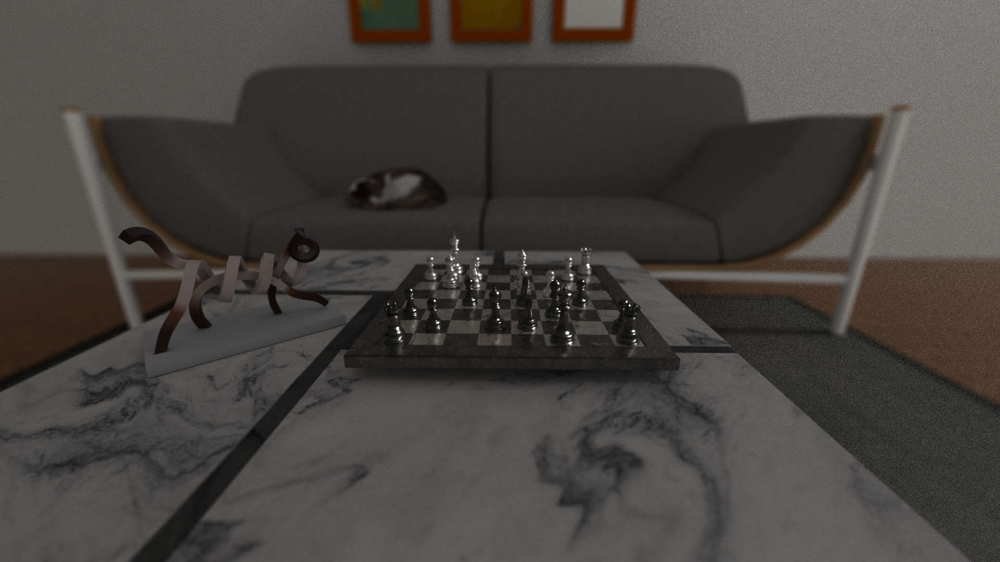
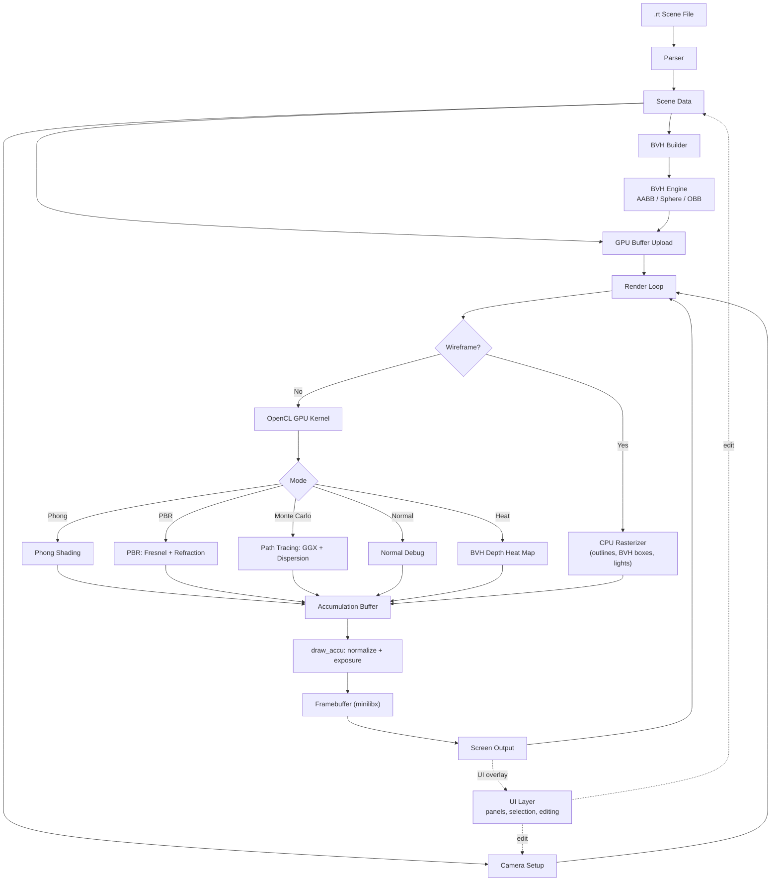
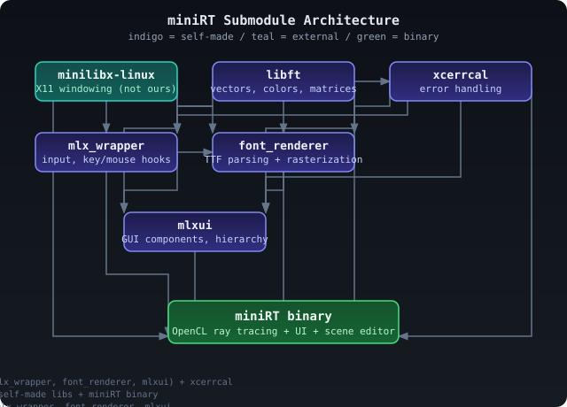

# miniRT

**miniRT** is a real-time GPU ray tracing engine written in C with OpenCL,
born from the 42 School common core. What started as the standard miniRT
project (render a few primitives with Phong shading using minilibx) grew
into something closer to a miniature Blender: a full scene editor with UI,
real-time selection and editing, import/export, multiple BVH acceleration
structures, and six rendering modes, all in pure C with our own custom
libraries for fonts, UI components, input handling, and error management.

The engine parses `.rt` scene files, loads Wavefront `.obj` meshes with
`.mtl` material libraries, supports PBR textures, and renders on the GPU
via OpenCL with progressive accumulation. The CPU side handles scene
parsing, BVH construction, an interactive UI layer with font rendering
and selection, and a wireframe debug visualizer.

---

## The Original Subject

The 42 School **miniRT** is a standard common core project very 
straightforward: render spheres, planes, and cylinders with Phong
shading using **minilibx**, the only external rendering library permitted.
Scenes are defined in a `.rt` text format with a camera, ambient light,
point lights, and primitives.



---

## Where We Went

We went a bit too far down the rabbit hole. The result is closer to a
miniature Blender than a basic ray tracer: six render modes (five GPU:
Phong, PBR with Fresnel and GGX, Monte Carlo path tracing with chromatic
dispersion, normal debug, and BVH heat map; plus a CPU wireframe view),
three BVH bounding shapes (AABB, Sphere, OBB with PCA), three splitting
algorithms (SAH, median-primitive, median-space), full OBJ/MTL loading
with PBR texture maps, a complete in-engine UI with edit panels and
selection, scene import/export, depth-of-field, exposure control, and
progressive accumulation rendering.

<table cellpadding="0" cellspacing="0" border="0" style="border:none;">
<tr><td rowspan="2"></td><td></td></tr>
<tr><td></td></tr>
</table>

---

## Architecture

The render pipeline goes from scene file through parsing, BVH construction,
GPU kernel dispatch, accumulation, and finally display through minilibx.
The UI layer is drawn on top of the rendered image and feeds edits back
into the scene data and camera.



### Custom Submodules

The project relies on seven submodules, six of which we wrote ourselves
specifically for miniRT. They are built as static libraries and linked
into the final binary.



Our custom libraries are **libft** (vector math, colors, utilities),
**mlx_wrapper** (input abstraction over minilibx), **font_renderer**
(TTF parser and rasterizer), **mlxui** (GUI component toolkit),
**xcerrcal** (structured error handling), and **minirt-assets**
(data submodule with meshes, textures, and test scenes). The seventh
dependency is **minilibx-linux**, the standard 42 X11 wrapper.

See [docs/01-architecture.md](docs/01-architecture.md) for full
submodule descriptions with struct definitions and API details.

---

## Reality Check

For a C project made in 8 months by two people with an obscure graphics
library and a strict norm, this is still pretty great. But if we're being
honest, there are real trade-offs and unimplemented features.

### Known Issues

**UI performance.** All UI elements (TTF font rendering, UI components,
panels, sliders, color pickers) are CPU-drawn through minilibx. There is
no GPU-accelerated 2D path. This absolutely destroys performance when the
UI is visible. The render itself is on GPU, but every frame the UI is
redrawn pixel by pixel on the CPU.

**Portability.** The project was developed on 42 campus iMacs with
self-compiled, somewhat wanky OpenCL packages. Portability is a real
issue. The build system has machine-ID detection to switch compilers
between known campus machines and everything else, which should tell
you something.

**Obscure C paradigms.** Some parts of the codebase use abusive patterns
to mimic OOP in C, notably in `mlxui` for component polymorphism and in
`mlx_wrapper` for key/mouse hook actions. This can cause compilation
issues on certain compiler versions. It works on campus because the
compiler is old enough to let it slide.

**Norminette constraints.** The 42 norm enforces a single coding style
(max 25 lines per function, no for loops, specific indentation, etc.).
Great for learning discipline, disabling at 487 source files across the
project and its submodules.

### What We'd Change

If we could redo it from scratch, a lot would change. The architecture
would be cleaner, the UI would not be CPU-drawn, and we'd use a proper
graphics abstraction instead of minilibx.

### What We Got Out of It

In any case, we had what we wanted: insight into creating big projects
with multiple moving parts, needing clean separation and modularisation.
It was learning how to engineer and architect from scratch big
codebases, and honestly, we think we did good.

### Notes on Design Scope

The project focuses on a streamlined set of features.

**Acceleration structures.** The renderer uses AABB, Sphere, and OBB bounding volumes with SAH, median-primitive, and median-space splitting. A single binary tree (BVH_ARITY=2) is used. BVH4/BVH8 (quad/octree branching) and DOP shapes are not implemented. A full UI for on-the-fly BVH type selection is not included - the BVH system remains simpler by design.

**Scene editing.** Basic property editing is available (position, rotation, scale, material assignment). A simplified scene list is provided, though not every object type is selectable in the hierarchy UI. A world settings panel for global settings like ambient light is not included.

**Camera and navigation.** The camera uses unified player/viewport navigation. Separate dissociated camera movement (like Blender's camera object vs. viewport) is not provided. Grid floor display, world-anchor rotation, and transform gizmo arrows are not implemented.

**Textures.** PPM and PFM texture formats are supported. PNG texture parsing is not included.

---

## Prerequisites

| Dependency | Notes |
|---|---|
| OpenCL (1.2+, target 3.0) | `libOpenCL.so.1`, GPU runtime |
| X11 development headers | Windowing via minilibx |
| gcc (12 or 14) | Or compatible C compiler |
| GNU Make | Build system |

libXtst is bundled inside `lib/minilibx-linux/local_xtst/` and does not
need to be installed separately. It is used to work around mouse
confinement issues on certain campus architectures.

On Debian/Ubuntu:

```bash
sudo apt install mesa-opencl-icd opencl-headers libxext-dev \
                 libx11-dev gcc-12 make
```

---

## Quick Start

```bash
# Clone, then initialize all submodules (this may take a while due to
# minirt-assets containing several gigabytes of meshes and textures)
git clone <repository-url> minirt && cd minirt && git submodule init && git submodule sync && git submodule update --remote

# Build
make

# Run
./miniRT minirt-assets/42.rt
```

---

## Render Modes

miniRT supports 6 render modes switched via keyboard:

| Mode | Key | Description |
|------|-----|-------------|
| Wireframe | `1` | CPU rasterized debug view: BVH boxes, object outlines, light positions |
| Phong | `2` | GPU Phong shading (ambient + diffuse + specular + emissive + shadows) |
| PBR | `3` | GPU physically based rendering (Fresnel, reflection, refraction, bounces) |
| Monte Carlo | `4` | GPU path tracing (GGX sampling, chromatic dispersion, progressive accumulation) |
| Normal Debug | `-` | GPU normal visualization (surface normals mapped to RGB) |
| Heat Map | `=` | GPU BVH traversal depth heat map (10 color palettes) |

See [docs/04-render-modes/](docs/04-render-modes/) for detailed descriptions of each mode's kernel logic, formulas, and pipeline diagrams.

---

## Key Bindings

### Camera

| Key | Action |
|-----|--------|
| `W` / `S` | Move forward / backward |
| `A` / `D` | Move left / right |
| `Space` / `Shift` | Move up / down |
| `Q` / `E` | Roll left / right |
| `Ctrl` (held) | Double movement speed |
| Mouse | Yaw / pitch look |
| `K` | Toggle mouse focus (confine pointer) |
| `T` / `G` | Increase / decrease focus distance (DOF) |
| `Y` / `H` | Increase / decrease lens radius / aperture (DOF) |

### Render Mode and Display

| Key | Action |
|-----|--------|
| `1` through `4` | Switch render mode (wireframe, Phong, PBR, Monte Carlo) |
| `-` / `=` | Switch to normal debug / heat map mode |
| `M` | Cycle UI mode: full UI, minimal (render switch only), hidden |
| `F5` / `F6` | Increase / decrease exposure |

### BVH Debug

| Key | Action |
|-----|--------|
| `V` | Toggle BVH debug overlay (bounding box visualization) |
| `Up` / `Down` | Increase / decrease displayed BVH depth |
| `Left` / `Right` | Switch BVH mode |
| `C` | Cycle BVH color palette (0 through 9) |

### Export

| Key | Action |
|-----|--------|
| `F11` | Export current scene to `.rt` file |
| `F12` | Schedule render task (hides UI, exports clean screenshot to PPM) |

See [docs/07-camera-and-interaction.md](docs/07-camera-and-interaction.md) for the full key binding table, camera model details, and depth of field mechanics.

---

## Build Options

| Flag | Default | Description |
|------|---------|-------------|
| `WIDTH` | 1920 | Window width (or `MAX_WIDTH` if `FULLSCREEN=1`) |
| `HEIGHT` | 1080 | Window height (or `MAX_HEIGHT` if `FULLSCREEN=1`) |
| `FULLSCREEN` | 0 | Use full screen resolution (detected via `xrandr`) |
| `RESIZEABLE` | 0 | Allow window resize |
| `WINDOWLESS` | 0 | Headless (no window) mode |
| `PERF` | 0 | Performance mode flag (passed to submodules) |
| `NPROC` | auto | Number of CPU cores for parallel work |
| `VERBOSE` | 0 | Show compile commands in build output |
| `CL_TARGET_OPENCL_VERSION` | 300 | OpenCL target version macro |
| `DEBUG_LVL` | 0 | Tiered debug level (see below) |
| `FAST` | auto | Set by `make fast`; adds `-Ofast -march=native -mtune=native -msse3` |

### Debug Levels

The build system uses a tiered debug level (`DEBUG_LVL=0..5`) that controls
which submodules compile with debug symbols. Each level adds more subsystems:

| `DEBUG_LVL` | Effect |
|-------------|--------|
| `0` | No debug (release build) |
| `1` | All submodules debug info (set by `make debug`) |
| `2` | + mlx_wrapper |
| `3` | + font_renderer |
| `4` | + mlxui |
| `5` | + miniRT binary itself (maximum verbosity) |

The `DEBUG` macro is passed as `-D DEBUG=0` or `-D DEBUG=1` to the C
compiler when `1 >= DEBUG_LVL <= 5`, so source code can use `#if DEBUG` guards.
See [docs/02-build-system.md](docs/02-build-system.md) for details on sanitizer targets,
compiler flags, and environment variables.

---

## Documentation

Full documentation covering architecture, data structures, mathematical
formulas (LaTeX), build system reference, render mode deep dives, BVH
construction, OpenCL integration, camera model, material system, UI
system, and asset catalog is in the [`docs/`](docs/) folder.

Documentation assets (diagrams, screenshots, GIFs) go in
[`docs/assets/`](docs/assets/).

---

## Authors

**Aubry Richard Jaurel** ([jaubry--](https://github.com/jaubry--)) and
**Bellissant Pablo** ([pabellis](https://github.com/pabellis)), 42 Lyon.
