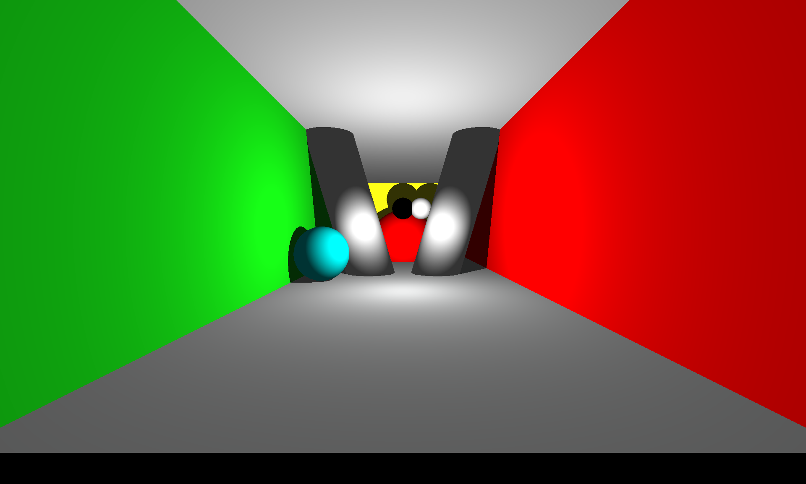
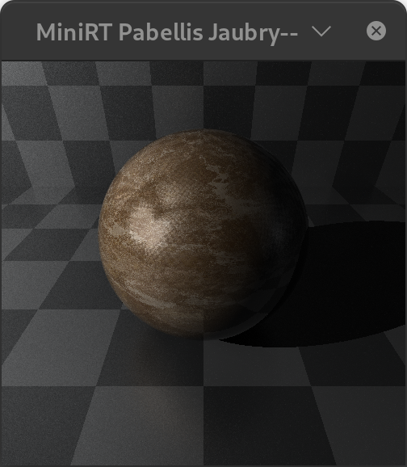
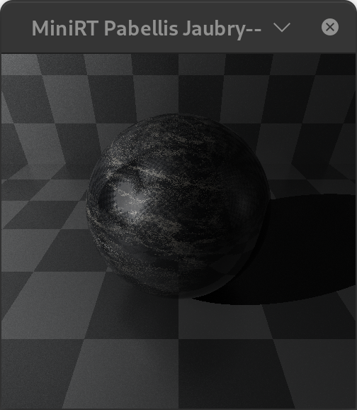
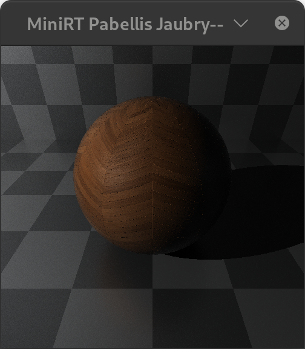
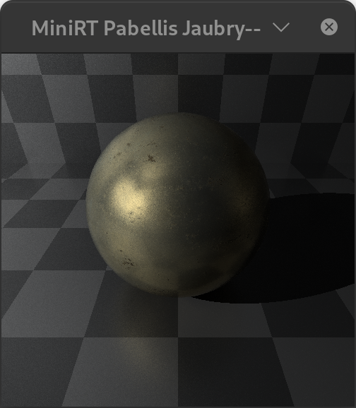
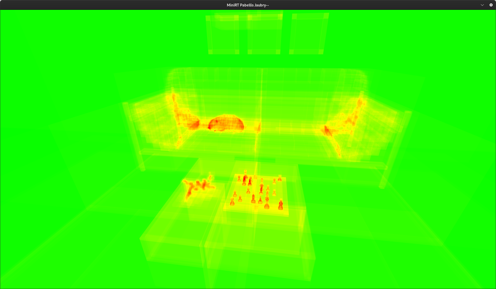
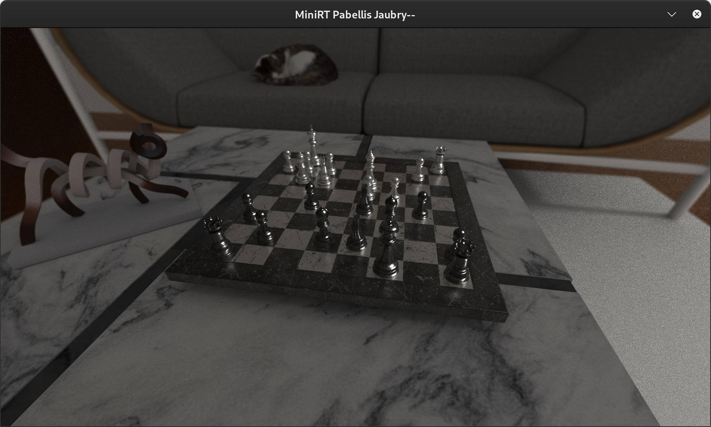

# miniRT - Project Overview

## What is miniRT?

miniRT is a **GPU-accelerated ray tracer** written in C with OpenCL - a fully interactive 3D scene editor with real-time rendering, a complete UI system, mesh loading, PBR materials, Monte Carlo path tracing, and a production-grade acceleration structure.

## Conventions

miniRT parses `.rt` scene files supporting ambient (`A`), camera (`C`), light (`L`), sphere (`sp`), plane (`pl`), cylinder (`cy`), mesh (`obj`), and skybox (`sky`) entries. The rendering engine uses C language with the **minilibx** graphics library (X11-based) and provides **6 render modes**: wireframe, Phong, PBR, Monte Carlo path tracing, normal debug, and heat map. Acceleration is handled by a **BVH** (Bounding Volume Hierarchy) with AABB, Sphere, and OBB bounding shapes and SAH/median splitting.

## Project Scope

miniRT was built as a school project with two people in 8 months, using the minilibx library and under the 42 coding norm (norminette). It's a full-featured ray tracer, but comes with real trade-offs.

### Known Issues

**The norminette is disabling at this scale.** The 42 coding norm (max 25 lines per function, no `for` loops, specific formatting) is excellent for learning discipline, but at 487 source files it becomes a real hindrance. **The base graphics library is a problem.** minilibx is a barebones X11 wrapper with no hardware-accelerated 2D. Every UI element - TTF font rendering, panels, sliders, color pickers - is CPU-drawn pixel by pixel. This destroys performance. **Portability issues** arose because we developed on 42 campus iMacs with self-compiled, somewhat wanky OpenCL packages; the build system literally has machine-ID detection to switch compilers. **Obscure C paradigms** were used, including abusive patterns to mimic OOP in C (notably in `mlxui` for polymorphism and `mlx_wrapper` for hooks), which may not compile on all compiler versions. Finally, some features were designed but remain unimplemented to keep the project manageable.

### Core Rendering

<table cellpadding="0" cellspacing="0" border="0" style="border:none;">
<tr><td></td><td></td><td></td></tr>
</table>

*Three render modes - Phong (left), PBR (center), Monte Carlo (right) - applied to the same scene.*

*miniRT rendering multiple scenes - Phong shading (left) compared with PBR rendering with Fresnel, shadows, and textures (right) on the same scene.*

The rendering engine provides **OpenCL GPU rendering** where all shading, intersection, and accumulation runs on the GPU via OpenCL compute kernels. There are **6 render modes**: wireframe (CPU rasterized), Phong, PBR, Monte Carlo path tracing, normal debug, and heat map. The **PBR (Physically Based Rendering)** system uses Fresnel (Schlick approximation) and **GGX microfacet distribution** for realistic specular highlights. **Monte Carlo path tracing** features progressive accumulation, multi-bounce indirect illumination, and **chromatic dispersion** (wavelength-dependent refraction) for physically accurate caustics and rainbows. The camera supports position, rotation, field of view, **depth of field** (lens radius + focus distance), and auto exposure. **Exposure control** is available with real-time adjustment in the UI via the F5/F6 keys. **Progressive accumulation** means samples accumulate over frames for noise-free Monte Carlo results.

### Scene Objects

*Scene objects rendered in miniRT - spheres, planes, meshes, and lights.*

The renderer supports spheres (`sp`) defined by position and diameter; planes (`pl`) with position, normal, material, and texture scaling; cylinders (`cy`) with position, rotation, diameter, and height (WIP render with full parser support); meshes (`obj`) via Wavefront OBJ loading with full transform (position, rotation, scale), per-vertex normals, UV coordinates, and material assignment; skybox (`sky`) as an equirectangular environment map via PPM texture; and point lights (`L`) with position, brightness, and color.

### Materials (MTL)

<table cellpadding="0" cellspacing="0" border="0" style="border:none;">
<tr><td></td><td></td></tr>
<tr><td></td><td></td></tr>
</table>

*Sample materials showing different PBR properties - metallic, dielectric, textured, and emissive surfaces.*
The system includes a full MTL file parser supporting `newmtl`, `Ns` (specular exponent), `Ka` (ambient), `Kd` (diffuse), `Ks` (specular), `Ke` (emissive), `Ni` (index of refraction), `d` (opacity), `Pr` (roughness), and `Pm` (metalness). It supports **texture maps** for `map_Kd` (albedo), `map_bump` (normal map), `map_Pr` (roughness map), `map_Ka` (ambient occlusion), `map_d` (opacity map), and `map_Pm` (metalness map). Eight or more materials are included in the minirt-assets repository.

### BVH Acceleration

*BVH debug overlay showing AABB bounding volumes around scene geometry.*

The **unified BVH system** provides three bounding shapes: **AABB** (Axis-Aligned Bounding Box) for fast, simple intersection tests; **Sphere** bounds optimal for sphere-heavy scenes; and **OBB** (Oriented Bounding Box) driven by PCA via Jacobi eigenvalue decomposition with quaternion rotation for the tightest fit. Three splitting algorithms are available: **SAH** (Surface Area Heuristic) using bins-based cost evaluation that minimizes expected traversal cost; **Median Primitive** splitting at the median primitive; and **Median Space** splitting at the spatial median. The tree uses `BVH_ARITY=2` (binary tree) with GPU-side traversal via `hit_aabb`, `hit_obb`, and `hit_sphere` functions. OBB uses quaternion-based ray-box intersection to avoid full matrix inverse. Debug visualization provides a wireframe BVH overlay and heat map by depth.

### User Interface

*Render output showcasing the full-ray traced scene with shadows, reflections, and PBR materials.*

The **full UI system** is built on `mlxui` - a custom GUI toolkit over minilibx. The **left panel** provides a scene list (hierarchical object browser), edit panels, and a render mode switch. **Object selection** works via click-to-select in the viewport with first-selected highlight. **Edit panels** are per object type, offering geometry transforms (position, rotation, scale), material properties (Ns, Kd, Ks, Ni, d, Pr, Pm, emissive), color pickers, sliders, and texture selectors. The UI also provides camera parameters (FOV, lens radius, focus distance), render controls (mode switching, BVH debug toggle, export render task), an **FPS counter** and info display overlay, and export to PPM and scene export (.rt format).

### Build and Development

The project comprises **487 C source files**, **30 header files**, **14 OpenCL kernel files**, and **48 .mk makefiles**. It depends on **5 library submodules** (`libft`, `mlx_wrapper`, `font_renderer`, `mlxui`, `xcerrcal`), a **build system helper** (`mkidir`), the **minilibx-linux** X11 library (bundled in `lib/`), and one **asset submodule** (`minirt-assets`) providing test scenes, meshes, materials, and textures in PPM format. The **modular build system** uses `mkidir` with automatic dependency tracking, **sanitizer support** (AddressSanitizer, LeakSanitizer, UndefinedBehaviorSanitizer), **6 debug levels** (DEBUG_LVL 0-5 controlling verbosity per submodule), **machine-ID based compiler selection** for local vs. remote development, and **tiered error handling** via the `xcerrcal` library.

## Feature Comparison

| Feature | 42 Subject | miniRT |
|---|---|---|
| Render backend | CPU | **GPU (OpenCL)** |
| Shading | Phong | **Phong, PBR (Fresnel/GGX), Monte Carlo** |
| Render modes | 1 | **6** (wireframe, Phong, PBR, Monte Carlo, normal, heat) |
| Acceleration | None | **BVH** (AABB/Sphere/OBB + SAH/median) |
| Primitives | Sphere, Plane, Cylinder | Sphere, Plane, **Cylinder (WIP)**, **Mesh (OBJ)** |
| Materials | Color only | **Full MTL** with texture maps |
| Textures | None | **map_Kd, map_bump, map_Pr, map_Ka, map_d, map_Pm** |
| Skybox | None | **Environment map** via PPM |
| Camera | Fixed | **DOF**, exposure, focus distance |
| UI | None | **Full UI**: scene list, edit panels, selection, color pickers |
| Progressive | None | **Accumulation buffer** for Monte Carlo |
| Dispersion | None | **Chromatic dispersion** |
| OBJ loading | None | **Full OBJ** with v/vn/vt, usemtl, mtllib |
| Error handling | Basic | **Structured** via xcerrcal library |
| File count | ~5 | **487 .c, 30 .h, 14 .cl** |

## minirt-assets Repository

*Cornell box scene rendered with PBR materials, demonstrating global illumination and progressive accumulation.*

The [minirt-assets](https://github.com/ketodin/minirt-assets) repository provides **test scenes** (`.rt` files) including Cornell box, refraction test, marble, chess, RGB, and template; **meshes** (`.obj`) such as glass cube, monkey head, diffraction grating, chess set, bunny, BMW, Porsche, Jesko, AMG, casino, dragon, triangle, and square; **materials** (`.mtl`) for sand, gold, leather, tiles, foil, marble, onyx, wood, metal, fence, paving, ornament, and checkerboard; and **textures** (`.ppm`) including skyboxes (nebula, studio), procedural textures, normal maps, roughness maps, and ambient occlusion maps.

---

## Notes on Design Scope

The project focuses on a streamlined set of features. The renderer uses a single binary BVH tree (BVH_ARITY=2) with AABB, Sphere, and OBB bounding shapes and SAH/median-primitive/median-space splitting - BVH UI panels, BVH4/BVH8 arities, and DOP shapes are not included. Split/merge algorithms beyond SAH, median-primitive, and median-space are not used. Object editing covers basic property editing (position, rotation, scale, material assignment) through a simplified scene list; per-vertex mesh editing, material assignment UI, transform gizmos, and a full scene hierarchy are not provided. A world panel for global settings (ambient light, etc.) is not included. The camera uses unified player/viewport navigation - dissociated camera/player movement, grid floor display, world-anchor rotation, and transform arrows are not present. Only PPM and PFM texture formats are supported; PNG parsing is not included.