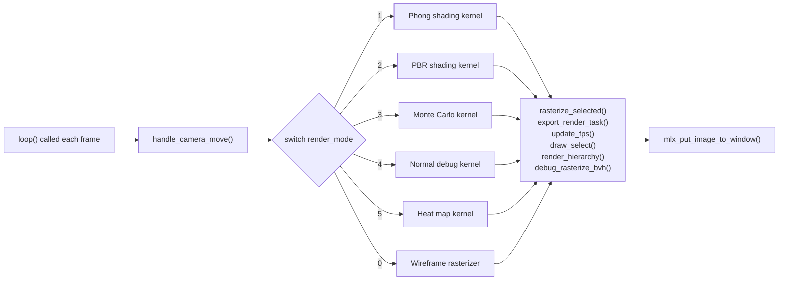

# miniRT - Architecture

## Overview

miniRT is a GPU-accelerated ray tracer with an interactive editor, written in C
with OpenCL compute kernels. The system follows a two-phase design: a single
startup sequence that parses scene data and initializes the GPU, then a
per-frame render loop that dispatches compute kernels, composites the result,
and draws a UI overlay.

At startup, the application reads a `.rt` scene file, populates an in-memory
scene graph with geometry, materials, textures, and lights, then uploads
everything to the GPU via OpenCL buffer transfers. A BVH acceleration structure
is built on the CPU and uploaded alongside the scene data. Once the GPU state
and the UI hierarchy are ready, a single call enters the render loop.

Each frame, the loop reads camera input, dispatches one of six render kernels,
post-processes the image (selection outlines, FPS counter, UI tree, BVH debug
overlay), and swaps the display buffer. This architecture keeps the CPU mostly
idle during rendering - all ray tracing, shading, and accumulation happen on
the GPU, with the CPU handling input, UI, and I/O.

## Startup Sequence

The entry point in `main()` proceeds in nine steps before entering the loop.
Startup errors are caught at each step; a failed parse or GPU init exits before
any rendering state is allocated.

```mermaid
sequenceDiagram
    participant Main as main()
    participant Graphics as minilibx
    participant OpenCL as OpenCL Device
    participant Parser as rt_parser
    participant UI as UI system
    participant Hooks as Event hooks
    participant Loop as Render loop

    Main->>Main: register_unit_errors()
    Main->>Graphics: init_graphics(data) - create window
    Main->>OpenCL: init_opencl(data, GPU)
    OpenCL->>OpenCL: compile 13 kernels, create buffers
    Main->>Parser: try_parse_scene(data, "scene.rt")
    Parser->>Parser: parse objects, materials, textures, lights
    Parser->>OpenCL: upload scene to GPU buffers
    Parser->>OpenCL: build + upload BVH nodes
    Main->>UI: init_ui(data) - build hierarchy tree
    Main->>Main: allocate accumulation buffer
    Main->>Hooks: setup_hooks(data) - register callbacks
    Hooks->>Graphics: mlx hooks bound
    Main->>Loop: mlx_loop calls loop() each frame
```

## Render Loop

The `loop()` function runs once per frame: it processes input, dispatches the
correct render kernel, applies post-processing overlays, and presents the
result. Both the camera state and render mode are live-switchable between
frames.



## Source Organization

The application source lives in five subdirectories under `src/`, plus a
`shader/` directory for OpenCL kernels:

| Directory | Purpose |
|-----------|---------|
| `src/` (root) | Entry point, render loop, camera controls, keyboard/mouse hooks, PPM export, error registration |
| `src/parsing/` | Parse `.rt`, `.mtl`, and `.obj` files into the scene graph, then upload data and BVH to the GPU |
| `src/calc/` | BVH construction and debug, OpenCL kernel dispatch wrappers, wireframe rasterization |
| `src/init/` | UI hierarchy construction: panels, scene list, on-screen info, selection state |
| `src/export_scene/` | Serialize the current in-memory scene back to a `.rt` file |

## Libraries

miniRT depends on seven library submodules, linked as static archives:

| Library | Archive | Provides |
|---------|---------|----------|
| libft | `libft.a` | Vectors, colors, matrices, dynamic arrays, file I/O, string utilities |
| mlx_wrapper | `mlx_wrapper.a` | Input abstraction, draw helpers, event hook registration |
| font_renderer | `font_renderer.a` | TTF table parsing, glyph outline rasterization, glyph atlas |
| mlxui | `mlxui.a` | Immediate-mode GUI: buttons, sliders, color pickers, scroll boxes, text labels |
| xcerrcal | `xcerrcal.a` | Structured error codes, error packing, cleanup hooks |
| minilibx-linux | `libmlx.a` | 42 School X11/OpenGL wrapper: window management, image buffers, events |
| minirt-assets | (data) | Test scenes, OBJ meshes, MTL materials, PPM textures |
| mkidir | (build) | Makefile rules, sanitizer flags, colorized output, machine-ID detection |

## OpenCL Shaders

Thirteen `.cl` kernel files are compiled at application startup and dispatched
by the render loop. Key shaders include:

| Shader | Role |
|--------|------|
| `phong.cl` | Per-ray Phong illumination with ambient, diffuse, specular, emissive, and shadow rays |
| `pbr.cl` | Physically based shading with Fresnel, roughness, and metalness |
| `monte_carlo.cl` | Progressive path tracing with multiple samples per pixel |
| `normal_debug.cl` | Visualize surface normals as RGB for debugging |
| `heat.cl` | Pseudocolor heat map based on BVH traversal depth per pixel |
| `intersect.cl` | Ray-scene intersection tests (sphere, triangle, plane, BVH traversal) |
| `sample_materials.cl` | Material sampling and evaluation on the GPU |
| `draw_accu.cl` | Tone-map and accumulate HDR samples into the display buffer |