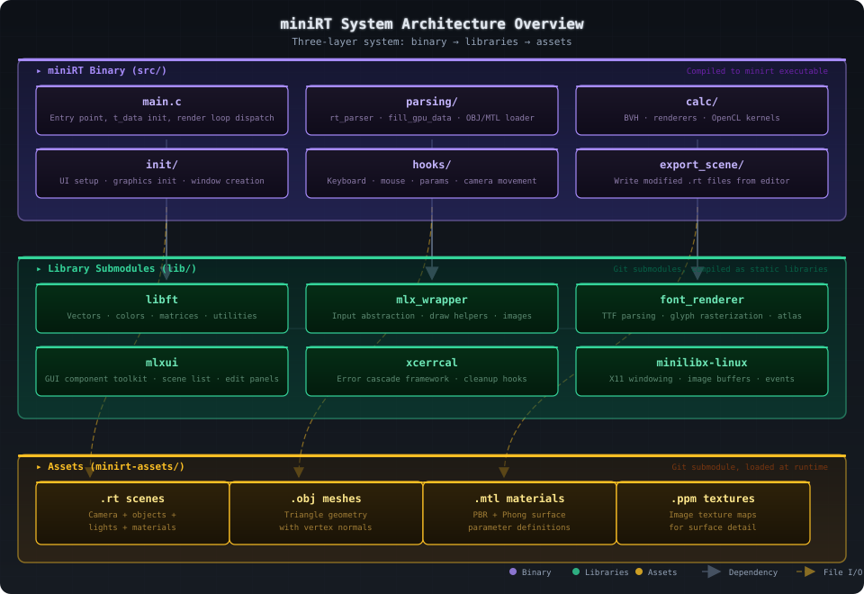
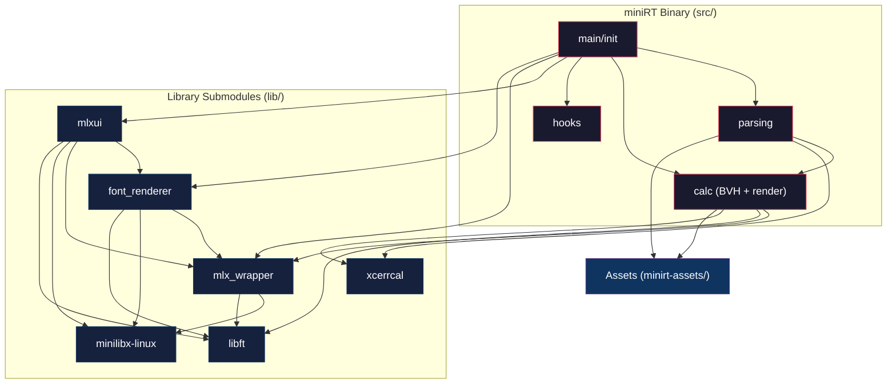
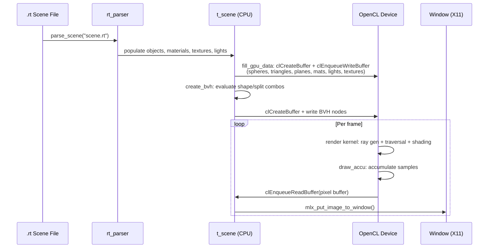

# miniRT - System Architecture

## Overview


*High-level system architecture showing the three layers: main binary, library submodules, and assets. The binary depends on library submodules for math, graphics, UI, and error handling, and reads assets at runtime for scenes, meshes, materials, and textures.*

miniRT is organized into three layers: the **main binary** (`src/`), **library submodules** (`lib/`), and **assets** (`minirt-assets/`). The binary reads `.rt` scene files from the assets directory, parses them into an in-memory scene graph, transfers data to the GPU via OpenCL, and runs a render loop that dispatches compute kernels. Library submodules provide foundational utilities (math, graphics, UI, font rendering, error handling) that the binary composes together, while assets supply the scene descriptions, meshes, materials, and textures consumed at load time.

## Data Hierarchy - `t_data`

`t_data` is the top-level state object that owns every subsystem in the application. It is instantiated once in `main()` and passed by pointer to all initialization, parsing, rendering, and event-handling functions. This single-owner design avoids global variables and makes the entire program state explicit and testable.

```c
typedef struct s_data
{
    t_opencl    cl;        // OpenCL state (platform, device, queue, kernels, GPU buffers)
    t_buffers   buffers;   // CPU-side buffers: addr (uint*) + accu (t_vec3*)
    t_params    params;    // Render mode ptr, BVH depth, color offset, exposure, UI mode
    t_keys      keys;      // Keyboard state (forward/left/right/backward/upward/roll)
    t_mouse     mouse;     // Mouse look (yaw/pitch target & current)
    t_mlx       *mlx;      // minilibx instance (window, image, display)
    t_vec2i     screen;    // Screen resolution
    t_scene     scene;     // Full scene description
    t_ui        ui;        // Complete UI state
}               t_data;
```

### `t_scene` - Scene Description

The `t_scene` struct is the complete in-memory representation of a parsed `.rt` file. It holds all scene geometry (spheres, triangles, planes via a unified `t_object` union array), material definitions, loaded textures, point lights, camera state, and the BVH acceleration structure. GPU buffer handles (`cl_mem` fields) are stored directly in the struct so the render loop can dispatch kernels without additional lookups.

```c
typedef struct s_scene
{
    t_rgb           ambient;       // Ambient light (float RGB x ratio)
    t_camera        camera;        // Camera: pos, rot, forward/right/up, FOV, DOF params
    char            *name;         // Scene file name
    t_vector        objects;       // All scene objects (t_object union array)
    t_vector        light;         // Point lights
    int             plane_count;   // Number of planes (for GPU dispatch)
    t_vector        texture;       // Loaded textures (t_texture / t_img_data)
    t_vector        mat;           // Material definitions
    t_vector        mtl_list;      // Loaded MTL file paths (strings)
    t_vector        mesh;          // Loaded mesh instances (t_mesh: offset, count, transform)
    t_bvh_engine    bvh;           // BVH acceleration structure
    t_mlx           *mlx;          // Back-link to mlx
    int             skybox_tex;    // Index of skybox texture (-1 if none)
    // GPU buffers (cl_mem):
    cl_mem          spheres;
    cl_mem          triangles;
    cl_mem          planes;
    cl_mem          textures;
    cl_mem          mats;
    cl_mem          lights;
    t_texture_data  skybox;        // Skybox texture descriptor for GPU
}                   t_scene;
```

The `t_scene` struct includes a `t_vector mesh` for loaded mesh instances, handles planes via the general `objects` vector and `plane_count` (there is no separate `planes_id` field), and uses `t_bvh_engine` - a unified BVH system with a single set of AABB/Sphere BVH pointers.

### `t_bvh_engine` - Unified BVH System

The BVH system state (`t_bvh_engine` and `t_bvh_header`) is documented in [05-bvh.md](05-bvh.md) with full struct definitions, bounding volume shapes, and splitting algorithms.

### `t_params` - Render Parameters

The `t_params` struct holds runtime configuration that controls how the render loop behaves. These values are toggled interactively via keyboard shortcuts and the UI, making them the primary interface between user input and render output.

```c
typedef struct s_params
{
    int     *render_mode;   // Pointer to current render mode (0-5)
    int     bvh_depth;      // BVH debug depth
    int     color_offset;   // Color palette offset for heat mode
    bool    bvh_debug;      // Show BVH wireframe overlay
    int     ui_mode;        // UI mode (0=hidden, 1=visible)
    float   exposure;       // Exposure multiplier
}           t_params;
```

Note that `render_mode` is an `int*` - it points to the render mode variable owned by the UI, allowing both the UI and the render loop to share the same value.

### `t_buffers` - Frame Buffers

The frame buffers store both the display-ready pixels and the progressive accumulation data. The `addr` buffer is an RGBA `uint*` that `mlx_put_image_to_window` reads directly, while `accu` is a `t_vec3*` HDR accumulation buffer that averages samples over multiple frames for anti-aliasing and motion blur.

```c
typedef struct s_buffers
{
    unsigned int    *addr;   // RGBA pixel buffer (for display)
    t_vec3          *accu;   // Accumulation buffer (HDR float3, for progressive rendering)
}                   t_buffers;
```

### `t_opencl` - OpenCL State

The OpenCL state (`t_opencl`) is documented in [06-opencl-integration.md](06-opencl-integration.md) with the full struct definition, initialization flow, and kernel details.

### `t_ui` - UI State

The UI state (`t_ui`) is documented in [10-ui-system.md](10-ui-system.md) with the full struct definition, hierarchy tree, and edit panel architecture.

## Module Dependency Diagram



## Render Pipeline Flowchart

The render loop dispatch is documented in [06-opencl-integration.md](06-opencl-integration.md) with a detailed frame-by-frame sequence diagram covering kernel dispatch, accumulation, display, UI rendering, and export.

## Data Flow - From `.rt` File to GPU



## Submodule Descriptions

### `libft` - Foundation Library

The 42 School standard library, stripped for miniRT. Key components include the **Vectors** module (`t_vec2`, `t_vec3`, `t_vec4` - constructors, arithmetic, dot/cross product, normalization, reflection, rotation), the **Colors** module (`t_rgb` as float, `t_rgb_int` as uint8, conversion routines, `get_real_ratio()` for light scaling), the **Matrices** module (`t_mat3`, `t_mat4` - constructors, multiplication, identity, transpose, Jacobi helper ops), the **Utilities** module (`t_vector` dynamic array, `t_list`, string functions including `ft_scan` - typed scanf with range validation, memory operations, math helpers), and the **File I/O** module (`get_next_line`, file descriptor utilities, PPM loader via `mlx_ppm_to_image`).

### `minilibx-linux` - X11 Graphics

The 42 School's minimal X11/OpenGL wrapper. It provides `t_mlx` for display connection and window management, `t_img_data` as an XImage with pixel buffer access, basic drawing primitives (pixel put, line, rectangle), keyboard and mouse event callbacks, and image creation from PPM files.

### `mlx_wrapper` - Input and Drawing Abstractions

Sitting on top of minilibx, this module provides **input abstraction** (key mapping, key repeat handling, mouse button/position tracking, scroll wheel), **draw helpers** (`mlx_draw_pixel()`, `mlx_draw_line()`, `mlx_draw_rect()`, filled shapes, circle drawing), **image utilities** (image creation, PPM file loading, pixel buffer manipulation), and **event registration** (unified hook setup for keyboard, mouse, expose, and loop hooks).

### `font_renderer` - TrueType Rasterization

This library parses and rasterizes TrueType (.ttf) font files, including TTF table parsing (cmap, glyf, loca, head, hhea, hmtx), glyph outline rasterization (quadratic and cubic Bezier curves), advance width and kerning, a pre-rasterized glyph atlas for performance. It is used by `mlxui` for all text rendering (labels, buttons, values, FPS display).

### `mlxui` - GUI Component Toolkit

A complete immediate-mode GUI toolkit built on `minilibx-linux` + `mlx_wrapper` + `font_renderer`. It uses a **hierarchy tree** (`t_htree` / `t_hbranch`) for component organization, supporting containers (vertical/horizontal layout), Box (spacer, divider), Button (clickable), ButtonGroup (mutually exclusive toggle group), Checkbox (boolean toggle), ColorPicker (RGB color selection with preview), Form (label + value pair), Image (texture display), ScrollBox (scrollable container), Select (dropdown list), Slider (range input), and TextBox (text label). It is used for the scene list, edit panels (geometry, material, camera), render mode switch, FPS overlay, and info display.

### `xcerrcal` - Structured Error Handling

A lightweight error handling framework providing **error codes** (module-specific error IDs), **error packing** (`pack_err()` packs module ID + error ID into an integer), **error reporting** (`error()` with file, line, and function context via macros (`FL`, `LN`, `FC`)), **complex error messages** (`register_complex_err_msg()` for dynamic error context), and **cleanup hooks** (`setup_cleanup_hooks()` for resource cleanup on error).

### `minirt-assets` - Test Scenes and Meshes

A separate repository (submodule at `minirt-assets/`) containing test scenes (`.rt`), OBJ meshes, MTL materials, and PPM textures. See [09-asset-catalog.md](09-asset-catalog.md) for the full asset listing.