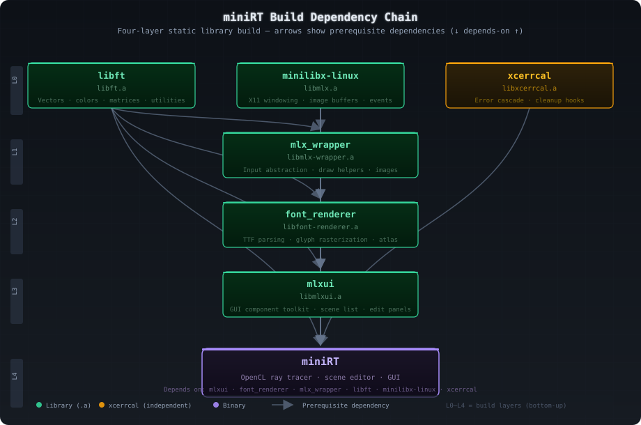

# miniRT - Build System

## Overview

miniRT uses a **modular recursive Makefile system** orchestrated by the `mkidir` submodule. The top-level `Makefile` coordinates 6 library submodules, each with their own Makefiles and `includes.mk`, plus the main binary's 487 C source files distributed across 48 `.mk` include files.

## Submodules

There are **7 submodules** registered in `.gitmodules`:

| # | Path | Library | Description |
|---|------|---------|-------------|
| 1 | `mkidir` | No | Build system helper (make rules, sanitizers, colors) |
| 2 | `lib/libft` | `libft.a` | Foundation library (vectors, colors, matrices, utilities) |
| 3 | `lib/minilibx-linux` | `libmlx.a` | 42 School X11 wrapper (windowing, image, events) |
| 4 | `lib/mlx_wrapper` | `libmlx-wrapper.a` | Input abstraction and draw helpers over minilibx |
| 5 | `lib/font_renderer` | `libfont-renderer.a` | TTF parsing and glyph rasterization |
| 6 | `lib/mlxui` | `libmlxui.a` | GUI component toolkit (hierarchy tree, panels, sliders) |
| 7 | `lib/xcerrcal` | `libxcerrcal.a` | Structured error handling framework |
| 8 | `minirt-assets` | No | Asset repository (scenes, meshes, materials, textures) |

## Build Chain

The libraries build in dependency layers. `libft`, `minilibx-linux`, and `xcerrcal` have no prerequisites and build in parallel. `mlx_wrapper` depends on minilibx and libft. `font_renderer` depends on mlx_wrapper, minilibx, and libft. `mlxui` depends on font_renderer, mlx_wrapper, minilibx, and libft. The binary links against all six archives plus the main object files.

## Available Targets

| Target | Description |
|--------|-------------|
| `all` | Default build, no optimization |
| `fast` | Build with `-Ofast -march=native -mtune=native -msse3` |
| `debug` | Build with `DEBUG_LVL=1` (debug symbols across all submodules) |
| `inspect` | Build with `-g3` for LLDB/gdb debugging |
| `profile` | Build with `-g3 -pg` for gprof profiling |
| `bonus` | Same as `all` (42 School requirement) |
| `san-mem` | AddressSanitizer build |
| `san-leak` | LeakSanitizer build |
| `san-ub` | UndefinedBehaviorSanitizer build |
| `re` | `fclean` + `all` |
| `refast` | `fclean` + `fast` |
| `redebug` | `fclean` + `debug` |
| `clean` | Remove `.obj/` and `.dep/` directories |
| `fclean` | `clean` + remove all `.a` archives and `miniRT` binary |
| `help` | Display help message with all targets, flags, and examples |

## Build Flags

| Flag | Default | Description |
|------|---------|-------------|
| `WIDTH` | `1920` | Window width (or `MAX_WIDTH` if `FULLSCREEN=1`) |
| `HEIGHT` | `1080` | Window height (or `MAX_HEIGHT` if `FULLSCREEN=1`) |
| `FULLSCREEN` | `0` | Use screen resolution (`WIDTH=MAX_WIDTH`, `HEIGHT=MAX_HEIGHT`) |
| `RESIZEABLE` | `0` | Enable window resize |
| `WINDOWLESS` | `0` | Headless mode (no X11 window, for CI/testing) |
| `PERF` | `0` | Performance mode (additional fps_counter output) |
| `NPROC` | `$(nproc)` | Parallel job count |
| `VERBOSE` | `0` | Show full compile commands (not suppressed) |
| `CL_TARGET_OPENCL_VERSION` | `300` | OpenCL target version for the compiled program |
| `DEBUG_LVL` | `0` | Tiered debug mode (see below) |
| `MINIRT_MODE` | `1` | Enable miniRT-specific defines in compilation |
| `FAST` | auto | Set to `1` when `make fast` target is used |

### DEBUG_LVL Tiered System

The `DEBUG_LVL` variable controls debug verbosity across submodules. At level `0`, no debug is active (default production build). Level `1` compiles all submodules plus the miniRT binary with debug info. Level `2` adds `mlx_wrapper` debug. Level `3` adds `font_renderer` debug. Level `4` adds `mlxui` debug. Level `5` adds miniRT binary debug at maximum verbosity. The Makefile sets `DEBUG=1` when `DEBUG_LVL >= 5` (configurable via `DEBUG_MINIRT = 5`).

## Machine-ID Compiler Selection

The build system automatically selects the compiler toolchain based on `/etc/machine-id`:

| Machine | Compiler | Archive tool | XTEST | Notes |
|---------|----------|-------------|-------|-------|
| HOME_ID match (local) | `gcc-14` | `ar` | `0` | Suppresses `maybe-uninitialized`, `stringop-overflow`, `alloc-size` warnings |
| Other (remote/CI) | `gcc-12` | `llvm-ar-12` | `1` | Uses bundled `local_xtst` for mouse confinement workaround |

> **NOTE on XTEST / mouse confinement:** libXtst is bundled inside `lib/minilibx-linux/local_xtst/` and does not need to be installed separately. It is used to work around mouse confinement issues on certain campus architectures.

## OpenCL Build Details

OpenCL kernels are loaded at runtime from the `shader/` directory (14 `.cl` files). The C code compiles the OpenCL program via `clBuildProgram()` with target version `-cl-std=CL3.0` (controlled by `CL_TARGET_OPENCL_VERSION=300`). Kernels are compiled into a single program object and individual kernels are extracted via `clCreateKernel()` by name. The C flags for the host side include `-l:libOpenCL.so.1` for linking.
