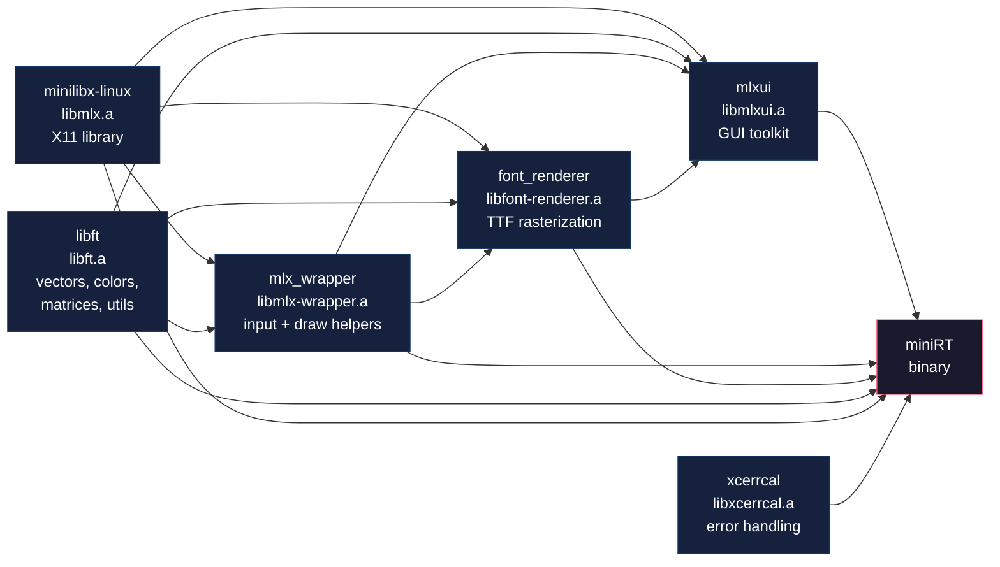

# miniRT — Build System

## Overview

miniRT uses a **modular recursive Makefile system** orchestrated by the `mkidir` submodule. The top-level `Makefile` coordinates 6 library submodules, each with its own Makefiles and `includes.mk`, plus the main binary's 251 C source files distributed across 48 `.mk` include files.

## Submodules

There are **8 submodules** registered in `.gitmodules`:

| # | Path | URL | Branch |
|---|---|---|---|
| 1 | `mkidir` | `git@github.com:dct-LuLu/mkidir.git` | (default) |
| 2 | `lib/libft` | `git@github.com:dct-LuLu/libft.git` | `libft-stripped` |
| 3 | `lib/font_renderer` | `git@github.com:dct-LuLu/mlx_ttf_font_renderer.git` | `library-stripped` |
| 4 | `lib/mlx_wrapper` | `git@github.com:dct-LuLu/mlx_wrapper.git` | `library-stripped` |
| 5 | `lib/xcerrcal` | `git@github.com:dct-LuLu/xcerrcal.git` | `library-stripped` |
| 6 | `lib/mlxui` | `git@github.com:dct-LuLu/mlxui.git` | `library-stripped` |
| 7 | `minirt-assets` | `git@github.com:ketodin/minirt-assets.git` | (default) |

Of the 8, **7 are libraries** (mkidir is a build system helper, not a library). `minirt-assets` is an asset repository (test scenes, meshes, textures).

## Submodule Build Chain



**Build order**: `minilibx-linux` → `libft` → `mlx_wrapper` → `font_renderer` → `mlxui` → `xcerrcal` → `miniRT binary`

Dependencies are enforced via Makefile prerequisites:
- `$(MLXUI)` depends on: `$(FONT_RENDER) $(MLXW) $(MLX) $(LIBFT)`
- `$(FONT_RENDER)` depends on: `$(MLXW) $(MLX) $(LIBFT)`
- `$(MLXW)` depends on: `$(MLX) $(LIBFT)`
- `$(LIBFT)` and `$(MLX)` and `$(XCERRCAL)` have no prerequisites (built first)
- The binary `$(NAME)` depends on: `$(XCERRCAL) $(MLXUI) $(FONT_RENDER) $(OBJS) $(INCLUDES)`

## Modular `.mk` File System

The build is decomposed into **48 `.mk` files** across the project:

```
miniRT/
├── Makefile                       # Top-level build orchestration
├── includes.mk                    # All include directories
├── src/
│   ├── srcs.mk                    # Main source list + includes sub-MKs
│   ├── parsing/
│   │   ├── parsing.mk             # +fill_gpu_data/fill_gpu_data.mk
│   │   ├── rt_parser/rt_parser.mk # All parser source .mk files
│   │   └── fill_gpu_data/fill_gpu_data.mk
│   ├── calc/
│   │   ├── calc.mk                # +bvh/bvh.mk +render/render.mk +kernel/kernel.mk
│   │   ├── bvh/bvh.mk             # All BVH sub-.mk files
│   │   └── render/render.mk       # All renderer .mk files
│   ├── init/
│   │   ├── init.mk                # +ui/ui.mk
│   │   └── ui/ui.mk               # All UI init .mk files
│   └── export_scene/export_scene.mk
├── mkidir/
│   ├── make_utils.mk              # Variables, machine-ID detection, print utils
│   ├── make_rules.mk              # Implicit rules, pattern rules, re- targets
│   ├── sanitize.mk                # Sanitizer flags, mode detection
│   └── colors.mk                  # Terminal color definitions, build messages
├── lib/libft/
│   └── includes.mk                # Export INCDIRS_LIBFT
├── lib/mlx_wrapper/
│   └── includes.mk                # Export INCDIRS_MLXW
├── lib/font_renderer/
│   └── includes.mk                # Export INCDIRS_FTRDR
├── lib/mlxui/
│   └── includes.mk                # Export INCDIRS_MLXUI
└── lib/xcerrcal/
    └── includes.mk                # Export INCDIRS_XCERRCAL
```

Each sub-MK file appends to the `SRCS` variable, keeping the build modular and avoiding a single 2000-line Makefile.

## Available Targets

### Standard Builds

| Target | Description |
|---|---|
| `all` | Default build, no optimization |
| `fast` | Build with `-Ofast -march=native -mtune=native -msse3` |
| `debug` | Build with `DEBUG_LVL=1` (debug symbols across all submodules) |
| `inspect` | Build with `-g3` for LLDB/gdb debugging |
| `profile` | Build with `-g3 -pg` for gprof profiling |
| `bonus` | Same as `all` (42 School requirement) |

### Sanitizer Builds

| Target | Sanitizer | Flags |
|---|---|---|
| `san-mem` | **AddressSanitizer** | `-fsanitize=address,pointer-compare,pointer-subtract,undefined,shift,...` (27 sanitizer kinds) + `-g3 -O1 -fno-omit-frame-pointer` |
| `san-leak` | **LeakSanitizer** | `-fsanitize=leak,address` + `-g3 -O1 -fno-omit-frame-pointer` |
| `san-ub` | **UndefinedBehaviorSanitizer** | `-fsanitize=undefined,shift,shift-base,...` (28 UB checks) + `-g3 -O1 -fno-sanitize-recover=all` |

### Rebuilds

| Target | Action |
|---|---|
| `re` | `fclean` + `all` |
| `refast` | `fclean` + `fast` |
| `redebug` | `fclean` + `debug` |
| `reinspect` | `fclean` + `inspect` |
| `reprofile` | `fclean` + `profile` |
| `resan-mem` | `fclean` + `san-mem` |
| `resan-leak` | `fclean` + `san-leak` |
| `resan-ub` | `fclean` + `san-ub` |

### Maintenance

| Target | Description |
|---|---|
| `clean` | Remove `.obj/` and `.dep/` directories |
| `fclean` | `clean` + remove all library `.a` archives and `miniRT` binary |
| `help` | Display comprehensive help message with all targets, flags, and examples |
| `print-%` | Print value of any Makefile variable (e.g., `make print-NAME`) |

## Build Flags

| Flag | Default | Description |
|---|---|---|
| `WIDTH` | `1920` | Window width (or `MAX_WIDTH` if `FULLSCREEN=1`) |
| `HEIGHT` | `1080` | Window height (or `MAX_HEIGHT` if `FULLSCREEN=1`) |
| `FULLSCREEN` | `0` | Use screen resolution (`WIDTH=MAX_WIDTH`, `HEIGHT=MAX_HEIGHT`) |
| `RESIZEABLE` | `0` | Enable window resize |
| `WINDOWLESS` | `0` | Headless mode (no X11 window, for CI/testing) |
| `PERF` | `0` | Performance mode (additional fps_counter output) |
| `NPROC` | `$(nproc)` | Parallel job count |
| `VERBOSE` | `0` | Show full compile commands (not suppressed) |
| `CL_TARGET_OPENCL_VERSION` | `300` | OpenCL target version for the compiled program |
| `DEBUG_LVL` | `0` | Tiered debug mode (see below) |
| `MINIRT_MODE` | `1` | Enable miniRT-specific defines in compilation |
| `FAST` | auto | Set to `1` when `make fast` target is used |

### DEBUG_LVL Tiered System

The `DEBUG_LVL` variable controls debug verbosity across submodules:

| Level | Effect |
|---|---|
| `0` | No debug (default production build) |
| `1` | **All submodules** + miniRT binary compiled with debug info |
| `2` | Same as 1 + `mlx_wrapper` debug |
| `3` | Same as 2 + `font_renderer` debug |
| `4` | Same as 3 + `mlxui` debug |
| `5` | Same as 4 + `miniRT` binary debug (MAXIMUM verbosity) |

The Makefile sets `DEBUG=1` when `DEBUG_LVL >= 5` (configurable via `DEBUG_MINIRT = 5`).

## Machine-ID Compiler Selection

The build system automatically selects compiler toolchain based on `/etc/machine-id`:

```makefile
HOME_ID = 6bb6eb3dbd1b58e9b11f9bba389b9fa248353ef0dd2fea7e9f1f5aeed881747d

# If machine ID matches HOME_ID (local development machine):
MLX_GCC = gcc-14
CC += -Wno-error=maybe-uninitialized -Wno-error=stringop-overflow -Wno-error=alloc-size
XTEST = 0  # No fake XTest library needed

# Else (remote/container/CI):
MLX_GCC = gcc-12
FAST_AR = llvm-ar-12
FAST_RANLIB = llvm-ranlib-12
XTEST = 1  # Use local XTest library
```

This ensures consistent builds across different development environments.

## OpenCL Build Details

OpenCL kernels are loaded at runtime from `shader/` directory (14 `.cl` files). The C code compiles the OpenCL program via `clBuildProgram()` with:

- Target version: `-cl-std=CL3.0` (controlled by `CL_TARGET_OPENCL_VERSION=300`)
- Kernels are compiled into a single program object
- Individual kernels are extracted via `clCreateKernel()` by name

The C flags for the host side include `-l:libOpenCL.so.1` for linking.

## Sanitizer Environment Variables

Each sanitizer build requires specific environment variables to be exported before running:

### AddressSanitizer (`san-mem`)
```bash
export ASAN_OPTIONS="intercept_tls_get_addr=0:detect_leaks=0:quarantine_size_mb=512:\
redzone=128:max_redzone=2048:report_globals=1:check_initialization_order=1:\
strict_init_order=1:detect_stack_use_after_return=0:min_uar_stack_size_log=16:\
max_uar_stack_size_log=20:detect_container_overflow=1:detect_odr_violation=2:\
strict_string_checks=1:replace_str=1:replace_intrin=1:print_stats=1:\
print_legend=1:atexit=1:print_full_thread_history=1:alloc_dealloc_mismatch=1:\
new_delete_type_mismatch=1:poison_heap=1:poison_partial=1:\
poison_array_cookie=1:max_malloc_fill_size=8192:allow_user_poisoning=1:\
check_malloc_usable_size=1:sleep_before_dying=0:verbosity=1:halt_on_error=0:\
dump_instruction_bytes=1:protect_shadow_gap=0:interceptor_via_fun=0"
```

### LeakSanitizer (`san-leak`)
```bash
export LSAN_OPTIONS="verbosity=1:log_threads=0:log_pointers=0:report_objects=0:\
use_registers=1:use_globals=1:use_stacks=1:use_root_regions=1:\
use_ld_allocations=1:use_tls=1:use_unaligned=1:print_suppressions=0:\
max_leaks=0:exitcode=23"
export ASAN_OPTIONS="detect_leaks=1:leak_check_at_exit=1:\
malloc_context_size=50:print_full_thread_history=1:verbosity=1"
```

### UndefinedBehaviorSanitizer (`san-ub`)
```bash
export UBSAN_OPTIONS="print_stacktrace=1:halt_on_error=0:verbosity=1:\
report_error_type=1"
```

## Compile Flags Summary

| Flag component | Value |
|---|---|
| `CC` | `cc` (overridden by machine-ID selection) |
| `CFLAGS` | `-Wall -Werror -Wextra -std=gnu11` |
| `DFLAGS` | `-MMD -MP -MF $(DEPDIR)/$*.d` |
| `OFLAGS` (fast) | `-Ofast -march=native -mtune=native -msse3` |
| `IFLAGS` | `-I$(all include directories)` |
| `LFLAGS` | `-lfont-renderer -lmlx-wrapper -lmlx -lft -lxcerrcal -lXtst -lXext -lX11 -lXrandr -lm -l:libOpenCL.so.1` |
| `VFLAGS` | `-D DEBUG_LVL=... -D MAX_WIDTH=... -D ...` (all `VARS` as `-D` defines) |
| Archive tool | `ar` or `llvm-ar-12` (machine-ID dependent) |

## Usage Examples

```bash
# Default build
make

# Optimized build
make fast

# Custom resolution
make WIDTH=800 HEIGHT=600

# Debug with all verbosity
make DEBUG_LVL=5

# Full-screen optimized
make FULLSCREEN=1 fast

# Sanitizer build (export env vars first)
export ASAN_OPTIONS="..."
make san-mem && ./miniRT scenes/template.rt

# Profile build
make profile && ./miniRT scenes/template.rt
gprof ./miniRT gmon.out

# Clean rebuild
make re
make refast
```