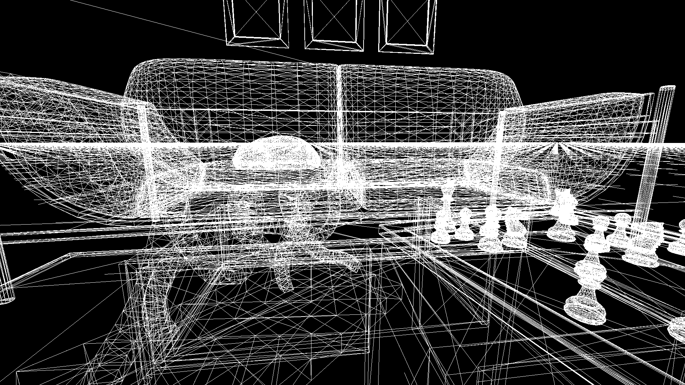
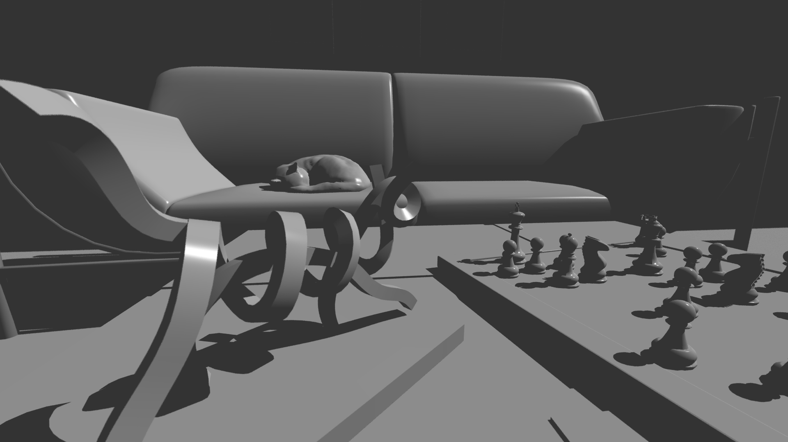
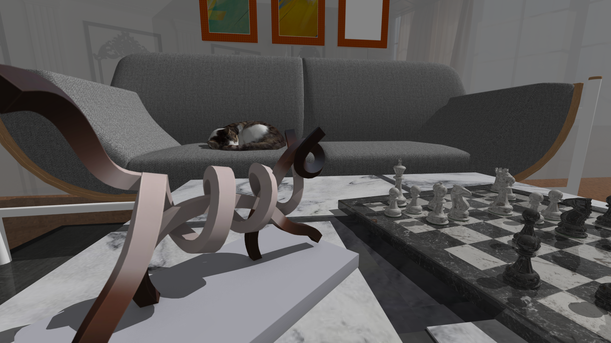
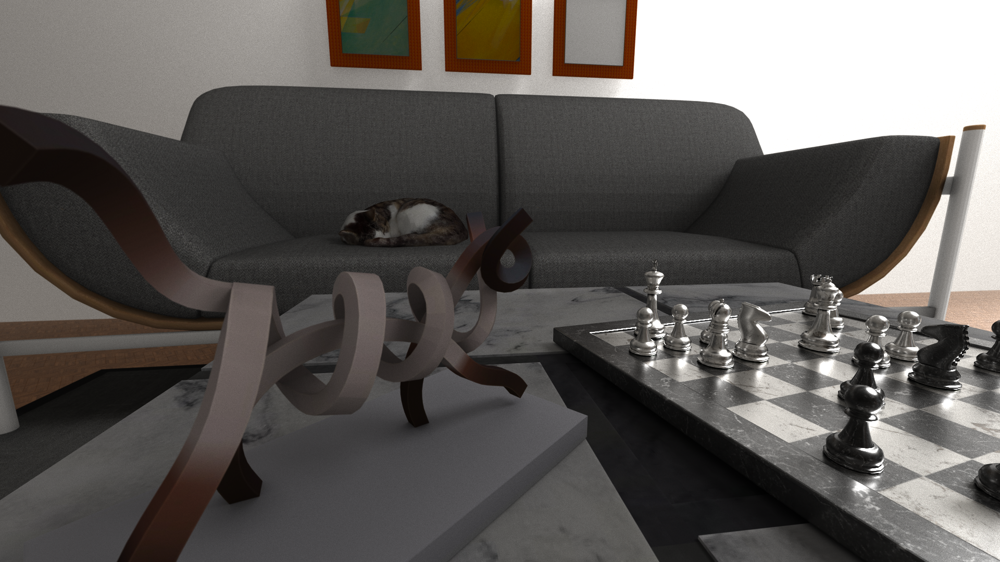
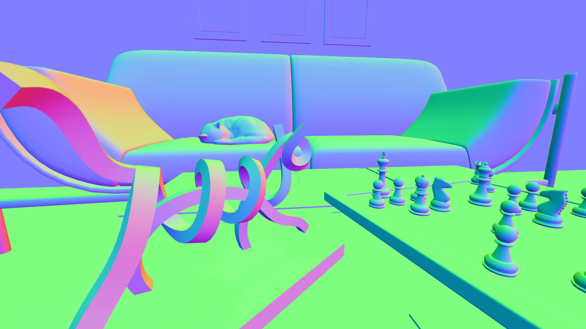
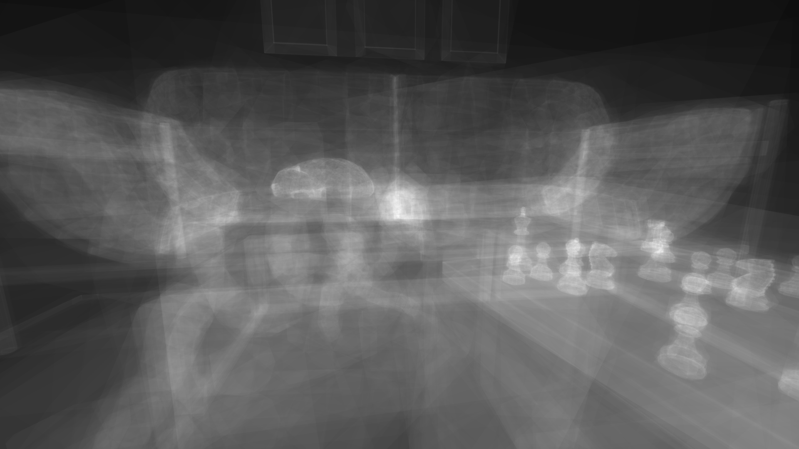

# Render Modes - Overview

miniRT supports **6 render modes**, selected at runtime and switched interactively via keyboard. Each mode produces a different visual output depending on the rendering technique used.


*Wireframe mode of chess.rt*


*Phong mode of chess.rt*


*PBR mode of chess.rt*


*Monte Carlo mode of chess.rt*


*Debug normal mode of chess.rt*


*Debug BVH heatmap mode of chess.rt*

## Mode Dispatch

The render loop in `src/loop.c` maintains a static function pointer table:

```c
static int (*render_func[])(t_data *, t_img_data *img)
    = {wireframe_render, phong_render, pbr_render,
       monte_carlo_render, normal_render, heat_render};
```

The current mode is read from `*data->params.render_mode` (an `int` pointer). The dispatch call checks if `render_func[*data->params.render_mode](data, &data->mlx->img)` returns non-zero (error) to break the mlx loop. Each render function returns `int` (0 on success, non-zero to signal exit).

## Mode Table

| Index | Mode | Description | Type |
|---|---|---|---|
| 0 | Wireframe | CPU rasterization, BVH debug overlay | CPU (raster) |
| 1 | Phong | Per-pixel Phong shading with shadow rays | GPU (OpenCL) |
| 2 | PBR | Physically-based rendering, multi-bounce | GPU (OpenCL) |
| 3 | Monte Carlo | Path tracing, GGX sampling, dispersion | GPU (OpenCL) |
| 4 | Normal Debug | Surface normal visualization | GPU (OpenCL) |
| 5 | Heat Map | BVH traversal depth visualization | GPU (OpenCL) |

*Side-by-side comparison of the same scene rendered in all six modes.*

## Keyboard Switching

The user switches render modes via keyboard input. Modes 0 through 5 are cycled or directly selected. The `*data->params.render_mode` value is updated, which triggers `render_changed()` to reset the progressive accumulation buffer.

## Progressive Accumulation

All GPU modes use progressive accumulation: a `float3` buffer accumulates samples across frames, reset when the camera or render parameters change. See [06-opencl-integration.md](../06-opencl-integration.md) for the accumulation buffer architecture and frame loop details.
