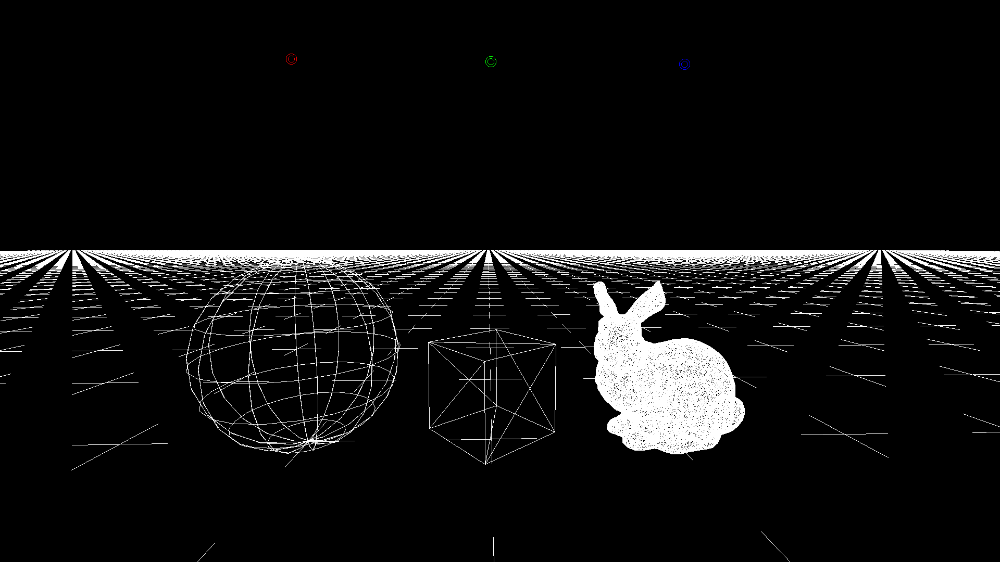
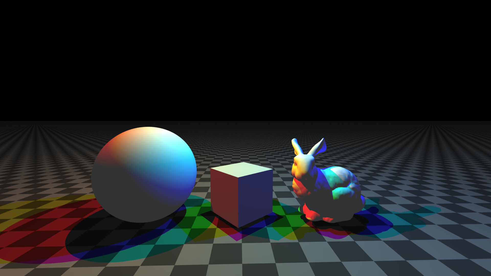

# Wireframe Mode (Index 0)

Wireframe mode performs **CPU-side rasterization** of the scene geometry. It does not use OpenCL kernels -- instead, it projects 3D points onto the 2D screen using the camera frustum and draws outlines directly into the pixel buffer.

*Wireframe mode showing all primitives plus lights.*

*And the phong version of the map*

### BVH Debug Overlay

When `data->params.bvh_debug` is `true` (toggled via the V key), `debug_rasterize_bvh()` draws the BVH hierarchy as an overlay on top of the wireframe. Each BVH node is rasterized in a **rainbow color** based on its depth, computed via `depth_to_rgb_int()`. The `bvh_depth` parameter controls which depths are visible (`-1` = all depths).

*BVH debug overlay showing AABB bounding volumes in wireframe mode.*
