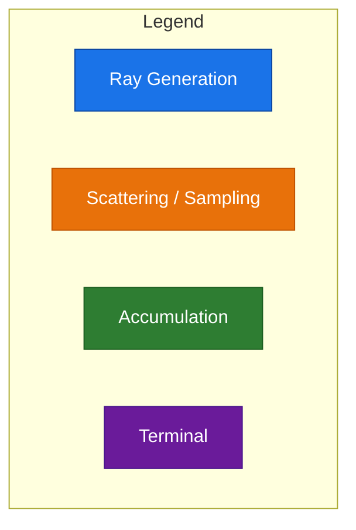

# Monte Carlo Path Tracing (Index 3)

Monte Carlo path tracing samples the light transport using **importance-sampled GGX microfacets** with **chromatic dispersion** (wavelength-dependent refraction), producing physically accurate caustics, rainbows, and glossy reflections.

## Source Files

- `shader/monte_carlo.cl` — kernel entry point
- `shader/sample_materials.cl` — GGX sampling, chromatic IOR, rainbow color

## Kernel Flow

```
monte_carlo() kernel (per pixel)
  ├─ through_power = (0.33, 0.33, 0.33)
  ├─ accumulated_color = (0,0,0)
  ├─ is_diffract = 0
  ├─ bounce = 0
  └─ while (bounce < MAX_BOUNCE):
       ├─ hit_register_gpu(&ray, &objects, bvh_type)
       ├─ if miss:
       │    ├─ if (bounce == 0): img[pixel] += skybox
       │    └─ else: img[pixel] += skybox × accumulated_color × 3
       │    return
       ├─ path_sample_materials(...) — GGX importance-sampled scatter
       ├─ if (emissive, ke > 0):
       │    ├─ accumulated_color += ke × through_power
       │    ├─ final_color = accumulated_color × ke × 3
       │    ├─ img[pixel] += final_color
       │    └─ return
       ├─ accumulated_color += kd × (1 - reflectivity) × through_power
       ├─ through_power *= reflectivity
       └─ bounce++
```

## GGX Importance Sampling

The **GGX microfacet distribution** is used to importance-sample reflection/refraction directions. Instead of always reflecting in the specular direction, GGX samples a random microfacet normal $\mathbf{h}$ proportional to the roughness:

$$
\theta = \arccos\left(\sqrt{\frac{1 - u_2}{1 + (\alpha^2 - 1)u_2}}\right), \quad
\phi = 2\pi u_1
$$

Where $\alpha = \text{roughness}^2$, and $u_1, u_2$ are uniform random numbers.

Implemented in `sample_ggx_gpu()`:

```c
float3 sample_ggx_gpu(float3 normal, float roughness, uint *rng)
{
    a = roughness * roughness;
    u1 = randomf(rng);
    u2 = randomf(rng);
    phi = 2.0f * M_PI * u1;
    cos_theta = sqrt((1.0f - u2) / (1.0f + (a * a - 1.0f) * u2));
    sin_theta = sqrt(1.0f - cos_theta * cos_theta);
    h = (float3)(cos(phi) * sin_theta, sin(phi) * sin_theta, cos_theta);
    // transform from tangent space to world space
    t = get_tangent(normal);
    b = cross(normal, t);
    h = normalize(t * h.x + b * h.y + normal * h.z);
    return h;
}
```

The sampled half-vector $\mathbf{h}$ is used to compute the scattered direction $\hat{D}' = \text{reflect}(\hat{D}, \mathbf{h})$ for glossy reflection, or $\hat{D}' = \text{refract}(\hat{D}, \mathbf{h}, \eta)$ for glossy refraction.

## Chromatic Dispersion

Dispersion models the **wavelength-dependent refractive index** of real materials. The color of the ray itself determines the IOR shift.

### Wavelength-to-IOR Mapping

The ray's current `through_power` color is converted to a **spectral hue index** (0–360°):

```c
int rgb_to_spectrum_index(float3 rgb)
{
    // Converts RGB to HSL-like hue value in [0, 360)
    // Uses standard RGB-to-hue formula
}
```

This hue is mapped to a **wavelength factor** in $[-1, 1]$:

```c
wavelength_factor = (spectrum_index / 127.5f) - 1.0f;
```

The effective IOR for the ray becomes:

$$
\eta_{\text{effective}} = \eta_{\text{base}} + \text{wavelength\_factor} \times \text{dispersion} \times (\eta_{\text{base}} - 1)
$$

Implemented in `get_ni_by_color()`:

```c
float get_ni_by_color(float ni_base, float3 rgb, float dispersion)
{
    spectrum_index = rgb_to_spectrum_index(rgb);
    wavelength_factor = (spectrum_index / 127.5f) - 1.0f;
    dispersion_scale = ni_base - 1.0f;
    return (ni_base + wavelength_factor * dispersion * dispersion_scale);
}
```

### Rainbow Color

When dispersion activates (first refraction on a diffracting path), the ray is assigned a **random RGB color**:

```c
float3 rainbow_color(uint *rng)
{
    return normalize((float3)(randomf(rng), randomf(rng), randomf(rng)));
}
```

This random color becomes the new `through_power` for subsequent bounces, multiplied by a **3× energy boost** to compensate for the splitting of white light into spectral components.

## The `path_sample_materials` Function

This is the core scattering function that combines GGX sampling, dispersion, and reflect/refract decisions:

```c
t_hit_data path_sample_materials(hit, tex, mat, ray, rng, through_power, is_diffract)
{
    hit_data = sample_materials(hit, tex, mat, ray);
    hit_data.opacity = fmax(hit_data.opacity, hit_data.reflectivity.x);

    if (randomf(rng) > hit_data.opacity)  // refract
    {
        ray->dir = sample_ggx_gpu(ray->dir, hit_data.roughness, rng);
        if (*is_diffract == 0)
        {
            *is_diffract = 1;
            *through_power *= rainbow_color(rng) * 3;
        }
        refract(&ray->dir, hit, &hit_data,
                get_ni_by_color(hit_data.ni, *through_power, 0.1));
    }
    else  // reflect
    {
        ray->dir = reflect(ray->dir, sample_ggx_gpu(hit_data.normal, hit_data.roughness, rng));
    }

    ray->origin = hit->hit_point + (0.0001f * ray->dir);
    ray->inv_dir = 1 / ray->dir;
    return hit_data;
}
```

Key behavior:
- **Refraction path**: The ray direction is GGX-scattered from the incident direction (not the normal). The first time a diffracting object is hit (`is_diffract` flips from 0 to 1), `through_power` is multiplied by `rainbow_color() × 3`.
- **Reflection path**: The ray is reflected using a GGX-sampled microfacet normal.
- The `opacity` threshold uses `fmax(opacity, reflectivity.x)` — highly reflective materials are more likely to reflect.

## Through-Power and Energy Boost

The initial `through_power` is `(0.33, 0.33, 0.33)` — one-third per channel — matching the approximate energy distribution of visible light.

After a diffracting event, the through-power is multiplied by a **random rainbow color** and **3× boost**:

$$
\text{through\_power}' = \text{through\_power} \times \text{rainbow\_color}(\text{rng}) \times 3
$$

The 3× factor compensates for the fact that only one random spectral component is followed, rather than the full spectrum. On average, this preserves energy.

## Emissive Materials

When a ray hits an emissive surface ($k_e > 0$), the path terminates immediately:

```c
if (dot(hit_data.ke, hit_data.ke) > 0.0f)
{
    accumulated_color += hit_data.ke * through_power;
    final_color = accumulated_color * hit_data.ke * 3;
    img[pixel] += final_color;
    return;
}
```

The accumulation includes all previous bounces plus the emissive contribution, multiplied by another 3× factor.

## Skybox

Skybox is handled differently depending on bounce:

- **Bounce 0** (primary ray miss): Skybox color is written directly to the pixel without scaling.
- **Bounce > 0** (secondary ray miss): Skybox color is multiplied by `accumulated_color × 3` and added. This allows the skybox to contribute color to bounces that exit the scene after internal reflections.

```c
if (bounce == 0)
    img[pixel] += draw_skybox(&hit, textures, skybox);
else
    img[pixel] += draw_skybox(&hit, textures, skybox) * accumulated_color * 3;
```

## Pipeline Diagram

The following Mermaid diagram illustrates the Monte Carlo ray path sampling pipeline:

```mermaid
flowchart TD
    START([Per-Pixel Kernel Start]) --> RAYGEN[Generate Primary Ray\n calc_ray()]

    RAYGEN --> BOUNCE_LOOP{while bounce < MAX_BOUNCE}

    BOUNCE_LOOP -->|bounce < 4| BVH_HIT[BVH Traversal\n hit_register_gpu()]
    BOUNCE_LOOP -->|bounce >= 4| DONE([Done — pixel complete])

    BVH_HIT --> IS_MISS{Object hit?}

    IS_MISS -->|Miss| SKYBOX_CHECK{bounce == 0?}

    SKYBOX_CHECK -->|Yes| SKYBOX_DIRECT[img += skybox color]
    SKYBOX_CHECK -->|No| SKYBOX_ACCU[img += skybox × accu × 3]

    SKYBOX_DIRECT --> DONE
    SKYBOX_ACCU --> DONE

    IS_MISS -->|Hit| SAMPLE_MATS[Sample materials\n kd, ke, normal, roughness, metallness, opacity]

    SAMPLE_MATS --> IS_EMISSIVE{ke > 0?}

    IS_EMISSIVE -->|Yes| EMIT_ACCU[accu += ke × through_power\n img += accu × ke × 3]
    EMIT_ACCU --> DONE

    IS_EMISSIVE -->|No| DECIDE_REFLECT{random < opacity?}

    DECIDE_REFLECT -->|Reflect| GGX_REFLECT[GGX sample reflection\n ray.dir = reflect(ray.dir,\n                  sample_ggx_gpu(normal))]

    DECIDE_REFLECT -->|Refract| GGX_REFRACT[GGX sample from incident\n ray.dir = sample_ggx_gpu(ray.dir)]

    GGX_REFRACT --> IS_DIFFRACT{is_diffract == 0?}

    IS_DIFFRACT -->|First diffract| SET_DISPERSION[Set is_diffract = 1\n through_power ×= rainbow_color × 3]

    IS_DIFFRACT -->|Already diffracting| SKIP_DISPERSION[Keep through_power]

    SET_DISPERSION --> REFRACT_WITH_DISP[Refract with\n chromatic IOR:\n get_ni_by_color()]

    SKIP_DISPERSION --> REFRACT_WITH_DISP

    REFRACT_WITH_DISP --> BOUNCE_ACCUM[accu += kd × (1-reflectivity) × through_power\n through_power ×= reflectivity]
    GGX_REFLECT --> BOUNCE_ACCUM

    BOUNCE_ACCUM --> ADVANCE_RAY[Advance ray origin\n offset by epsilon]

    ADVANCE_RAY --> BOUNCE_INC[bounce++]
    BOUNCE_INC --> BOUNCE_LOOP
```



## Performance Notes

- The Monte Carlo kernel uses a **separate RNG per pixel** (seeded by pixel index + random offset).
- The `randomf()` function uses a linear congruential generator:

```c
float randomf(uint *rng)
{
    *rng = *rng * 747796405 + 2891336453;
    uint result = ((*rng >> ((*rng >> 28) + 4)) ^ *rng) * 277803737;
    result = (result >> 22) ^ result;
    return (result / 4294967295.0f);
}
```

- Unlike Phong/PBR, the Monte Carlo kernel does not pass `ambient` or `lights` directly — it relies entirely on path sampling for illumination.
- The 3× boost factors (in both dispersion and emissive/skybox final accumulation) are heuristic energy compensation factors tuned for visual convergence.