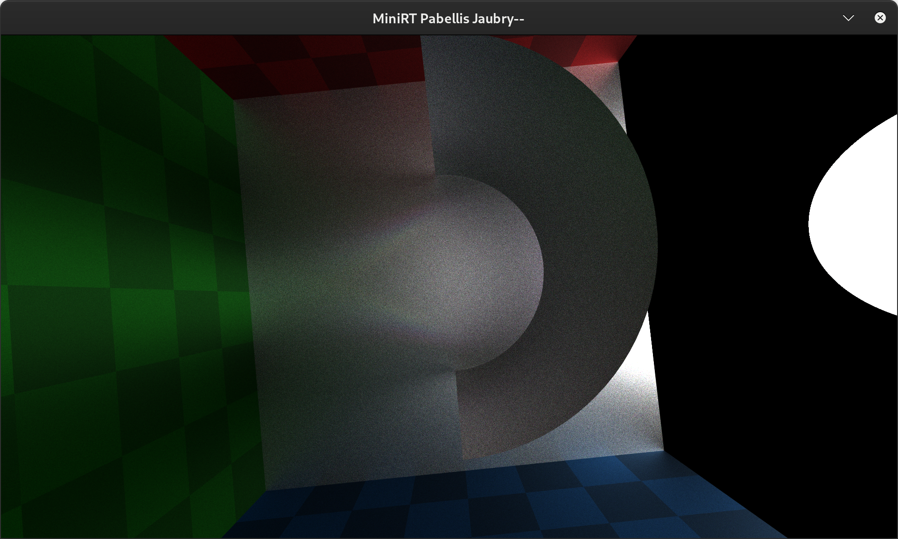
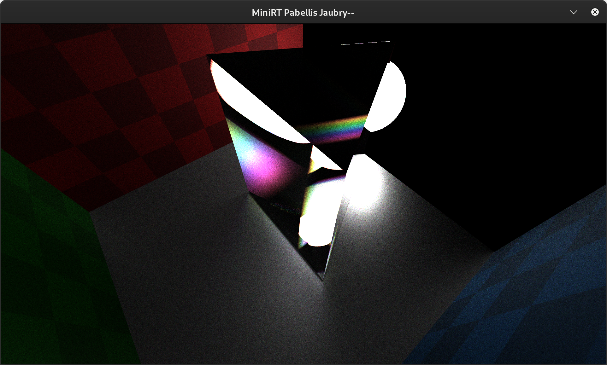
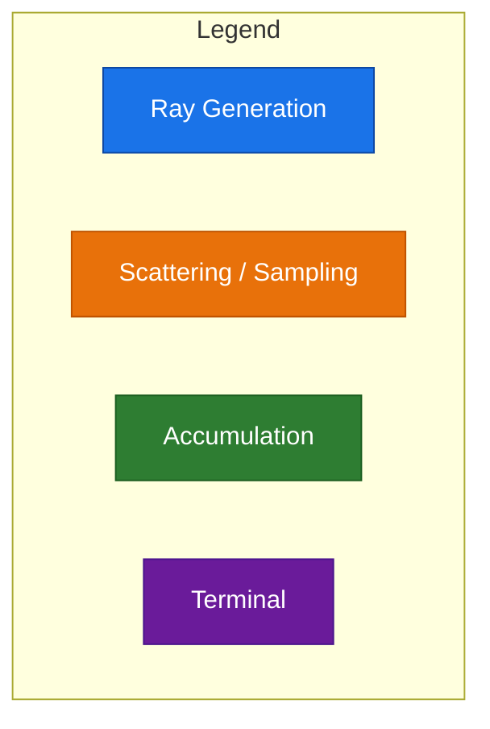

# Monte Carlo Path Tracing (Index 3)

Monte Carlo path tracing samples the light transport using **importance-sampled GGX microfacets** with **chromatic dispersion** (wavelength-dependent refraction), producing physically accurate caustics, rainbows, and glossy reflections.

## Source Files

The Monte Carlo path tracer is implemented across two shader source files: `shader/monte_carlo.cl` serves as the kernel entry point, while `shader/sample_materials.cl` handles GGX sampling, chromatic IOR, and rainbow color generation.

## Kernel Flow

```
monte_carlo() kernel (per pixel)
  +-- through_power = (0.33, 0.33, 0.33)
  +-- accumulated_color = (0,0,0)
  +-- is_diffract = 0
  +-- bounce = 0
  +-- while (bounce < MAX_BOUNCE):
       +-- hit_register_gpu(&ray, &objects, bvh_type)
       +-- if miss:
       |    +-- if (bounce == 0): img[pixel] += skybox
       |    +-- else: img[pixel] += skybox x accumulated_color x 3
       |    +-- return
       +-- path_sample_materials(...) - GGX importance-sampled scatter
       +-- if (emissive, ke > 0):
       |    +-- accumulated_color += ke x through_power
       |    +-- final_color = accumulated_color x ke x 3
       |    +-- img[pixel] += final_color
       |    +-- return
       +-- accumulated_color += kd x (1 - reflectivity) x through_power
       +-- through_power *= reflectivity
       +-- bounce++
```

*Screenshot of Monte Carlo mode showing progressive path tracing with caustics and chromatic dispersion.*

## GGX Importance Sampling

The **GGX microfacet distribution** is used to importance-sample reflection and refraction directions. Instead of always reflecting in the specular direction, GGX samples a random microfacet normal $\mathbf{h}$ proportional to the roughness:

$$\theta = \arccos\left(\sqrt{\frac{1 - u_2}{1 + (\alpha^2 - 1)u_2}}\right), \quad \phi = 2\pi u_1$$

Where $\alpha = \text{roughness}^2$, and $u_1, u_2$ are uniform random numbers. The sampled half-vector $\mathbf{h}$ is used to compute the scattered direction $\hat{D}' = \text{reflect}(\hat{D}, \mathbf{h})$ for glossy reflection, or $\hat{D}' = \text{refract}(\hat{D}, \mathbf{h}, \eta)$ for glossy refraction.

## Chromatic Dispersion

<table cellpadding="0" cellspacing="0" border="0" style="border:none;">
<tr><td></td><td></td></tr>
</table>

*Chromatic dispersion in Monte Carlo mode: wavelength-dependent IOR produces physically accurate rainbow caustics and colored refractions.*

Dispersion models the **wavelength-dependent refractive index** of real materials. The ray's current `through_power` color is converted to a **spectral hue index** (0-360 degrees) via `rgb_to_spectrum_index()`. This hue is mapped to a **wavelength factor** in $[-1, 1]$, and the effective IOR for the ray becomes:

$$\eta_{\text{effective}} = \eta_{\text{base}} + \text{wavelength_factor} \times \text{dispersion} \times (\eta_{\text{base}} - 1)$$

This is implemented in `get_ni_by_color()`. When dispersion activates (first refraction on a diffracting path), the ray is assigned a **random RGB color** via `rainbow_color()`, which becomes the new `through_power` for subsequent bounces, multiplied by a **3x energy boost** to compensate for the splitting of white light into spectral components.

## The `path_sample_materials` Function

This is the core scattering function that combines GGX sampling, dispersion, and reflect/refract decisions. The opacity threshold uses `fmax(opacity, reflectivity.x)` so highly reflective materials are more likely to reflect. On the **refraction path**, the ray direction is GGX-scattered from the incident direction (not the normal), and the first time a diffracting object is hit, `through_power` is multiplied by `rainbow_color() x 3`. On the **reflection path**, the ray is reflected using a GGX-sampled microfacet normal.

## Through-Power and Energy Boost

The initial `through_power` is `(0.33, 0.33, 0.33)` - one-third per channel, matching the approximate energy distribution of visible light. After a diffracting event, the through-power is multiplied by a random rainbow color and 3x boost. The 3x factor compensates for the fact that only one random spectral component is followed rather than the full spectrum; on average, this preserves energy.

## Emissive Materials

When a ray hits an emissive surface ($k_e > 0$), the path terminates immediately. The accumulation includes all previous bounces plus the emissive contribution, multiplied by another 3x factor.

## Skybox

Skybox is handled differently depending on bounce number. On **bounce 0** (primary ray miss), the skybox color is written directly to the pixel without scaling. On **bounce > 0** (secondary ray miss), the skybox color is multiplied by `accumulated_color x 3` and added, allowing the skybox to contribute color to bounces that exit the scene after internal reflections.

## Pipeline Diagram

*Flowchart illustrating the Monte Carlo ray path sampling pipeline from primary ray generation through bounce accumulation.*

The following Mermaid diagram illustrates the Monte Carlo ray path sampling pipeline:

```mermaid
flowchart TD
    START([Per-Pixel Kernel Start]) --> RAYGEN[Generate Primary Ray\n calc_ray()]

    RAYGEN --> BOUNCE_LOOP{while bounce < MAX_BOUNCE}

    BOUNCE_LOOP -->|bounce < 4| BVH_HIT[BVH Traversal\n hit_register_gpu()]
    BOUNCE_LOOP -->|bounce >= 4| DONE([Done - pixel complete])

    BVH_HIT --> IS_MISS{Object hit?}

    IS_MISS -->|Miss| SKYBOX_CHECK{bounce == 0?}

    SKYBOX_CHECK -->|Yes| SKYBOX_DIRECT[img += skybox color]
    SKYBOX_CHECK -->|No| SKYBOX_ACCU[img += skybox x accu x 3]

    SKYBOX_DIRECT --> DONE
    SKYBOX_ACCU --> DONE

    IS_MISS -->|Hit| SAMPLE_MATS[Sample materials\n kd, ke, normal, roughness, metalness, opacity]

    SAMPLE_MATS --> IS_EMISSIVE{ke > 0?}

    IS_EMISSIVE -->|Yes| EMIT_ACCU[accu += ke x through_power\n img += accu x ke x 3]
    EMIT_ACCU --> DONE

    IS_EMISSIVE -->|No| DECIDE_REFLECT{random < opacity?}

    DECIDE_REFLECT -->|Reflect| GGX_REFLECT[GGX sample reflection\n ray.dir = reflect(ray.dir,\n                  sample_ggx_gpu(normal))]

    DECIDE_REFLECT -->|Refract| GGX_REFRACT[GGX sample from incident\n ray.dir = sample_ggx_gpu(ray.dir)]

    GGX_REFRACT --> IS_DIFFRACT{is_diffract == 0?}

    IS_DIFFRACT -->|First diffract| SET_DISPERSION[Set is_diffract = 1\n through_power x= rainbow_color x 3]

    IS_DIFFRACT -->|Already diffracting| SKIP_DISPERSION[Keep through_power]

    SET_DISPERSION --> REFRACT_WITH_DISP[Refract with\n chromatic IOR:\n get_ni_by_color()]

    SKIP_DISPERSION --> REFRACT_WITH_DISP

    REFRACT_WITH_DISP --> BOUNCE_ACCUM[accu += kd x (1-reflectivity) x through_power\n through_power x= reflectivity]
    GGX_REFLECT --> BOUNCE_ACCUM

    BOUNCE_ACCUM --> ADVANCE_RAY[Advance ray origin\n offset by epsilon]

    ADVANCE_RAY --> BOUNCE_INC[bounce++]
    BOUNCE_INC --> BOUNCE_LOOP
```



## Performance Notes

The Monte Carlo kernel uses a **separate RNG per pixel** (seeded by pixel index + random offset). The `randomf()` function uses a linear congruential generator. Unlike Phong and PBR, the Monte Carlo kernel does not pass `ambient` or `lights` directly - it relies entirely on path sampling for illumination. The 3x boost factors (in both dispersion and emissive/skybox final accumulation) are heuristic energy compensation factors tuned for visual convergence.