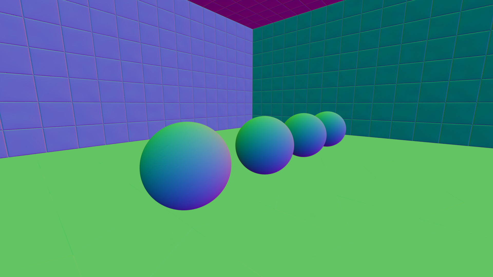

# Normal Debug Mode (Index 4)

Normal debug mode visualizes surface normals directly, mapping each normal vector component to a color channel. The surface normal $\mathbf{N} = (N_x, N_y, N_z)$ is mapped to RGB colorspace as:

$$\text{color} = (N_x \cdot 0.5 + 0.5,\; N_y \cdot 0.5 + 0.5,\; N_z \cdot 0.5 + 0.5)$$

Since each normal component is in $[-1, 1]$, the mapping shifts it to $[0, 1]$. For example, +X (right) maps to red, -X (left) maps to teal, +Y (up) maps to green, -Y (down) maps to purple, +Z (forward) maps to blue, and -Z (backward) maps to yellow. When a ray misses all geometry, the pixel is set to black.

*Normal debug mode in chess.rt showing surface normals mapped to RGB colors.*

*Normal debug mode in marble.rt*

The mode uses `sample_materials()` to get the mapped normal (after tangent-space normal map perturbation), so normal map textures are visible in the debug view. The result stabilizes immediately with no stochastic component since the normal is deterministic.
