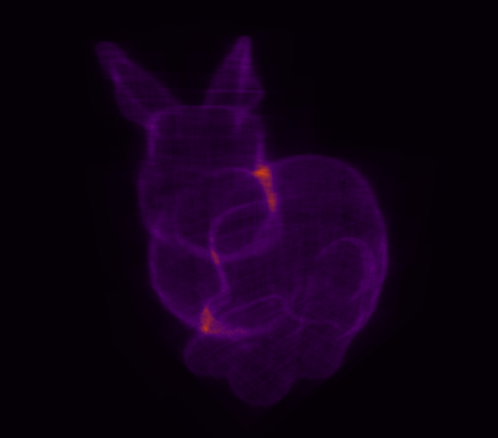
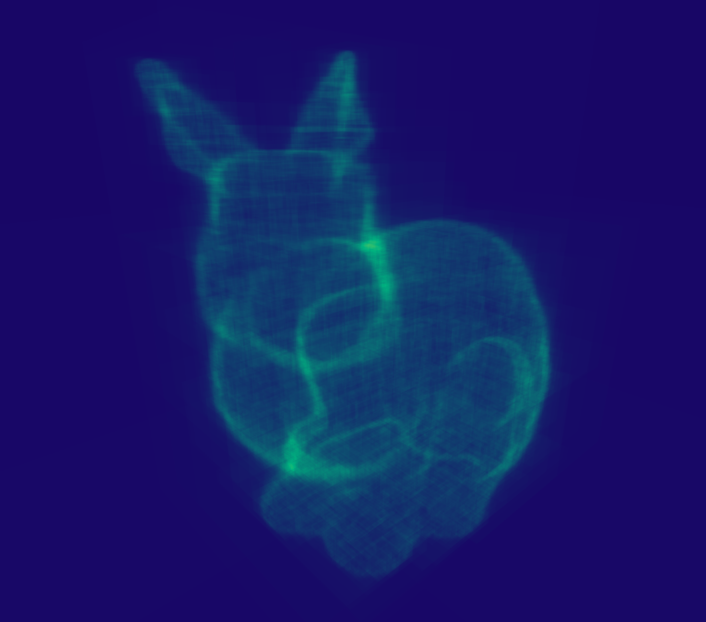
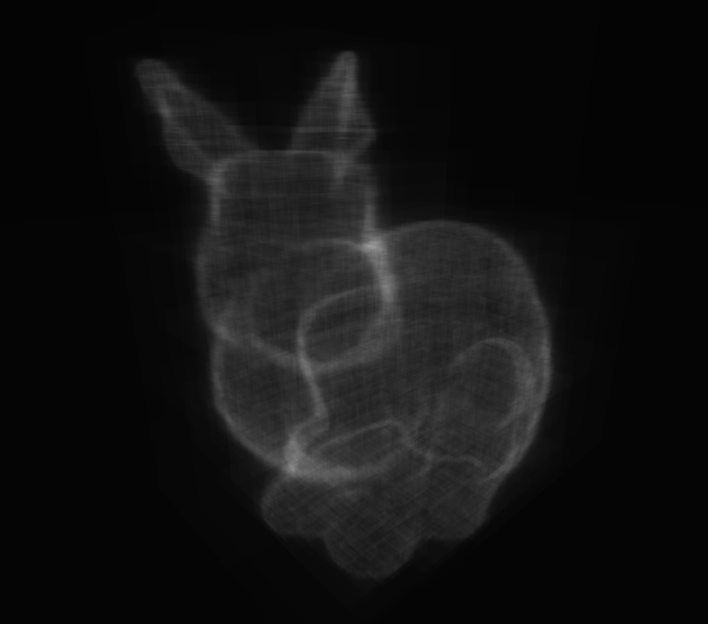
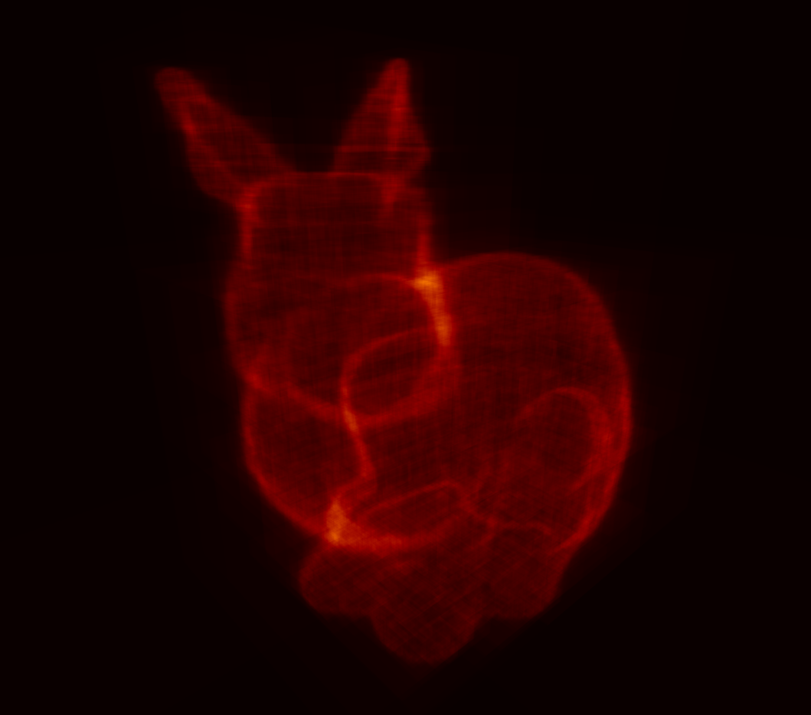

# Heat Map Mode (Index 5)

Heat map mode visualizes the **BVH traversal depth** per pixel as a color-coded heat map, exposing how deeply the BVH is traversed for each ray. This is a debugging tool for BVH performance and balance. Pixels with hit_depth <= 1 (no or trivial traversal) are left black. The `C` key cycles through color palettes interactively. Three BVH type variants dispatch to sphere, AABB, or OBB depth counting, adapting the heat map to whatever BVH shape is active.

*BVH heatmap in chess.rt with AABB and SAH*

## Normalization

The raw hit depth is normalized by $D_{\max}^2$: $v = \frac{d_{\text{hit}}}{D_{\max}^2}$. The `max_depth` is passed from the CPU side (`data->scene.bvh.world_bvh->max_depth`). Squaring the max depth compresses the heat range, making shallow traversals appear cooler.

## Color Palettes

Ten predefined palettes are available, selected by `color_offset % 10`. Each palette is defined as an array of color stops that are linearly interpolated (RGB lerp):

| ID | Name | Stops | Description |
|----|------|-------|-------------|
| 0 | Black -> White | 2 | Grayscale |
| 1 | Cool -> Warm | 4 | Dark blue -> cyan -> yellow -> red |
| 2 | Dark -> Gold | 4 | Black -> purple -> orange -> gold |
| 3 | Violet -> Teal -> Yellow | 3 | Deep purple -> teal -> bright yellow |
| 4 | Magenta -> Pink -> Gold | 3 | Purple -> pink -> yellow |
| 5 | Black -> Red -> Gold | 3 | Black -> dark red -> bright yellow |
| 6 | Deep Blue -> Cyan -> White | 3 | Navy -> cyan -> near-white |
| 7 | Black -> Red -> Orange -> White | 4 | Black -> deep red -> orange -> white |
| 8 | Black -> Green -> Lime | 3 | Black -> dark green -> bright green |
| 9 | Dark Gray -> Light Gray | 2 | Subtle grayscale |

<table cellpadding="0" cellspacing="0" border="0" style="border:none;">
<tr>
  <td></td>
  <td></td>
</tr>
<tr>
  <td></td>
  <td></td>
</tr>
</table>

*Heat map visualization of BVH traversal depth - BVH themes showing traversal depth color-coded across a sample of 4 different palette mappings.*
