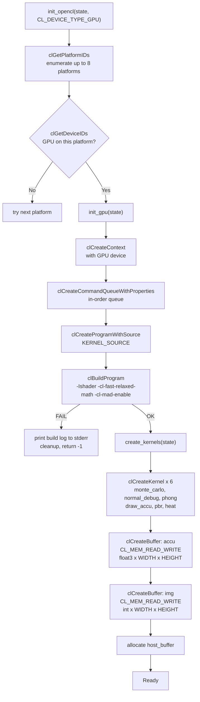

# OpenCL Integration

## Overview

miniRT uses OpenCL for all GPU-accelerated ray tracing. The host (C code) manages the OpenCL lifecycle - platform enumeration, device selection, kernel compilation, buffer management, and dispatch - while the device (OpenCL C kernels) executes the actual intersection and shading computations. The rendering pipeline is designed for progressive accumulation: each frame adds one sample per pixel to an accumulation buffer, which is then averaged and displayed.

The full OpenCL state is held in `t_opencl` (`include/minirt.h`, lines 94-104):

```c
typedef struct s_opencl
{
    cl_platform_id      platform;
    cl_device_id        device;
    cl_context          context;
    cl_command_queue    queue;
    cl_program          program;
    t_kernel            kernel;     // 6 kernels
    t_gpu_buffers       bu;         // accu (float3[]) + img (int[])
    unsigned char       *host_buffer;
}                       t_opencl;
```

*Diagram showing the relationship between the host (C code), OpenCL platform layer, and GPU device with kernels.*

---

## Initialization Flow



The initialization proceeds through several stages. First, **platform enumeration** uses `clGetPlatformIDs()` to find up to 8 OpenCL platforms, iterating until a platform provides a device matching `CL_DEVICE_TYPE_GPU`. Next, **device selection** calls `clGetDeviceIDs()` on each platform; the first platform with a matching device wins. Then **context and queue** creation uses `clCreateContext()` and `clCreateCommandQueueWithProperties()` with an in-order queue (kernels execute sequentially per frame). **Program compilation** calls `clBuildProgram()` with the embedded kernel source string and flags `-Ishader -cl-fast-relaxed-math -cl-mad-enable`; on failure the build log is retrieved via `clGetProgramBuildInfo()` and printed to stderr. **Kernel creation** calls `clCreateKernel()` for each of 6 kernels. Finally, **buffer allocation** creates the accumulation buffer (`float3 x WIDTH x HEIGHT`) and output image buffer (`int x WIDTH x HEIGHT`) as read-write GPU buffers.

---

## Kernel Source Embedding

The entire OpenCL kernel source is compiled into the binary as a C string literal. All `.cl` files are `#include`d into a single program using the OpenCL `#include` mechanism (which resolves relative to the `-I` include path):

```c
#define KERNEL_SOURCE \
"#include \"phong.cl\"\\n" \
"#include \"calc_rays.cl\"\\n" \
"#include \"draw_accu.cl\"\\n" \
"#include \"intersect.cl\"\\n" \
"#include \"phong_shading.cl\"\\n" \
"#include \"sample_texture.cl\"\\n" \
"#include \"pbr.cl\"\\n" \
"#include \"sample_materials.cl\"\\n" \
"#include \"random.cl\"\\n" \
"#include \"monte_carlo.cl\"\\n" \
"#include \"heat.cl\"\\n" \
"#include \"normal_debug.cl\"\\n"
```

This approach eliminates file I/O at runtime and avoids the need to ship external `.cl` files with the binary, using a single compilation unit where cross-file function calls are resolved at compile time. The trade-off is that the kernel source becomes part of the binary, increasing its size. All `.cl` files reside in `shader/` and include `shader/include/gpu.cl` for shared type definitions (`t_camera_gpu`, `t_ray_gpu`, `t_objects`, `t_mat_gpu`, `t_hit_gpu`, `t_hit_data`, etc.).

---

## The 6 Kernels

### 1. `phong` - Phong Shading

**Source:** `shader/phong.cl` | **Dispatch:** `phong_kernel.c`

For each pixel, casts one ray, finds the nearest hit via BVH, samples materials (textures + normal maps), and computes Phong shading (ambient + diffuse + specular + emissive) against all lights. Single-bounce shading.

### 2. `pbr` - Physically Based Rendering

**Source:** `shader/pbr.cl` | **Dispatch:** `pbr_kernel.c`

Multi-bounce ray tracing (up to `MAX_BOUNCE` = 4) with Fresnel reflection/refraction via `sample_refract()`, Schlick approximation, roughness-based Cook-Torrance glossy factor. Accumulates color through reflected rays with `through_power` attenuation. Supports refractive materials with Snell's law.

### 3. `monte_carlo` - Monte Carlo Path Tracing

**Source:** `shader/monte_carlo.cl` | **Dispatch:** `monte_carlo_kernel.c`

Full path tracing with GGX/Trowbridge-Reitz microfacet importance sampling (`sample_ggx_gpu`), chromatic dispersion (wavelength-dependent IOR via `get_ni_by_color`), emissive surfaces, and rainbow-colored refractions (`rainbow_color`). Each frame accumulates into the buffer for progressive denoising, up to `MAX_BOUNCE` (4) bounces.

### 4. `normal_debug` - Normal Visualization

**Source:** `shader/normal_debug.cl` | **Dispatch:** `normal_kernel.c`

Maps the shading normal to RGB: `img[pixel] = hit_data.normal * 0.5 + 0.5`. Normal maps are applied before visualization, so perturbed normals are visible.

### 5. `heat` - BVH Traversal Depth Heat Map

**Source:** `shader/heat.cl` | **Dispatch:** `heat_kernel.c`

Traverses the BVH counting the number of inner nodes intersected (stackless traversal with skip pointers). Maps the count to a color from one of 10 built-in palettes (2-4 gradient stops). The palette is cycled via the `C` key (which increments `color_offset`).

### 6. `draw_accu` - Accumulation Buffer to Image

**Source:** `shader/draw_accu.cl` | **Dispatch:** `accu_kernel.c`

Divides each pixel's accumulated `float3` color by `max(1.0f, sample_count)`, multiplies by 255, clamps to [0, 255], and packs into a 32-bit integer for minilibx display.

---

## NDRange Dispatch

Every kernel is dispatched with a 2D global work size equal to the screen dimensions. Each work item processes exactly one pixel, computing its position from `get_global_id(0)` and `get_global_id(1)`. The local work size is `NULL`, allowing OpenCL to pick it automatically based on device capabilities. No explicit work-group sizing is used.

---

## Accumulation Buffer Architecture

The project uses a two-buffer progressive accumulation scheme on the GPU. The **accu** buffer (`float3[]`, WIDTH x HEIGHT, `CL_MEM_READ_WRITE`) stores accumulated samples, while the **img** buffer (`int[]`, WIDTH x HEIGHT, `CL_MEM_READ_WRITE`) holds the normalized display output. On the host side, a **host_buffer** (`int[]`, WIDTH x HEIGHT) receives the GPU output and is copied into the minilibx image object via `mlx_put_data_addr` and `mlx_put_image_to_window`.

*Diagram showing how render kernels write to the accumulation buffer, which is normalized by draw_accu and read back to the host for display.*

### Flow per Frame

If the camera position, rotation, FOV, lens radius, or focus distance changed (`cam_has_moved()`), or if render parameters changed (`render_changed()`), the accumulation buffer is **zeroed out** (via `clEnqueueWriteBuffer` with zeros) and `camera.frame` is reset to 1. Then `camera.frame` increments and one of 5 GPU kernels runs, writing `float3` values into the accumulation buffer. The `draw_accu` kernel divides each pixel's accumulated value by `max(1.0f, frame x exposure)`, multiplies by 255, clamps, and writes to `img`. The `img` buffer is read back to the host via `clEnqueueReadBuffer`. The host buffer is copied into the minilibx image and displayed via `mlx_put_data_addr` and `mlx_put_image_to_window`.

The result is progressive rendering with exposure control. After N frames, each pixel has N samples and noise is reduced by $\sqrt{N}$. **Exposure** (controlled via F5/F6) acts as a multiplier on the final accumulated color through `sample_count = frame x exposure`, allowing brightening or darkening of the result without re-rendering.

---

## Host-to-GPU Data Transfer

Scene data is transferred to the GPU during scene loading via `clCreateBuffer` with `CL_MEM_READ_ONLY | CL_MEM_COPY_HOST_PTR`, which allocates GPU memory and copies the host data in a single call. The data categories transferred include BVH nodes (once on BVH build), sphere/triangle/plane arrays (once on scene load), the texture atlas (once on scene load), material arrays (once on scene load), and light arrays (once on scene load). All buffers use `CL_MEM_READ_ONLY` except the accumulation and image buffers which use `CL_MEM_READ_WRITE`.

The texture atlas is a single flat byte array containing all loaded texture pixels concatenated. Each `t_texture_data` struct (embedded in `t_mat_gpu`) contains an `offset` field pointing into this atlas, plus `width`, `height`, and `channels` for sampling.

---

## Render Frame Sequence

The main loop in `loop()` executes the following sequence every frame:


### Cumulative Rendering

The accumulation buffer is never cleared unless camera or render state changes. Frame 1 has 1 sample per pixel (noisy), frame 10 has 10 samples per pixel (reduced noise), and frame 100 has 100 samples per pixel (clean). When the camera moves, the buffer is cleared and accumulation restarts from 1 sample per pixel. This gives instant feedback when moving the camera while gradually converging to a noise-free image when stationary.