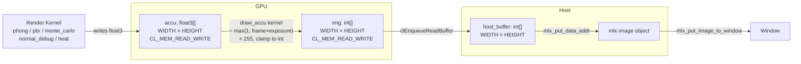
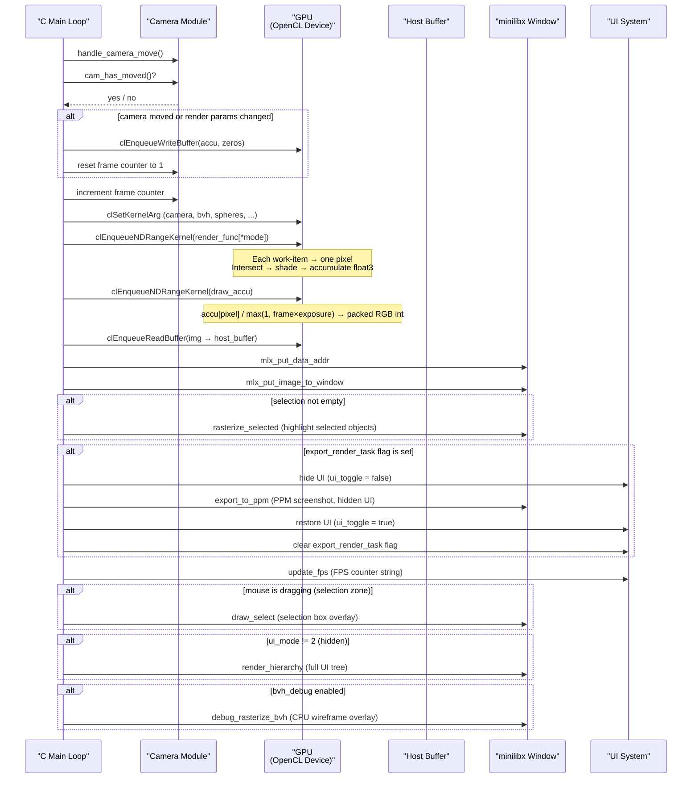

# OpenCL Integration

## Overview

miniRT uses OpenCL for all GPU-accelerated ray tracing. The host (C code)
manages the OpenCL lifecycle — platform enumeration, device selection, kernel
compilation, buffer management, and dispatch — while the device (OpenCL C
kernels) executes the actual intersection and shading computations. The
rendering pipeline is designed for progressive accumulation: each frame adds
one sample per pixel to an accumulation buffer, which is then averaged and
displayed.

The full OpenCL state is held in `t_opencl` (`include/minirt.h`, lines 94-104):

```c
typedef struct s_opencl
{
    cl_platform_id      platform;
    cl_device_id        device;
    cl_context          context;
    cl_command_queue    queue;
    cl_program          program;
    t_kernel            kernel;     // 6 kernels
    t_gpu_buffers       bu;         // accu (float3[]) + img (int[])
    unsigned char       *host_buffer;
}                       t_opencl;
```

---

## Initialization Flow


### Step-by-Step

1. **Platform enumeration:** `clGetPlatformIDs()` finds up to 8 OpenCL
   platforms. Iterates until a platform provides a device matching
   `CL_DEVICE_TYPE_GPU`.

2. **Device selection:** `clGetDeviceIDs()` on each platform. The first
   platform that has a matching device wins.

3. **Context and queue:** `clCreateContext()` and
   `clCreateCommandQueueWithProperties()` (in-order queue — kernels execute
   sequentially per frame).

4. **Program compilation:** `clBuildProgram()` with the embedded kernel
   source string and flags:
   ```
   -Ishader -cl-fast-relaxed-math -cl-mad-enable
   ```
   On failure, the build log is retrieved via `clGetProgramBuildInfo()` and
   printed to stderr.

5. **Kernel creation:** `clCreateKernel()` for each of 6 kernels (see table
   below).

6. **Buffer allocation:** The accumulation buffer (`float3 × WIDTH × HEIGHT`)
   and output image buffer (`int × WIDTH × HEIGHT`) are allocated as
   read-write GPU buffers.

---

## Kernel Source Embedding

The entire OpenCL kernel source is compiled into the binary as a C string
literal. All `.cl` files are `#include`d into a single program using the
OpenCL `#include` mechanism (which resolves relative to the `-I` include
path):

```c
#define KERNEL_SOURCE \
"#include \"phong.cl\"\\n" \
"#include \"calc_rays.cl\"\\n" \
"#include \"draw_accu.cl\"\\n" \
"#include \"intersect.cl\"\\n" \
"#include \"phong_shading.cl\"\\n" \
"#include \"sample_texture.cl\"\\n" \
"#include \"pbr.cl\"\\n" \
"#include \"sample_materials.cl\"\\n" \
"#include \"random.cl\"\\n" \
"#include \"monte_carlo.cl\"\\n" \
"#include \"heat.cl\"\\n" \
"#include \"normal_debug.cl\"\\n"
```

**Benefits:** No file I/O at runtime, no external `.cl` files to ship with
the binary, single compilation unit means cross-file function calls are
resolved at compile time.

**Trade-off:** The kernel source is part of the binary (increases size).

All `.cl` files reside in `shader/` and include `shader/include/gpu.cl` for
shared type definitions (`t_camera_gpu`, `t_ray_gpu`, `t_objects`,
`t_mat_gpu`, `t_hit_gpu`, `t_hit_data`, etc.).

---

## The 6 Kernels

### 1. `phong` — Phong Shading

**Source:** `shader/phong.cl` | **Dispatch:** `phong_kernel.c`

| # | Argument | Type | Description |
|---|----------|------|-------------|
| 0 | `cam` | `t_camera_gpu` | Camera state (position, rotation, viewport) |
| 1 | `bvh` | `__constant t_bvh_node_gpu *` | BVH node array |
| 2 | `bvh_type` | `int` | BVH shape: 0=sphere, 1=AABB, 2=OBB |
| 3 | `spheres` | `__constant t_sphere_gpu *` | Sphere array |
| 4 | `triangles` | `__constant t_triangle_gpu *` | Triangle array |
| 5 | `planes` | `__constant t_plane_gpu *` | Plane array |
| 6 | `planes_count` | `int` | Number of planes |
| 7 | `img` | `__global float3 *` | Accumulation buffer output |
| 8 | `textures` | `__constant uchar *` | Texture atlas byte array |
| 9 | `mats` | `__constant t_mat_gpu *` | Material array |
| 10 | `lights` | `__constant t_light_gpu *` | Light array |
| 11 | `lights_count` | `int` | Number of lights |
| 12 | `ambient` | `rgb3` | Ambient light color |

**Operation:** For each pixel, casts one ray, finds nearest hit via BVH,
samples materials (textures + normal maps), computes Phong shading
(ambient + diffuse + specular + emissive) against all lights. Single bounce.

### 2. `pbr` — Physically Based Rendering

**Source:** `shader/pbr.cl` | **Dispatch:** `pbr_kernel.c`

| # | Argument | Type | Description |
|---|----------|------|-------------|
| 0-11 | (same as phong) | | |
| 12 | `skybox` | `t_texture_data` | Skybox texture descriptor |
| 13 | `ambient` | `rgb3` | Ambient light color |

**Operation:** Multi-bounce ray tracing (up to `MAX_BOUNCE` = 4) with Fresnel
reflection/refraction via `sample_refract()`, Schlick approximation,
roughness-based Cook-Torrance glossy factor. Accumulates color through reflected
rays with `through_power`. Supports refractive materials with Snell's law.

### 3. `monte_carlo` — Monte Carlo Path Tracing

**Source:** `shader/monte_carlo.cl` | **Dispatch:** `monte_carlo_kernel.c`

| # | Argument | Type | Description |
|---|----------|------|-------------|
| 0-11 | (same as pbr, without ambient) | | |
| 12 | `skybox` | `t_texture_data` | Skybox texture descriptor |
| 13 | `random` | `int` | Random seed offset |

**Operation:** Full path tracing with GGX/Trowbridge-Reitz microfacet
importance sampling (`sample_ggx_gpu`), chromatic dispersion
(wavelength-dependent IOR via `get_ni_by_color`), emissive surfaces, and
rainbow-colored refractions (`rainbow_color`). Each frame accumulates into
the buffer for progressive denoising. Up to `MAX_BOUNCE` (4) bounces.

### 4. `normal_debug` — Normal Visualization

**Source:** `shader/normal_debug.cl` | **Dispatch:** `normal_kernel.c`

| # | Argument | Type | Description |
|---|----------|------|-------------|
| 0 | `cam` | `t_camera_gpu` | Camera state |
| 1 | `bvh` | `__constant t_bvh_node_gpu *` | BVH node array |
| 2 | `bvh_type` | `int` | BVH shape |
| 3 | `spheres` | `__constant t_sphere_gpu *` | Sphere array |
| 4 | `triangles` | `__constant t_triangle_gpu *` | Triangle array |
| 5 | `planes` | `__constant t_plane_gpu *` | Plane array |
| 6 | `planes_count` | `int` | Number of planes |
| 7 | `img` | `__global float3 *` | Accumulation buffer output |
| 8 | `textures` | `__constant uchar *` | Texture atlas |
| 9 | `mats` | `__constant t_mat_gpu *` | Material array |

**Operation:** Maps the shading normal to RGB: `img[pixel] = hit_data.normal * 0.5 + 0.5`.
Normal maps are applied before visualization, so perturbed normals are visible.

### 5. `heat` — BVH Traversal Depth Heat Map

**Source:** `shader/heat.cl` | **Dispatch:** `heat_kernel.c`

| # | Argument | Type | Description |
|---|----------|------|-------------|
| 0 | `cam` | `t_camera_gpu` | Camera state |
| 1 | `bvh` | `__constant t_bvh_node_gpu *` | BVH node array |
| 2 | `bvh_type` | `int` | BVH shape: 0=sphere, 1=AABB, 2=OBB |
| 3 | `img` | `__global float3 *` | Accumulation buffer output |
| 4 | `max_depth` | `int` | Maximum BVH depth |
| 5 | `color_offset` | `int` | Color palette index (0-9) |

**Operation:** Traverses the BVH counting the number of inner nodes
intersected (stackless traversal with skip pointers). Maps the count to a
color from one of 10 built-in palettes (2-4 gradient stops). The palette is
cycled via the `C` key (which increments `color_offset`).

### 6. `draw_accu` — Accumulation Buffer to Image

**Source:** `shader/draw_accu.cl` | **Dispatch:** `accu_kernel.c`

| # | Argument | Type | Description |
|---|----------|------|-------------|
| 0 | `accu` | `__global float3 *` | Accumulation buffer (input) |
| 1 | `img` | `__global int *` | Output image buffer (packed ARGB integer) |
| 2 | `sample_count` | `int` | `frame × exposure` for averaging |

**Operation:** Divides each pixel's accumulated `float3` color by
`max(1.0f, sample_count)`, multiplies by 255, clamps to [0, 255], and packs
into a 32-bit integer for minilibx display.

```c
accu_divide = (accu[pixel] / (max(1.0f, (float) sample_count))) * 255.0f;
color.r = accu_divide[0];  // uchar
color.g = accu_divide[1];
color.b = accu_divide[2];
img[pixel] = color.rgb;    // packed int (little-endian: B, G, R, unused)
```

---

## NDRange Dispatch

Every kernel is dispatched with a 2D global work size equal to the screen
dimensions:

```c
const size_t global_size[2] = {img->width, img->height};
clEnqueueNDRangeKernel(cl_state->queue, cl_state->kernel.monte_carlo,
    2, NULL, global_size, NULL, 0, NULL, NULL);
```

Each work item processes exactly one pixel:

```c
pos.x = get_global_id(0);
pos.y = get_global_id(1);
pixel = pos.y * get_global_size(0) + pos.x;
```

The local work size is `NULL` (OpenCL picks it automatically based on device
capabilities). No explicit work-group sizing is used.

---

## Accumulation Buffer Architecture

The project uses a two-buffer progressive accumulation scheme on the GPU:



### Flow per Frame

1. **Movement/render check:** If camera position, rotation, FOV, lens radius,
   or focus distance changed (`cam_has_moved()`), or if render parameters
   changed (`render_changed()`), the accumulation buffer is **zeroed out**
   (via `clEnqueueWriteBuffer` with zeros) and `camera.frame` is reset to 1.

2. **Increment frame:** `camera.frame++` — tracks the number of accumulated
   samples.

3. **Render kernel:** One of 5 GPU kernels runs, writing `float3` values into
   the accumulation buffer (`accu`). Each frame adds one more sample per pixel.

4. **Accumulation kernel:** `draw_accu` divides each pixel's accumulated
   value by `max(1.0f, frame × exposure)`, multiplies by 255, clamps, and
   writes to `img` (packed integer).

5. **Readback:** `clEnqueueReadBuffer` reads `img` into `host_buffer`.

6. **Display:** The host buffer is copied into the minilibx image and
   displayed via `mlx_put_data_addr` and `mlx_put_image_to_window`.

The result: progressive rendering with exposure control. After N frames,
each pixel has N samples and noise is reduced by √N.
**Exposure** (controlled via F5/F6) acts as a multiplier on the final
accumulated color through `sample_count = frame × exposure`, allowing
brightening or darkening of the result without re-rendering.

---

## Host-to-GPU Data Transfer

Scene data is transferred to the GPU during scene loading via
`clCreateBuffer` with `CL_MEM_READ_ONLY | CL_MEM_COPY_HOST_PTR`, which
allocates GPU memory and copies the host data in a single call:

```c
cl_mem buffer = clCreateBuffer(context, CL_MEM_READ_ONLY | CL_MEM_COPY_HOST_PTR,
    size, host_ptr, &err);
```

### Data Categories

| Data | GPU Memory | Size | Frequency |
|------|------------|------|-----------|
| BVH nodes | `__constant t_bvh_node_gpu *` | `sizeof(t_bvh_node_gpu) × node_count` | Once (BVH build) |
| Sphere array | `__constant t_sphere_gpu *` | `sizeof(t_sphere_gpu) × count` | Once (scene load) |
| Triangle array | `__constant t_triangle_gpu *` | `sizeof(t_triangle_gpu) × count` | Once (scene load) |
| Plane array | `__constant t_plane_gpu *` | `sizeof(t_plane_gpu) × count` | Once (scene load) |
| Texture atlas | `__constant uchar *` | total texture byte size | Once (scene load) |
| Material array | `__constant t_mat_gpu *` | `sizeof(t_mat_gpu) × count` | Once (scene load) |
| Light array | `__constant t_light_gpu *` | `sizeof(t_light_gpu) × count` | Once (scene load) |

All buffers use `CL_MEM_READ_ONLY` except the accumulation and image buffers
which use `CL_MEM_READ_WRITE`.

The texture atlas is a single flat byte array containing all loaded texture
pixels concatenated. Each `t_texture_data` struct (embedded in `t_mat_gpu`)
contains an `offset` field pointing into this atlas, plus `width`, `height`,
and `channels` for sampling.

---

## Render Frame Sequence

The main loop in `loop()` executes the following sequence every frame:



### Cumulative Rendering

The accumulation buffer is never cleared unless camera/render state changes.
This means:

- **Frame 1:** 1 sample/pixel (noisy)
- **Frame 10:** 10 samples/pixel (reduced noise)
- **Frame 100:** 100 samples/pixel (clean)
- **Camera move:** Buffer cleared, restart from 1 sample/pixel

This gives instant feedback when moving the camera while gradually converging
to a noise-free image when stationary.