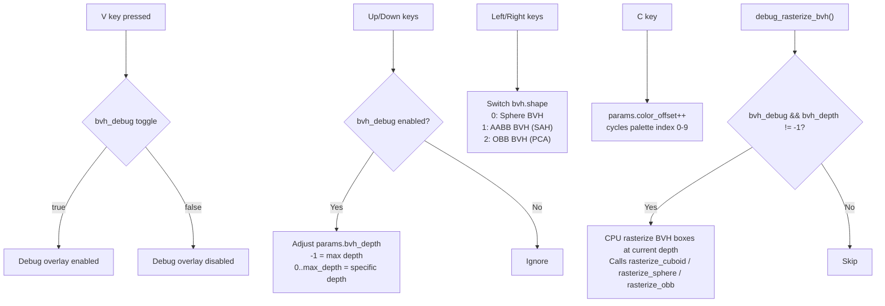

# Camera and Interaction

## Overview

miniRT provides a full 6-degree-of-freedom camera with Euler-angle rotation,
a configurable viewport, thin-lens depth of field, and real-time exposure
control. The camera state is held in `t_camera` (`include/render.h`,
lines 26-39):

```c
typedef struct s_camera
{
    cl_float3   pos;            // World-space position
    cl_float3   rot;            // Euler angles: yaw (y), pitch (x), roll (z)
    cl_float3   camera_forward; // Orthonormal basis: forward vector
    cl_float3   camera_right;   // Orthonormal basis: right vector
    cl_float3   camera_up;      // Orthonormal basis: up vector
    cl_float3   pixel_delta_u;  // Viewport: horizontal pixel step
    cl_float3   pixel_delta_v;  // Viewport: vertical pixel step
    cl_float3   pixel00_loc;    // Viewport: top-left pixel world position
    cl_int      fov;            // Field of view in degrees
    cl_int      frame;          // Accumulation frame counter
    cl_float    lens_radius;    // DOF: aperture radius (0 = pinhole)
    cl_float    focus_dist;     // DOF: focal plane distance
}               t_camera;
```

---

## Camera Model: Euler Angles

The camera uses **yaw-pitch-roll** Euler angles stored in `rot`:
- `rot.y` — **Yaw** (left/right rotation around Y axis)
- `rot.x` — **Pitch** (up/down rotation around X axis)
- `rot.z` — **Roll** (tilt around forward axis)

### Forward/Rotation Calculation

`apply_yaw_and_pitch()` in `camera_utils.c` computes the orthonormal basis
from Euler angles:

```c
cam->camera_forward = (t_vec3){{
    sinf(cam->rot.y) * cosf(cam->rot.x),
    sinf(cam->rot.x),
    cosf(cam->rot.y) * cosf(cam->rot.x)
}};
```

The **right** and **up** vectors are derived from yaw-only for the horizontal
basis, then roll-rotated around the forward axis:

```c
temp_right = (t_vec3){{cosf(cam->rot.y), 0, -sinf(cam->rot.y)}};
temp_up = (t_vec3){{
    -sinf(cam->rot.y) * sinf(cam->rot.x),
    cosf(cam->rot.x),
    cosf(cam->rot.y) * -sinf(cam->rot.x)
}};

// Apply roll: rotate right/up by rot.z around forward
cam->camera_right.x = temp_right.x * cosf(cam->rot.z) - temp_up.x * sinf(cam->rot.z);
cam->camera_up = vec3_add(vec3_scale(temp_right, sinf(cam->rot.z)),
                           vec3_scale(temp_up, cosf(cam->rot.z)));
```

### Viewport

`fill_camera()` recomputes the viewport whenever the camera or image
dimensions change:

```
viewport_height = 2.0 × tan(FOV × π / 180 / 2.0)
viewport_width = viewport_height × (width / height)
```

The viewport is centered on the forward axis at unit distance from the
camera position. `pixel00_loc` is the world-space coordinate of the
top-left pixel (accounting for half-pixel offset).

---

## Depth of Field (Thin Lens Approximation)

The GPU ray generation in `calc_rays.cl` implements a thin-lens DOF model:

```c
jx = randomf(rng) - 0.5f;          // Sub-pixel jitter (antialiasing)
jy = randomf(rng) - 0.5f;
x_offset = cam->pixel_delta_u * ((float)pos.x + jx);
y_offset = cam->pixel_delta_v * ((float)pos.y + jy);
pixel_center = cam->pixel00_loc + x_offset + y_offset;
ray.dir = normalize(pixel_center - cam->pos);
focal_point = cam->pos + ray.dir * cam->focus_dist;

disk = random_in_unit_disk(rng) * cam->lens_radius;  // Lens sampling
lens_offset = cam->camera_right * disk.x + cam->camera_up * disk.y;
ray.origin = cam->pos + lens_offset;
ray.dir = normalize(focal_point - ray.origin);
```

- **`focus_dist`** controls the distance at which objects are perfectly in
  focus. Objects at this distance have zero circle of confusion. Adjusted via
  `T` (increase ×1.05) and `G` (decrease ÷1.05). Range: [0.2, 10000].
- **`lens_radius`** controls the aperture size. Larger values produce a
  shallower depth of field (more blur). Adjusted via `Y` (increase ×1.05)
  and `H` (decrease ÷1.05). Range: [0.0, 0.5].
- When `lens_radius = 0`, the camera acts as a perfect pinhole (no DOF).

---

## Exposure Control

**New in this version:** Real-time exposure control via `F5` / `F6`.

```
F5: exposure *= 1.3   (brighten)
F6: exposure /= 1.3   (darken)
```

Exposure is stored as `data->params.exposure` (a `float`). It is applied in
`draw_accu` kernel:

```c
int sample = data->scene.camera.frame * data->params.exposure;
```

The exposure multiplier is baked into the `sample_count` divisor: higher
exposure → smaller divisor → brighter image. This is purely a post-process
multiplier on the accumulation buffer — it requires no re-rendering.

Default exposure is `1.0`.

---

## Movement Speed

Movement speed in `camera_move.c`:

```c
#define MOVE_SPEED 5
#define RUN_SPEED 5
const float step = MOVE_SPEED * (1 + RUN_SPEED * ctrl) * delta_time;
```

- Base speed: 5 units/second
- Holding **Ctrl** doubles the speed: `1 + RUN_SPEED * ctrl` → 6× base when
  `ctrl=1`, but since `RUN_SPEED=5`, the multiplier becomes `1 + 5 = 6`.
- Roll sensitivity: `0.03` radians per frame
- Mouse look sensitivity: `0.003` radians per pixel movement

---

## Complete Key Binding Table

### Camera Movement

| Key | Action |
|-----|--------|
| `W` | Move forward (in horizontal look direction) |
| `S` | Move backward |
| `A` | Move left (strafe) |
| `D` | Move right (strafe) |
| `Space` | Move up (world Y) |
| `Shift` | Move down (world Y) |
| `Ctrl` (held) | Double movement speed |
| `Q` | Roll left (counter-clockwise) |
| `E` | Roll right (clockwise) |
| Mouse (when focused) | Yaw / pitch look |

### Depth of Field

| Key | Action |
|-----|--------|
| `T` | Increase focus distance (×1.05) |
| `G` | Decrease focus distance (÷1.05) |
| `Y` | Increase lens radius / aperture (×1.05) |
| `H` | Decrease lens radius / aperture (÷1.05) |

### Render Mode

| Key | Mode |
|-----|------|
| `1` | Wireframe (CPU rasterized debug view) |
| `2` | Phong (GPU: ambient + diffuse + specular + emissive) |
| `3` | PBR (GPU: Fresnel, reflection, refraction, bounces) |
| `4` | Monte Carlo (GPU: path tracing, GGX, dispersion) |
| `-` | Normal Debug (GPU: surface normals → RGB) |
| `=` | Heat Map (GPU: BVH traversal depth heat map) |

### BVH Debug

| Key | Action |
|-----|--------|
| `V` | Toggle BVH debug overlay (bounding box wireframe visualization) |
| `Up` | Increase displayed BVH depth (fewer, shallower boxes) |
| `Down` | Decrease displayed BVH depth (more, deeper boxes) |
| `Left` | Switch to previous BVH mode (sphere → AABB → OBB cycle) |
| `Right` | Switch to next BVH mode (sphere → AABB → OBB cycle) |
| `C` | Cycle BVH heat map color palette offset (0-9) |

### UI / Display

| Key | Action |
|-----|--------|
| `M` | Cycle UI mode: full UI → minimal (render switch only) → hidden |
| `K` | Toggle mouse focus (confine pointer to window for look) |
| `F5` | Increase exposure (×1.3) |
| `F6` | Decrease exposure (÷1.3) |
| `F11` | Export current scene to `.rt` file |
| `F12` | Schedule render task (hides UI, renders clean frame, exports PPM) |

### Summary Table (all 27+ keys)

| Key | Category | Action |
|-----|----------|--------|
| `W` | Movement | Forward |
| `S` | Movement | Backward |
| `A` | Movement | Left strafe |
| `D` | Movement | Right strafe |
| `Space` | Movement | Up (world Y) |
| `Shift` | Movement | Down (world Y) |
| `Ctrl` | Movement | Speed boost (×6) |
| `Q` | Movement | Roll left |
| `E` | Movement | Roll right |
| `Mouse` | Look | Yaw/pitch |
| `T` | DOF | ↑ Focus distance |
| `G` | DOF | ↓ Focus distance |
| `Y` | DOF | ↑ Lens radius |
| `H` | DOF | ↓ Lens radius |
| `1` | Render | Wireframe |
| `2` | Render | Phong |
| `3` | Render | PBR |
| `4` | Render | Monte Carlo |
| `-` | Render | Normal Debug |
| `=` | Render | Heat Map |
| `V` | BVH Debug | Toggle overlay |
| `Up` | BVH Debug | ↑ Depth |
| `Down` | BVH Debug | ↓ Depth |
| `Left` | BVH Debug | Prev mode |
| `Right` | BVH Debug | Next mode |
| `C` | BVH Debug | Cycle palette |
| `M` | UI | Cycle UI mode |
| `K` | UI | Toggle mouse focus |
| `F5` | Exposure | Increase |
| `F6` | Exposure | Decrease |
| `F11` | Export | Scene to `.rt` |
| `F12` | Export | Render task (PPM screenshot) |

---

## Mouse Look

Mouse look is implemented in `mouse_hooks.c`:

1. `cam_move()` is called on every mouse move event.
2. It computes `delta_pos = current_pos - last_pos`.
3. If `mouse_input.focus` is `true`, `handle_camera_rotation()` is called.

```c
void handle_camera_rotation(t_data *data, int delta_x, int delta_y)
{
    cam->rot.y -= delta_x * SENSITIVITY;  // Yaw
    // Wrap yaw to [-π, π]
    cam->rot.x += delta_y * SENSITIVITY;  // Pitch
    // Clamp pitch to ±MAX_PITCH (~88.2°)
}
```

- **SENSITIVITY** = 0.003
- **MAX_PITCH** ≈ 1.53938 rad ≈ 88.2° (prevents gimbal lock at zenith)
- **Roll** via Q/E is applied in the rotation handler, not from mouse.

Mouse focus is toggled via `K`. When focused, the pointer is confined to the
window (XTEST extension).

---

## BVH Debug Controls

The BVH debug system (`params_hooks1.c`, `params_hooks3.c`) provides
real-time visualization of the acceleration structure:



The CPU-side `debug_rasterize_bvh()` rasterizes bounding boxes at the
currently selected depth level using the camera projection
(`project_point()`). Colors are either the heat map palette or a simple
white outline depending on configuration.

---

## UI Mode Toggle (M key)

The `ui_mode()` function in `params_hooks2.c` cycles through three states:

```
ui_mode = (ui_mode + 1) % 3
```

| Mode | `ui_mode` | Description |
|------|-----------|-------------|
| **Full UI** | 0 | Left panel (scene list + editor) + render switch + on-display info |
| **Minimal** | 1 | Only render switch icons (top-right). `lpannel_toggle = false` |
| **Hidden** | 2 | All UI hidden. `ui_toggle = false` (body not rendered) |

When switching back to Full UI from Minimal, the render switch position is
recalculated to account for the left panel width.