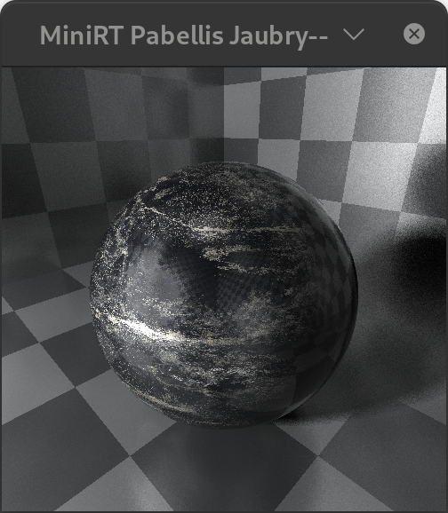
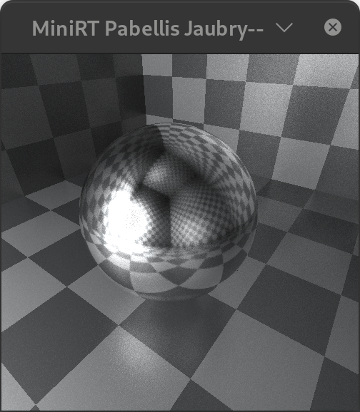
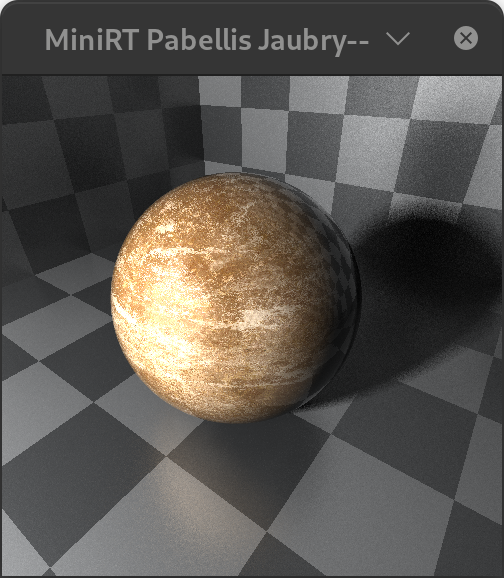
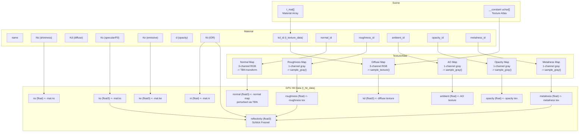

# Materials and Textures

## Overview

miniRT supports a full PBR material system with 6 texture map types, a flat texture atlas for GPU access, per-pixel normal mapping with TBN transforms, and both 3-channel (RGB) and 1-channel (grayscale) texture sampling on the GPU.

---

## Material Properties

Each material (`t_mat` in `object.h`, mirrored as `t_mat_gpu` on the GPU) holds a name, diffuse color (kd), specular color (ks), emissive color (ke), shininess exponent (ns), opacity, and index of refraction (ni). Up to 6 texture map IDs can be assigned: diffuse/albedo, normal, roughness, ambient occlusion, opacity, and metalness.

### PBR Properties

| Field | MTL Equivalent | Description |
|---|---|---|
| `Ns` | `Ns` | Specular exponent (shininess). Range [0, infinity). Higher = sharper highlights. |
| `Kd` | `Kd` | Diffuse albedo (base color). Used as the diffuse reflectance. |
| `Ks` | `Ks` | Specular color / F0. For metals, this is the reflectance color. |
| `Ke` | `Ke` | Emissive color. Non-zero means the surface acts as a light source. |
| `Pr` | (via roughness map) | **Roughness** - sampled from `roughness_id` texture. Controls microfacet distribution spread. |
| `Pm` | (via metalness map) | **Metalness** - sampled from `metalness_id` texture. Blends between dielectric and metallic F0. |
| `Ni` | `Ni` | Index of refraction. Used for Fresnel (dielectric F0) and Snell's law refraction. |
| `d` | `d` | Opacity (dissolve). 1.0 = fully opaque, 0.0 = fully transparent. |
| `Ka` | `Ka` | Ambient color - sampled from `ambient_id` as grayscale AO factor. |

### GPU-Side Material Sampling

The GPU kernel `sample_materials()` in `shader/sample_materials.cl` assembles a `t_hit_data` struct from the material and textures at the hit point. It samples the diffuse color and ambient occlusion from texture maps, copies the specular color, emissive color, and shininess from the material, applies normal map perturbation via TBN transform, samples PBR texture maps (metalness, roughness, opacity), and computes Fresnel reflectance using the Schlick approximation.

---

## Texture Map Types

miniRT supports **6 texture map types** per material. Each map is an optional `t_texture_data` descriptor pointing into the global texture atlas.

| Map | Channels | Sampling Function | Usage |
|---|---|---|---|
| `kd_id` | 3 (RGB) | `sample_texture()` | Diffuse/albedo color |
| `normal_id` | 3 (RGB) | `sample_texture()` + TBN | Normal perturbation |
| `roughness_id` | 1 (grayscale) | `sample_gray_level_texture()` | Roughness [0,1] |
| `ambient_id` | 1 (grayscale) | `sample_gray_level_texture()` | Ambient occlusion [0,1] |
| `opacity_id` | 1 (grayscale) | `sample_gray_level_texture()` | Opacity mask [0,1] |
| `metalness_id` | 1 (grayscale) | `sample_gray_level_texture()` | Metalness [0,1] |

---

## Texture Atlas

All loaded textures are concatenated into a single flat byte array (`__constant uchar *textures` on the GPU) called the **texture atlas**. Each texture is described by a `t_texture_data` struct containing an index, byte offset into the atlas, width, height, and number of channels.

<table cellpadding="0" cellspacing="0" border="0" style="border:none;">
<tr><td></td><td></td><td></td></tr>
</table>

*Sample material renders showing different PBR surface properties - metallic, dielectric, and textured materials.*

### Per-Pixel Sampling (GPU)

**RGB texture sampling** (`sample_texture.cl`) computes the pixel position from UV coordinates and the texture dimensions, then reads 3 consecutive bytes (R, G, B) from the atlas at the calculated offset, returning them as a normalized float3 in [0, 1].

**Grayscale texture sampling** (`sample_gray_level_texture`) follows the same approach but reads a single byte (no channels multiplier), returning it as a normalized float in [0, 1].

---

## Normal Map TBN Transform

Normal maps store normals in tangent space. The GPU applies a tangent-bitangent-normal (TBN) transform to convert them to world space. The tangent is computed from a reference up vector (Y or X if the normal is near-vertical), and the bitangent is computed as `cross(normal, tangent)`. The normal map sample is uncompressed from [0, 1] to [-1, 1] and combined with the tangent, negated bitangent, and normal vectors. The Y component of the normal map is negated to account for the OpenGL convention (where V texture coordinate increases downward, opposite of the math convention).

---

## Material Diagrams

*Complete flowchart from MTL file parsing through GPU-side material sampling and Fresnel computation.*

---

## Fresnel (F0) Calculation

The `get_f0()` function computes the Fresnel reflectance at normal incidence (F0), blending between dielectric and metallic behavior. For dielectrics (metalness = 0), F0 is a scalar computed from IOR: F0 = ((eta - 1) / (eta + 1))^2 (for glass with IOR ~ 1.5, F0 ~ 0.04). For metals (metalness = 1), F0 is the specular color (`ks`), which is the actual reflectance color of the metal (e.g., gold gives a yellowish tint). For mixed materials, linear interpolation is used between the two.

---

## Reflectivity (Glossy Factor)

The Schlick approximation computes Fresnel reflectance as a function of viewing angle: F(theta) = F0 + (1 - F0) * (1 - cos(theta))^5, with cos(theta) = |D.N|. The result is modulated by roughness (smoother surfaces are more reflective) via `glossy_factor = 1.0f - (roughness * roughness)`. The final reflectivity is `fresnel * glossy_factor`, clamped to [0, 1].

---

## Refraction (Snell's Law)

The `refract()` function in `sample_materials.cl` handles refraction using the vector form of Snell's law. It computes the refracted direction from the incident ray direction, surface normal, and IOR ratio eta = eta1 / eta2. The function handles both entering (IOR ratio = 1/ni) and exiting (IOR ratio = ni) a refractive material. Total internal reflection is detected when 1 - eta^2 * (1 - cos^2(theta_i)) < 0. In Monte Carlo mode, chromatic dispersion is added via `get_ni_by_color()`, which perturbs the IOR based on the hue of the accumulated light, producing rainbow-like caustics.