# UI System

## Overview


*Screenshot of the miniRT UI showing the left panel with scene hierarchy list, object selection in the viewport, and edit panels.*

miniRT features a full hierarchical UI system built on top of the **mlxui** library, a custom minilibx UI toolkit. The UI provides a **scene hierarchy list** (left panel) showing all objects, lights, and the camera; **edit panels** for modifying object geometry, materials, and render settings in real time; **on-display information** including an FPS counter, info text, and render mode switch buttons with logos; a **selection system** via click, drag (rubber-band), and scene list interaction; a **color theme** with a customizable Material Design-like palette; and **TTF font rendering** via the custom `font_renderer` library.

The UI is built from a **hierarchical tree** (`t_htree`) of **branches** (`t_hbranch`), where each branch is a UI component (box, button, textbox, slider, colorpicker, etc.). The tree is populated once during initialization and rebuilt dynamically when the selection or edit mode changes.

*Annotated screenshot of the miniRT UI showing the left panel, scene list, edit panel, render mode switch, and FPS counter.*

---

## The `t_ui` Struct

Defined in `include/ui/ui.h` (lines 52-82):

```c
typedef struct s_ui
{
    t_htree         htree;              // Root UI tree (holds style + refs)
    t_selection     selection;          // Object selection state
    int             lpannel_width;      // Left panel width (WIDTH / 5)
    int             scene_height;       // Scene list height (HEIGHT / 4)
    int             lpannel_switch_height;  // Switch tab height (35 px)
    int             lpannel_edit_height;    // Edit panel height (remaining)
    bool            export_render_task;     // F12 flag

    t_hbranch       *edit_pannel;       // Edit panel container
    union {
        t_hbranch   *inner_edit;        // Inner edit (obj or render)
        t_hbranch   *obj_edit;
        t_hbranch   *bvh_edit;          // (unused, reserved)
        t_hbranch   *render_edit;
    };
    int             *edit_mode;         // 0 = OBJ_EDIT_MODE, 1 = RENDER_EDIT_MODE

    t_hbranch       *lpannel_switch;    // Tab switch bar
    t_hbranch       *render_switch;     // Render mode button group (top-right)

    char            *fps_buffer;        // FPS text buffer
    char            *info_buffer;       // Info display text buffer

    t_scene_entry   scene_entries[MAX_SCENE_ENTRIES]; // Scene list entries (max 50)

    bool            *lpannel_toggle;    // Left panel visibility
    bool            *ui_toggle;         // Full UI visibility
}                   t_ui;
```

---

## UI Hierarchy Tree

```mermaid
flowchart TD
    ROOT["t_htree (body)<br/>BOX / anchor=LT<br/>size = screen<br/>rendered = ui_toggle"]
    
    subgraph "On-Display Layer"
        FPS["FPS Counter<br/>TEXTBOX / anchor=LT<br/>font_size=4 / YELLOW"]
        RENDER_SW["Render Switch<br/>BUTTON_GROUP / anchor=RT<br/>GROUP_HORZ / GROUP_SWITCH"]
        RS_0["Button 0: Wireframe<br/>PAM logo: wireframe-logo.pam"]
        RS_1["Button 1: Phong<br/>PAM logo: phong-logo.pam"]
        RS_2["Button 2: PBR<br/>PAM logo: pbr-logo.pam"]
        RS_3["Button 3: Monte Carlo<br/>PAM logo: monte-carlo-logo.pam"]
        INFO["Info Display<br/>TEXTBOX / anchor=LT<br/>(pos=50,240) / opacity=15<br/>font_size=2"]
    end
    
    subgraph "Left Panel (lpannel)"
        LPANNEL["Left Panel<br/>BOX / anchor=RT<br/>width = WIDTH/5<br/>rendered = lpannel_toggle"]
        
        SCENE_LIST["Scene List<br/>(scrollable)"]
        SL_CAM["Camera entry"]
        SL_LIGHTS["Light entries<br/>-> add_light_entry()"]
        SL_OBJS["Object entries<br/>-> add_obj_entry()"]
        
        LP_SWITCH["LPannel Switch<br/>BUTTON_GROUP<br/>GROUP_HORZ / GROUP_SWITCH"]
        LP_SW_OBJ["Button: Object Edit"]
        LP_SW_REND["Button: Render Options"]
        
        EDIT_PANNEL["Edit Panel<br/>BOX / rounded<br/>scrollable"]
        
        subgraph "Object Edit Mode"
            OBJ_EDIT["Object Edit<br/>(rebuilt on selection change)"]
            GEOM["Geometry Block<br/>-> populate_obj_geometry()<br/>-> populate_sphere_geometry()<br/>-> populate_plane_geometry()"]
            MAT_EDIT["Material Edit Block<br/>-> populate_mat_edit()"]
            MAT_KD["Kd (diffuse) -> colorpicker"]
            MAT_KS["Ks (specular) -> colorpicker"]
            MAT_KE["Ke (emissive) -> colorpicker"]
            MAT_NS["Ns -> slider [0,1000]"]
            MAT_NI["Ni -> slider [1,3]"]
            MAT_D["d (opacity) -> slider [0,1]"]
            MAT_PM["Pm (metalness) -> slider [0,1]"]
            MAT_PR["Pr (roughness) -> slider [0,1]"]
            MAT_KA["Ka (ambient) -> slider [0,1]"]
            MAT_TEX["Texture pickers per map type"]
        end
        
        subgraph "Render Edit Mode"
            RENDER_EDIT["Render Options"]
            CAM_PARAMS["Camera Params Block<br/>pos.x, pos.y, pos.z<br/>rot.x, rot.y, rot.z<br/>FOV -> slider<br/>focus_dist -> slider<br/>lens_radius -> slider<br/>exposure -> slider"]
            EXPORT_BLOCK["Export Block"]
            EXPORT_SCENE_BTN["Button: Export Scene (F11)"]
            EXPORT_IMG_BTN["Button: Export Image (F12)"]
        end
    end
    
    ROOT --> FPS
    ROOT --> RENDER_SW
    RENDER_SW --> RS_0
    RENDER_SW --> RS_1
    RENDER_SW --> RS_2
    RENDER_SW --> RS_3
    ROOT --> INFO
    ROOT --> LPANNEL
    
    LPANNEL --> SCENE_LIST
    SCENE_LIST --> SL_CAM
    SCENE_LIST --> SL_LIGHTS
    SCENE_LIST --> SL_OBJS
    
    LPANNEL --> LP_SWITCH
    LP_SWITCH --> LP_SW_OBJ
    LP_SWITCH --> LP_SW_REND
    
    LPANNEL --> EDIT_PANNEL
    
    EDIT_PANNEL --> OBJ_EDIT
    OBJ_EDIT --> GEOM
    OBJ_EDIT --> MAT_EDIT
    MAT_EDIT --> MAT_KD
    MAT_EDIT --> MAT_KS
    MAT_EDIT --> MAT_KE
    MAT_EDIT --> MAT_NS
    MAT_EDIT --> MAT_NI
    MAT_EDIT --> MAT_D
    MAT_EDIT --> MAT_PM
    MAT_EDIT --> MAT_PR
    MAT_EDIT --> MAT_KA
    MAT_EDIT --> MAT_TEX
    
    EDIT_PANNEL --> RENDER_EDIT
    RENDER_EDIT --> CAM_PARAMS
    RENDER_EDIT --> EXPORT_BLOCK
    EXPORT_BLOCK --> EXPORT_SCENE_BTN
    EXPORT_BLOCK --> EXPORT_IMG_BTN
```



---

## Edit Panels

*Close-up screenshot of the edit panel showing the material block with sliders (Ns, Ni, d, Pm, Pr, Ka), color pickers (Kd, Ks, Ke), and texture map selectors for each PBR channel.*

The left panel's edit section uses a **block-based** layout system defined in `include/ui/edit_pannel/blocks.h`.

### Block Types

| Block Type | Header | Constructor | Description |
|---|--------|-------------|-------------|
| **Base** (block title) | `add_block_title()` | Adds a titled section with background card |
| **Form** | `add_form_block()` | Container for float/vec3 form entries |
| **Slider** | `add_slider_edit()` | Slider with min/max range, linear or non-linear |
| **Slider (grayscale)** | `add_grayscale_edit()` | Grayscale-only slider (1-channel) |
| **Colorpicker** | `add_color_edit()` | RGB color picker with sliders |
| **Texture picker** | `add_texture_edit()` | Texture selector for a specific map slot |

### Edit Modes

The edit panel has two modes, toggled by the lpannel switch tabs.

#### Object Edit Mode (`OBJ_EDIT_MODE = 0`)

This mode is rebuilt via `rebuild_obj_edit()` when the selection changes. It contains an **object title** (name + type), a **geometry block** with Position (vec3), rotation (vec3), and type-specific fields (radius for spheres, normal for planes, etc.), and a **material block** with all PBR properties using sliders and colorpickers, plus texture map selectors per channel (kd, normal, roughness, ambient, opacity, metalness).

#### Render Edit Mode (`RENDER_EDIT_MODE = 1`)

This mode contains **camera parameters** (Position, rotation, FOV, focus distance, lens radius, exposure - all with sliders) and an **export block** with two buttons: "Export Scene" (F11, writes `.rt` file) and "Export Image" (F12, schedules render task for PPM output).

### Dynamic Rebuild

*Animated GIF showing the left panel switching between Object Edit and Render Edit modes.*

When the user clicks a different edit mode tab, `rebuild_inner_edit()` is called, which destroys the current inner edit panel's components, calls `populate_obj_edit()` or `populate_render_edit()` depending on `edit_mode`, and calls `precompute_hbranch()` on the entire edit panel subtree.

---

## Scene List

The scene list (`include/ui/scene_list.h`) displays all objects in the scene hierarchy. Each entry is a `t_scene_entry`:

```c
typedef struct s_scene_entry
{
    t_object    *obj;       // Pointer to the scene object
    t_hbranch   *entry;     // UI branch (selectable)
}               t_scene_entry;
```

Entries are added by type: `add_cam_entry()` for the camera, `add_light_entry()` for each light, and `add_obj_entry()` for each object (sphere, plane, mesh). The maximum number of entries is `MAX_SCENE_ENTRIES = 50`. Clicking an entry in the scene list triggers `select_entry()`, which calls `select_obj()` on the corresponding `t_object`.

---

## Selection System

Defined in `include/ui/logic/selection.h`:

```c
typedef struct s_selection
{
    t_vec2i     mouse_pos[2];   // START and END of drag rectangle
    t_vector    selected;       // Vector of t_object* pointers
}               t_selection;
```

### Mouse Drag Selection

On mouse button down (`MLCLICK`), `select_zone()` records the start position and begins tracking mouse movement. On mouse move, `select_mouse_pos()` updates `mouse_pos[END]`. `draw_select()` renders a selection rectangle overlay on the screen. On mouse button up, objects inside the drag rectangle are selected: `rearrange_order()` ensures START < END in both axes, and `select_zone()` detects which objects are within the rectangle via `is_click_inside()` (which tests against the on-display UI bounding box or the full screen).

### Click Selection

Clicking an object in the scene list calls `select_obj(data, obj)`, which pushes `obj` onto `data->ui.selection.selected`, calls `update_scene_select()` to highlight the entry in the scene list, calls `rebuild_obj_edit()` to show the object's edit panel, and sets `edit_mode` to `OBJ_EDIT_MODE`.

### Rendered Selection Highlight

`rasterize_selected()` in `loop.c` draws outlines around all selected objects using the CPU rasterizer: spheres get circles, triangles get triangle outlines, planes get quads, and lights get diamond shapes.

---

## On-Display Information

### FPS Counter

A `TEXTBOX` at the top-left of the screen (anchor=LT, font_size=4, color YELLOW) displays the current frames per second, updated every frame via `update_fps()`.

### Info Display

A `TEXTBOX` positioned at `(50, 240)` with font_size=2 and opacity 15 (mostly transparent) writes information about the selected object name and type, plus global render parameters. It is updated via `update_info_display()`.

### Render Mode Switch

A `BUTTON_GROUP` with `GROUP_SWITCH` behavior (radio-button style, 4 buttons) is positioned at top-right (anchor=RT). Each button contains an `IMAGE` with a `.pam` logo:

| Index | Mode | Logo File |
|---|---|---|
| 0 | Wireframe | `assets/ui_logo/wireframe-logo.pam` |
| 1 | Phong | `assets/ui_logo/phong-logo.pam` |
| 2 | PBR | `assets/ui_logo/pbr-logo.pam` |
| 3 | Monte Carlo | `assets/ui_logo/monte-carlo-logo.pam` |

The switched index is aliased to `data->params.render_mode`, so clicking a logo immediately changes the render mode.

---

## Color Theme

Defined in `include/ui/ui.h` (lines 34-48) and applied in `init_ui.c`:

```c
#define C_BACKGROUND  0xff1c151e  // Dark purple-black
#define C_FOREGROUND  0xFFFDFDFD  // Near-white
#define C_CARD        0xff211b23  // Dark card surface
#define C_PRIMARY     0xFFF7A83B  // Amber/orange
#define C_PRIMARY_FG  0xFFFCF2E8  // Light beige
#define C_SECONDARY   0xFF2F2C37  // Dark gray-purple
#define C_SECONDARY_FG 0xFFFDFDFD // White
#define C_MUTED       0xFF2F2C37  // Muted surface
#define C_MUTED_FG    0xFFB2B5D6  // Muted lavender
#define C_ACCENT      0xFF2F2C37  // Accent surface
#define C_ACCENT_FG   0xFFFDFDFD  // White
#define C_DESTRUCTIVE 0xFFE25A2B  // Red-orange
#define C_BORDER      0xff403743  // Subtle border
#define C_INPUT       0xff2e2730  // Input field
#define C_HIGHLIGHT   0x239c949f  // Highlight (low alpha)
```

---

## Font Rendering

The UI uses the custom **font_renderer** library (`lib/font_renderer/`) to render TTF fonts. The font is loaded at UI initialization:

```c
#define FONT_PATH "assets/fonts/JetBrainsMono-ExtraLight.ttf"
init_ttf(FONT_PATH, &data->ui.htree.style.font);
```

The same font is used system-wide for all text boxes. Font size is specified per-component (values 2, 3, 4 map to scaled sizes in the font renderer). The font file lives at `assets/fonts/JetBrainsMono-ExtraLight.ttf` and is also symlinked at `asset/fonts/JetBrainsMono-ExtraLight.ttf`.

---

## UI Lifecycle

```mermaid
sequenceDiagram
    participant Init as "init_ui()"
    participant Body as "create_body()"
    participant Pop as "populate_ui()"
    participant Precomp as "precompute"
    participant Loop as "Main Loop"
    participant Rebuild as "rebuild_inner_edit()"
    
    Init->>Init: init_htree() -> style + font
    Init->>Body: t_htree.body (full-screen BOX)
    Init->>Init: init_ttf(JetBrainsMono)
    Init->>Init: init_ui_misc() -> sizes
    Init->>Pop: populate_ui(body)
    
    Pop->>Pop: init_ondisplay() -> FPS + render_switch + info
    Pop->>Pop: init_lpannel() -> scene_list + edit_pannel + switch
    
    Init->>Precomp: precompute_hierarchy()
    
    Loop->>Loop: render_hierarchy() each frame
    Loop->>Loop: update_fps()
    Loop->>Loop: update_info_display()
    
    alt selection changed
        Loop->>Rebuild: rebuild_obj_edit()
    end
    
    alt lpannel switch tab clicked
        Rebuild->>Rebuild: rebuild_inner_edit()
    end
    
    alt F12 pressed
        Loop->>Loop: export_render_task() -> hide UI -> render -> PPM -> show UI
    end
```