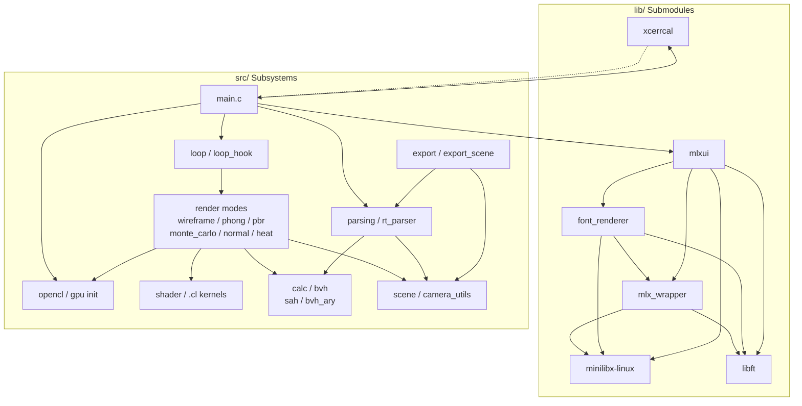
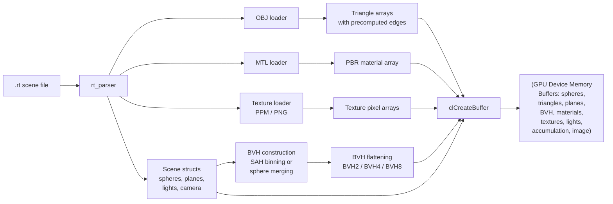

# MiniRT — System Architecture

This document describes the high-level architecture of miniRT: the module
dependency graph, the render pipeline, the data flow from scene file to GPU
buffers, and the key data structure hierarchy.

---

## 1. Data Structure Hierarchy

The entire renderer state is rooted in a single `t_data` struct, which owns or
references all subsystems.

### 1.1. Top-Level State (`t_data`)

```
t_data (top-level state)
├── t_opencl cl            — OpenCL context, command queue, kernels, GPU buffers
├── t_buffers buffers      — Host-side accumulation + image buffers
├── t_params params        — Render mode, BVH depth, color offset, debug flags
├── t_keys keys            — WASD + QE roll state (keyboard input)
├── t_mouse mouse          — Yaw/pitch (target + current, smoothed)
├── t_mlx *mlx             — Minilibx window and image handles
├── t_vec2i screen         — Screen dimensions (width × height)
└── t_scene scene          — The parsed scene
```

### 1.2. Scene State (`t_scene`)

```
t_scene
├── t_rgb ambient          — Ambient light color
├── t_camera camera        — Position, rotation, basis vectors, FOV, DOF params
├── t_vector objects       — All geometric objects (sphere/plane/triangle union)
├── t_vector lights        — Point lights
├── int *planes_id         — Plane indices for sorting
├── int plane_count
├── t_bvh_main bvh         — BVH acceleration structure (all variants)
├── t_vector textures      — Loaded texture images (PPM/PNG)
├── t_vector mats          — Materials parsed from MTL files
├── t_vector mtl_list      — MTL file references
├── t_vector obj_list      — OBJ file references
├── int skybox_tex         — Skybox texture index (-1 if none)
└── cl_mem spheres/triangles/planes/textures/mats/lights — GPU buffers
```

### 1.3. Key Sub-Structures

**Camera: `t_camera`**
```c
t_camera {
    cl_float3 pos;             // World position
    cl_float3 rot;             // Euler angles (pitch, yaw, roll)
    cl_float3 camera_forward;  // Computed orthonormal basis
    cl_float3 camera_right;
    cl_float3 camera_up;
    cl_float3 pixel_delta_u;   // Per-pixel viewport step (x direction)
    cl_float3 pixel_delta_v;   // Per-pixel viewport step (y direction)
    cl_float3 pixel00_loc;     // Top-left pixel center in world space
    cl_int    fov;             // Field of view (degrees)
    cl_int    frame;           // Accumulation frame counter
    cl_float  lens_radius;     // Depth-of-field aperture radius
    cl_float  focus_dist;      // Depth-of-field focal distance
}
```

**BVH: `t_bvh_main`**
```c
t_bvh_main {
    t_aabb_bvh *triangle_bvh;  // BVH2 triangle node array
    t_aabb_bvh *sphere_bvh;    // BVH2 sphere node array
    int         bvh_mode;      // 0 = sphere BVH, 1 = SAH AABB BVH
    int         sphere_bvh_size;
    int         triangle_bvh_size;
    t_aabb_bvh *triangle_bvh4; // BVH4 variant
    t_aabb_bvh *sphere_bvh4;
    t_aabb_bvh *triangle_bvh8; // BVH8 variant
    t_aabb_bvh *sphere_bvh8;
    cl_mem      sphere_gpu_bvh;     // GPU buffer copy
    cl_mem      triangle_gpu_bvh;   // GPU buffer copy
}
```

**BVH Node: `t_aabb_bvh`**
```c
t_aabb_bvh {
    union { struct { cl_float3 min; cl_float3 max; }; t_cuboid cuboid; }; // AABB
    union { int next; int object; int children[8]; };  // Skip pointer / leaf / wide
    int            depth;         // 0 = leaf, >0 = internal node
    int            skip;          // Stackless traversal jump index
    int            child_count;
    t_bvh_ary_type bvh_ary_type;  // BVH2, BVH4, or BVH8
}
```

**Material: `t_mat`**
```c
t_mat {
    char           *name;        // Material name (from MTL)
    cl_float       ns;           // Shininess (Phong exponent)
    cl_float3      kd;           // Diffuse color
    cl_float3      ks;           // Specular color
    cl_float3      ke;           // Emissive color
    cl_float       opacity;      // d in MTL (1 = opaque, 0 = transparent)
    t_texture_data kd_id;        // Diffuse texture index
    t_texture_data normal_id;    // Normal/bump map index
    t_texture_data roughness_id; // Roughness map index (Pr)
    t_texture_data ambient_id;   // Ambient occlusion map index (Ka)
    t_texture_data opacity_id;   // Opacity map index (map_d)
    t_texture_data metalness_id; // Metalness map index (Pm)
    cl_float       ni;           // Index of refraction
}
```

---

## 2. Module Dependency Diagram

The following diagram shows how the `src/` subsystems and `lib/` submodules
depend on each other. Arrows point from consumer to provider.



---

## 3. Render Pipeline Flowchart

The rendering pipeline proceeds through these stages for each frame:

```mermaid
flowchart TD
    A[Start Frame] --> B{Camera Moved?}
    B -->|Yes| C["Reset accumulation buffer<br/>Recompute camera basis<br/>Recompute viewport"]
    B -->|No| D[Increment frame counter]

    D --> E["Determine render mode<br/>from dispatch table"]
    E --> F{Mode == 0?}
    F -->|Wireframe| G["CPU rasterize<br/>BVH boxes + outlines + lights"]
    F -->|Phong / PBR /<br/>Monte Carlo /<br/>Normal / Heat| H["Set GPU kernel args<br/>(camera, BVH, materials,<br/>textures, lights)"]

    H --> I["clEnqueueNDRangeKernel<br/>global_size = {width, height}"]
    I --> J[Read GPU accumulation buffer]

    J --> K["accu_kernel / draw_accu.cl<br/>accumulation ÷ frame_count<br/>clamp to [0,255"]<br/>pack to RGB int]

    G --> K

    K --> L[Copy to mlx image buffer]
    L --> M[mlx_put_image_to_window]
    M --> N{Exit?}
    N -->|No| A
    N -->|Yes| O[Done]
```

---

## 4. Data Flow: `.rt` File → GPU Buffers



---

## 5. Render Mode Dispatch Table

The render modes are dispatched through a function pointer table in `src/loop.c`.
For full details of each mode, see [04-render-modes/00-overview.md](04-render-modes/00-overview.md).

The 6 modes are: Wireframe (CPU), Phong (GPU), PBR (GPU), Monte Carlo (GPU),
Normal debug (GPU), and Heat map (GPU). Keys 1–6 switch between them.

---

## 6. Build System Dependencies

The project uses a modular GNU Make infrastructure. Six submodule libraries
(minilibx-linux, libft, mlx_wrapper, font_renderer, mlxui, xcerrcal) are built
as static archives and linked with the project's object files into the final
`MiniRT` binary. For full build dependency details, targets, flags, and the
modular `.mk` file system, see [02-build-system.md](02-build-system.md).

---

## 7. Key Architectural Decisions

1. **Hybrid CPU/GPU rendering** — The wireframe debug mode runs entirely on the
   CPU using minilibx rasterization. All other modes run on the GPU. This means
   the BVH and OpenCL buffers are only allocated when switching away from
   wireframe mode.

2. **Embedded kernel source** — All OpenCL `.cl` files are `#include`d into a
   single C string literal (`KERNEL_SOURCE`) and compiled into the binary. No
   file I/O at runtime.

3. **Progressive accumulation** — The accumulation buffer persists across
   frames, averaging new samples with previous ones. The frame counter resets
   when the camera moves, mode changes, or any render parameter changes.

4. **Dual BVH systems** — Both a sphere BVH (fast, simple, for spheres only)
   and an AABB SAH BVH (optimal for triangles) coexist. The user switches via
   `bvh_mode`. For BVH construction and traversal details, see
   [05-bvh.md](05-bvh.md).

5. **BVH2/4/8 variants** — The base BVH is always BVH2 with stackless skip
   pointers. BVH4 and BVH8 variants are packed from BVH2 for wider GPU
   traversal with a stack of size 64. See [05-bvh.md](05-bvh.md) for traversal
   pseudocode and AABB intersection details.