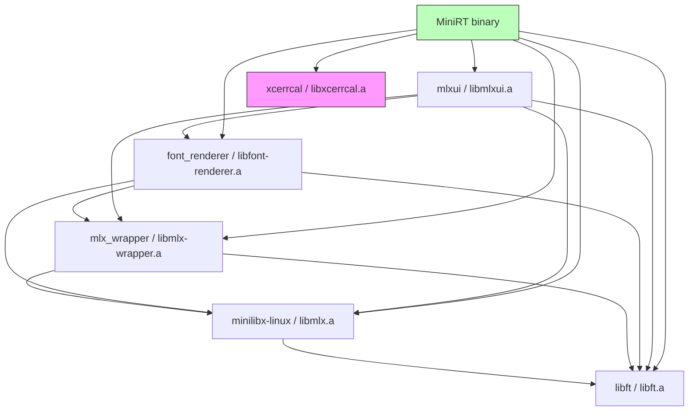
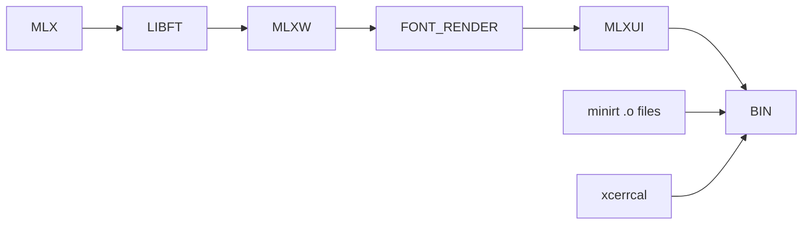
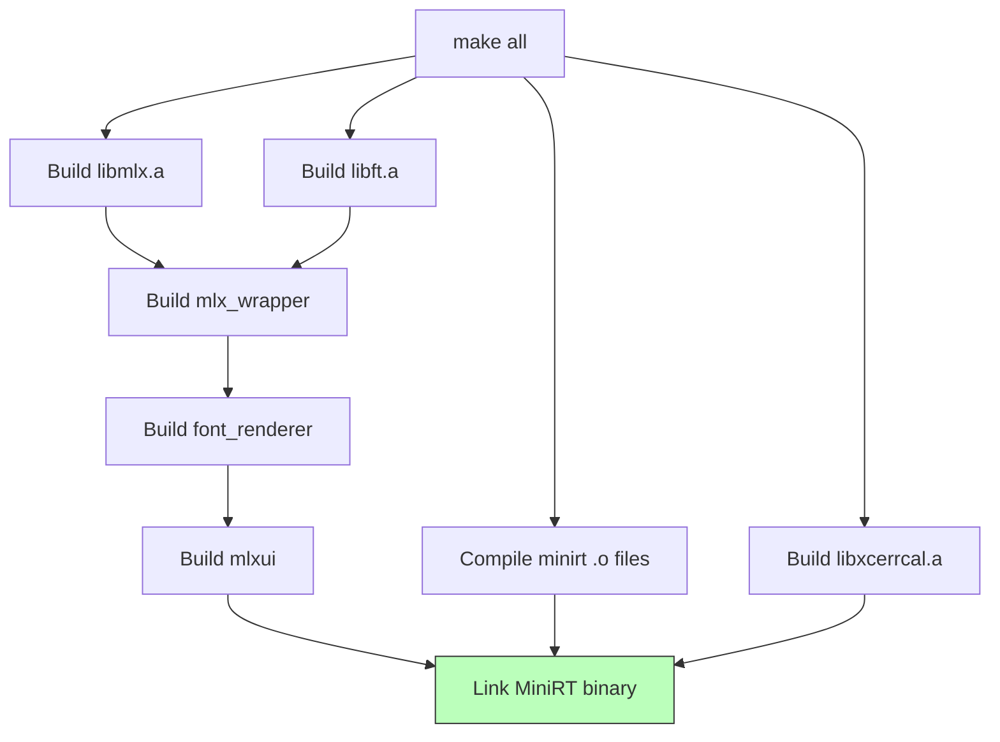

# Build System

## Overview

The miniRT build system is a modular GNU Make infrastructure spread across a
root `Makefile`, a centralized `mkidir/` directory of shared `.mk` rules, and
per-library/submodule `.mk` files. The final binary is `MiniRT`, an executable
that links together six library archives and the project's own object files.

---

## Submodule Dependency Chain

Each submodule is built as a static library archive. The dependencies form a
chain because higher-level modules depend on the types and functions of
lower-level ones:



- **minilibx-linux (MLX):** Low-level windowing and pixel buffer library
  (libmlx.a). Has no internal dependencies.
- **libft (LIBFT):** Standard C utility library (libft.a). Has no internal
  dependencies.
- **mlx_wrapper (MLXW):** Wraps MLX with higher-level input handling, PPM
  parsing, and drawing utilities (libmlx-wrapper.a). Depends on MLX + LIBFT.
- **font_renderer (FONT_RENDER):** TTF font parser and text rasterizer
  (libfont-renderer.a). Depends on MLXW + MLX + LIBFT.
- **mlxui (MLXUI):** UI widget library — buttons, sliders, forms, etc.
  (libmlxui.a). Depends on FONT_RENDER + MLXW + MLX + LIBFT.
- **xcerrcal:** Standalone error-handling library (libxcerrcal.a).
  **Independent** — has no dependencies on any other submodule.

The root Makefile builds them in order: MLX → LIBFT → MLXW → FONT_RENDER →
MLXUI → XCERRCAL, then links all six archives with the project's own `.o`
files into the final `MiniRT` binary.

---

## Build Dependency Order

The Makefile encodes these dependencies as prerequisite targets:



The actual Makefile rules:

```
$(MLXUI): $(FONT_RENDER) $(MLXW) $(MLX) $(LIBFT)
$(FONT_RENDER): $(MLXW) $(MLX) $(LIBFT)
$(MLXW): $(MLX) $(LIBFT)
$(LIBFT):
$(MLX):
$(XCERRCAL):
```

MLX is built with a separate compiler (`MLX_GCC`) and uses the
`-Wno-error=` flags family; all other libraries use the project's `CC` with
the shared `CFLAGS`.

---

## Make Targets

All targets are defined in `mkidir/make_rules.mk` (which the root Makefile and
every submodule Makefile includes).

### Build Targets

| Target | Description |
|--------|-------------|
| `all` | Default build. Compiles with standard flags (`-Wall -Werror -Wextra -std=gnu11`). |
| `fast` | Optimized build. Adds `-Ofast -march=native -mtune=native -msse3`. Sets `FAST=1`. |
| `debug` | Debug build. Sets `DEBUG_LVL=1`, `DEBUG=1`. Links with `-g3` and debug-aware runtime. |
| `inspect` | Inspection build. Adds `-g3` for LLDB/gdb. Sets `INSPECT=1`. |
| `profile` | Profiling build. Adds `-g3 -pg` for gprof. Sets `PROFILE=1`. On non-home machines, also adds `-Rpass-missed=.*`. |
| `san-mem` | AddressSanitizer build. Enables all memory-error detection (heap/stack/global overflow, UAF, use-after-scope, pointer checks) via `-fsanitize=address,pointer-compare,pointer-subtract,undefined,...` plus `-fno-omit-frame-pointer`, `-fno-optimize-sibling-calls`, `-fno-common`, `-fsanitize-address-use-after-scope`. Sets `SAN_MEM=1`. |
| `san-leak` | LeakSanitizer build. Adds `-fsanitize=leak,address` with `-g3 -O1 -fno-omit-frame-pointer -fno-common`. Sets `SAN_LEAK=1`. |
| `san-ub` | Undefined Behavior Sanitizer build. Enables ALL UB check categories (shift, integer overflow, bounds, alignment, float cast, bool, enum, implicit conversions, nullability, etc.) via `-fsanitize=undefined,shift,shift-base,...`. Sets `SAN_UB=1`, `-fno-sanitize-recover=all`. |

### Rebuild Targets

| Target | Description |
|--------|-------------|
| `re` | `fclean` + `all` |
| `refast` | `fclean` + `fast` |
| `redebug` | `fclean` + `debug` |
| `reinspect` | `fclean` + `inspect` |
| `reprofile` | `fclean` + `profile` |
| `resan-mem` | `fclean` + `san-mem` |
| `resan-leak` | `fclean` + `san-leak` |
| `resan-ub` | `fclean` + `san-ub` |

### Housekeeping Targets

| Target | Description |
|--------|-------------|
| `clean` | Remove object files (`.o`) and dependency files (`.d`) from `$(OBJDIR)` and `$(DEPDIR)`. Also runs clean in font_renderer. |
| `fclean` | `clean` + remove all library archives and the `MiniRT` binary. Also runs fclean in font_renderer. |
| `help` | Show available targets (currently minimal — lists all, debug, re, fast, clean, fclean, print-%). |

### Utility Targets

| Target | Description |
|--------|-------------|
| `print-%` | Print the value of any Make variable by replacing `%` with the variable name. Example: `make print-CFLAGS` prints the current CFLAGS value. |
| `bonus` | Alias for `all`. |

### Target-to-Variable Mapping

The sanitize module (`mkidir/sanitize.mk`) maps the active target to internal
Make variables used by rules throughout the build:

```
MAKECMDGOALS contains "fast"    → FAST=1
MAKECMDGOALS contains "debug"   → DEBUG=1
MAKECMDGOALS contains "inspect" → INSPECT=1
MAKECMDGOALS contains "profile" → PROFILE=1
MAKECMDGOALS contains "san-mem" → SAN_MEM=1
MAKECMDGOALS contains "san-leak" → SAN_LEAK=1
MAKECMDGOALS contains "san-ub"  → SAN_UB=1
```

When a sanitizer target is active, the build prints a reminder message with
the required `export` commands for runtime environment variables.

---

## Build Flags

### Window / Render Flags

| Flag | Default | Description |
|------|---------|-------------|
| `WIDTH` | 500 (or `MAX_WIDTH` if `FULLSCREEN=1`) | Window width in pixels |
| `HEIGHT` | 500 (or `MAX_HEIGHT` if `FULLSCREEN=1`) | Window height in pixels |
| `FULLSCREEN` | 0 | When set to `1`, uses the screen's native resolution as reported by `xrandr` |
| `RESIZEABLE` | 0 | Enable window resize via the window manager |
| `WINDOWLESS` | 0 | Headless mode — no window created (for batch/server rendering) |
| `PERF` | 0 | Performance mode flag (passed as `-D PERF=$(PERF)`) |

### Build Infrastructure Flags

| Flag | Default | Description |
|------|---------|-------------|
| `NPROC` | `$(shell nproc)` | Number of CPU cores used for parallel compilation. Auto-detected. |
| `VERBOSE` | 0 | When set to `1`, prints the full compiler command line for each compilation. Suppressed by default for cleaner output. |
| `CL_TARGET_OPENCL_VERSION` | 300 | OpenCL version target passed to the kernel compiler (CL 3.0). Used in CFLAGS as `-D CL_TARGET_OPENCL_VERSION=300`. |

### Mode Flags (Auto-Set by Target)

| Flag | Set By Target | Description |
|------|---------------|-------------|
| `FAST` | `fast` | Enables `-Ofast -march=native -mtune=native -msse3` optimization flags |
| `DEBUG` | `debug` | Enables `-g3` debug symbols, sets `DEBUG_LVL=1` |
| `DEBUG_LVL` | `debug` (or user override) | Debug level integer — value `5` and above enable `DEBUG=1`; `DEBUG_MINIRT = 5` is the project's threshold |
| `INSPECT` | `inspect` | Enables `-g3` for inspection without debug behavior |
| `PROFILE` | `profile` | Enables `-g3 -pg` for gprof profiling |
| `SAN_MEM` | `san-mem` | Enables AddressSanitizer and related sanitizers |
| `SAN_LEAK` | `san-leak` | Enables LeakSanitizer |
| `SAN_UB` | `san-ub` | Enables Undefined Behavior Sanitizer |

**Note:** `FAST` also passes the optimization flags to the MLX build by
appending `$(OFLAGS)` to MLX's `CC` variable.

---

## Machine-ID-Based Compiler Selection

The Makefile performs runtime machine detection by hashing `/etc/machine-id`
with SHA-256 and comparing it against a known hash.

```
GET_ID = cat /etc/machine-id | sha256sum | cut -d' ' -f1
HOME_ID = 6bb6eb3dbd1b58e9b11f9bba389b9fa248353ef0dd2fea7e9f1f5aeed881747d
```

### Home Machine (matching hash)

| Variable | Value |
|----------|-------|
| `CC` (augmented) | `gcc-14` with `-Wno-error=maybe-uninitialized -Wno-error=stringop-overflow -Wno-error=alloc-size` |
| `AR` | `ar` (standard) |
| `RANLIB` | `ranlib` (standard) |
| `MLX_GCC` | `gcc-14` |
| `XTEST` | `0` (disabled — XTEST library not linked) |

### Other Machines (non-matching hash)

| Variable | Value |
|----------|-------|
| `CC` (augmented) | `gcc-12` (base, without home-machine warnings suppressed) |
| `AR` | `llvm-ar-12` |
| `RANLIB` | `llvm-ranlib-12` |
| `MLX_GCC` | `gcc-12` |
| `XTEST` | `1` (enabled — XTEST library linked for X11 testing) |

Additionally, on non-home machines when `PROFILE=1`, the flag
`-Rpass-missed=.*` is added to enable LLVM-style missed optimization remarks.

---

## OpenCL Build Flags

The OpenCL program (compiled from the embedded kernel source string) is built
with two optimization flags passed to `clBuildProgram`:

| Flag | Effect |
|------|--------|
| `-cl-fast-relaxed-math` | Allows the OpenCL compiler to perform algebraically unsafe floating-point optimizations (e.g., reassociation, reciprocal approximations). Significantly faster but potentially less numerically precise. |
| `-cl-mad-enable` | Allows the compiler to fuse multiply-add operations into a single MAD instruction, which is faster and often more accurate for the fused operation. |
| `-Ishader` | Include path pointing to the `shader/` directory so that `#include "include/gpu.cl"` and all cross-file includes resolve correctly. |

The flags are set in `src/opencl.c` during `build_program()`:

```c
err = clBuildProgram(program, 1, &state->device,
    "-Ishader -cl-fast-relaxed-math -cl-mad-enable", NULL, NULL);
```

---

## Sanitizer Runtime Environment Variables

When using sanitizer builds (`san-mem`, `san-leak`, `san-ub`), the following
environment variables must be exported at runtime. The build prints the
appropriate `export` command at the end of compilation.

### ASAN_OPTIONS (AddressSanitizer)

Used by `san-mem` and (in modified form) by `san-leak`. Key options:

```bash
export ASAN_OPTIONS="intercept_tls_get_addr=0:detect_leaks=0:quarantine_size_mb=512:redzone=128:max_redzone=2048:report_globals=1:check_initialization_order=1:strict_init_order=1:detect_stack_use_after_return=0:min_uar_stack_size_log=16:max_uar_stack_size_log=20:detect_container_overflow=1:detect_odr_violation=2:strict_string_checks=1:replace_str=1:replace_intrin=1:print_stats=1:print_legend=1:atexit=1:print_full_thread_history=1:alloc_dealloc_mismatch=1:new_delete_type_mismatch=1:poison_heap=1:poison_partial=1:poison_array_cookie=1:max_malloc_fill_size=8192:allow_user_poisoning=1:check_malloc_usable_size=1:sleep_before_dying=0:verbosity=1:halt_on_error=0:dump_instruction_bytes=1:protect_shadow_gap=0:interceptor_via_fun=0"
```

Key options explained:

| Option | Value | Description |
|--------|-------|-------------|
| `detect_leaks` | 0 | Leak detection disabled in ASan (separate LSAN build exists) |
| `quarantine_size_mb` | 512 | Size of the free memory quarantine (512 MB) — controls UAF detection window |
| `redzone` | 128 | Redzone size in bytes around each allocation |
| `strict_init_order` | 1 | Check dynamic initialization order for globals |
| `detect_container_overflow` | 1 | Detect overflow within standard containers |
| `container_overflow` | 1 | Same — detect container overflow |
| `halt_on_error` | 0 | Continue execution after first error (collect as many as possible) |
| `alloc_dealloc_mismatch` | 1 | Detect mismatched new/delete vs malloc/free |
| `print_full_thread_history` | 1 | Print full thread creation history on error |
| `dump_instruction_bytes` | 1 | Dump instruction bytes around faulting instruction |

### LSAN_OPTIONS (LeakSanitizer)

Used by `san-leak`. Additionally, ASAN_OPTIONS is overridden with
`LASAN_OPTIONS` to enable leak detection:

```bash
export LSAN_OPTIONS="verbosity=1:log_threads=0:log_pointers=0:report_objects=0:use_registers=1:use_globals=1:use_stacks=1:use_root_regions=1:use_ld_allocations=1:use_tls=1:use_unaligned=1:print_suppressions=0:max_leaks=0:exitcode=23"
export ASAN_OPTIONS="detect_leaks=1:leak_check_at_exit=1:malloc_context_size=50:print_full_thread_history=1:verbosity=1"
```

Key options:

| Option | Value | Description |
|--------|-------|-------------|
| `use_registers` | 1 | Scan registers for leaked pointers |
| `use_stacks` | 1 | Scan thread stacks for leaked pointers |
| `use_tls` | 1 | Scan thread-local storage for leaked pointers |
| `print_suppressions` | 0 | Don't print suppression information |
| `exitcode` | 23 | Exit code when leaks are detected |
| `detect_leaks` | 1 | (in LASAN_OPTIONS) Enable leak detection |
| `malloc_context_size` | 50 | (in LASAN_OPTIONS) Stack trace depth for allocation contexts |

### UBSAN_OPTIONS (Undefined Behavior Sanitizer)

Used by `san-ub`:

```bash
export UBSAN_OPTIONS="print_stacktrace=1:halt_on_error=0:verbosity=1:report_error_type=1"
```

Key options:

| Option | Value | Description |
|--------|-------|-------------|
| `print_stacktrace` | 1 | Print full stack trace on UB detection |
| `halt_on_error` | 0 | Continue execution after first UB (collect multiple reports) |
| `verbosity` | 1 | Verbose error reporting |
| `report_error_type` | 1 | Include the UB category name in error messages |

---

## Modular .mk File System

The build system uses a modular, distributed `.mk` file infrastructure:

### `mkidir/` — Shared Rules Directory

Located at the project root under `mkidir/`:

| File | Purpose |
|------|---------|
| `make_rules.mk` | Common build targets (all, fast, debug, inspect, profile, sanitizers, re variants, clean, fclean, print-%) and the generic `.o` compilation rules for both `.c` and `.cpp` sources. Shared by all submodules. |
| `make_utils.mk` | Utility definitions: `NPROC`, `MAX_WIDTH`/`MAX_HEIGHT` (from `xrandr`), compiler selection (machine-ID-based), ar/ranlib selection, and the include of `sanitize.mk` and `colors.mk`. |
| `sanitize.mk` | Sanitizer flag construction: target-to-variable mapping (FAST, DEBUG, etc.), flag sets for `san-mem`, `san-leak`, `san-ub`, and the runtime env var definitions (ASAN_OPTIONS, LSAN_OPTIONS, UBSAN_OPTIONS). |
| `colors.mk` | Terminal color definitions and print-message macros (build messages, link messages, library archive messages, sanitizer reminders, etc.). All build output is color-coded. |

### Per-Module `.mk` Includes

Each submodule and the root project uses `.mk` files to declare its sources
and include paths:

| Module | `.mk` Files |
|--------|-------------|
| **miniRT (root)** | `src/srcs.mk` + `src/parsing/parsing.mk` + `src/calc/calc.mk` + `src/export_scene/export_scene.mk` + `includes.mk` |
| **libft** | `lib/libft/src/srcs.mk` + per-subdirectory `.mk` files (`str_utils/`, `strr_utils/`, `mem_utils/`, `parsing/`, `io/`, `data_structs/`, `alloc/`, `conversion/`, `utils/`) + `includes.mk` |
| **mlx_wrapper** | `lib/mlx_wrapper/src/srcs.mk` + per-subdirectory `.mk` files (`keys/`, `primitives/`, `pnm_parser/`, `mouse/`, `draw/`) + `includes.mk` |
| **font_renderer** | `lib/font_renderer/src/srcs.mk` + per-subdirectory `.mk` files (`utils/`, `text_renderer/`, `font_filler/`, `ttf_parser/`, `font_drawer/`) + `includes.mk` |
| **mlxui** | `lib/mlxui/src/srcs.mk` + per-subdirectory `.mk` files (`hierarchy/`, `utils/`, `operations/`, `components/` which includes `textbox/`, `slider/`, `select/`, `colorpicker/`, `scrollbox/`, `checkbox/`, `image/`, `button_group/`, `form/`, `box/`, `button/`) + `includes.mk` |
| **xcerrcal** | `lib/xcerrcal/src/src.mk` + `includes.mk` |

Each per-subdirectory `.mk` file prepends source files to the `SRCS` variable:

```makefile
# Example: lib/libft/src/str_utils/str_utils.mk
SRCS += $(addprefix $(LIBFTDIR)/src/str_utils/, \
    ft_strlen.c ft_strdup.c ft_strlcpy.c ...)
```

The build system uses `VPATH` to resolve source files across directories,
allowing all `.o` files to land in a flat `$(OBJDIR)/` without directory
collisions.

---

## Compilation Flow (Simplified)



The root Makefile's `$(NAME)` rule:

```makefile
$(NAME): $(XCERRCAL) $(MLXUI) $(FONT_RENDER) $(OBJS) $(INCLUDES)
    $(CF) $(OBJS) $(ARCHIVES) $(LFLAGS) -o $@
```

Where `ARCHIVES` = `$(MLXUI) $(FONT_RENDER) $(MLXW) $(MLX) $(LIBFT) $(XCERRCAL)`
and `LFLAGS` links `-lfont-renderer -lmlx-wrapper -lmlx -lft -lxcerrcal
-lXtst -lXext -lX11 -lXrandr -lm -l:libOpenCL.so.1`.