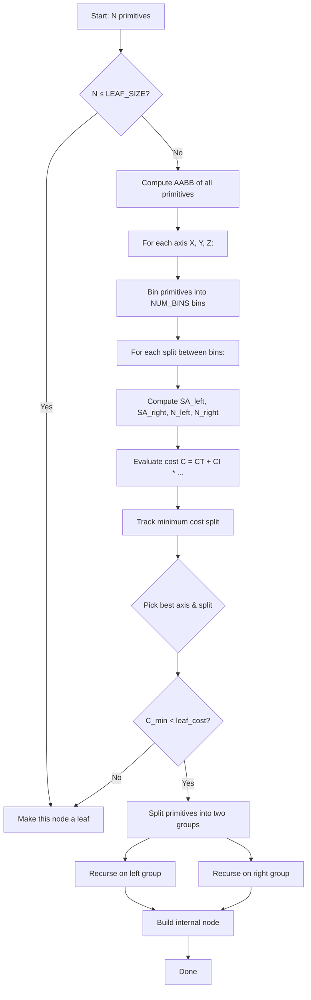
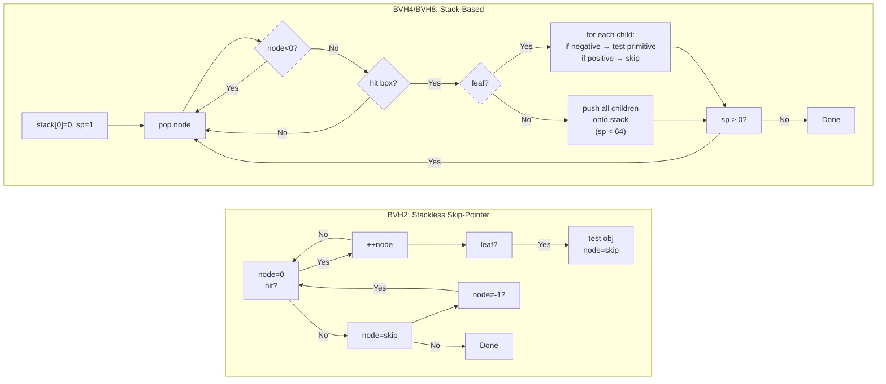
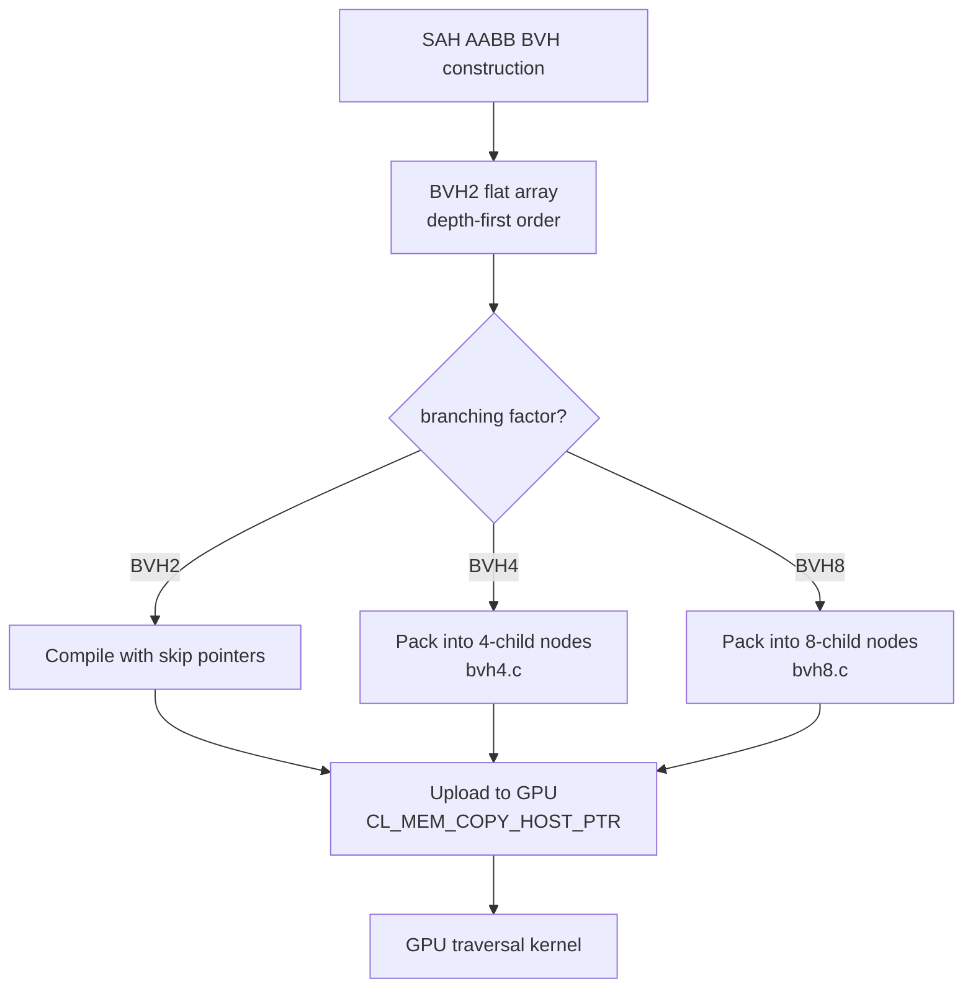
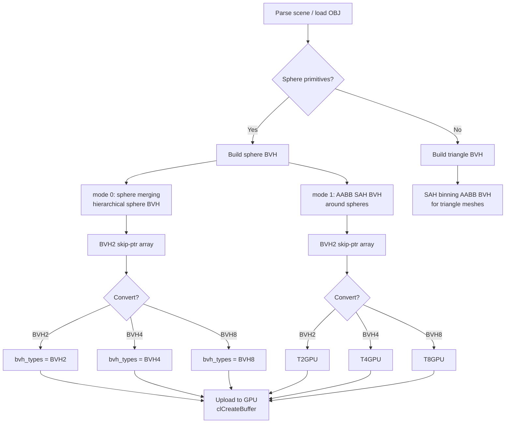

# BVH — Bounding Volume Hierarchy

## Overview

miniRT implements two distinct Bounding Volume Hierarchy (BVH) systems and
three branching factors (BVH2, BVH4, BVH8) for GPU-accelerated ray tracing.
The user can switch between BVH types at runtime. Both systems accelerate
intersection testing by pruning groups of primitives that do not intersect a
given ray.

---

## Two BVH Types

### 1. Sphere BVH (mode 0)

A hierarchical merging of bounding spheres. Each node stores a sphere center
(position) and a radius. Construction proceeds bottom-up by repeatedly
selecting the two nearest spheres (by combined surface area) and merging them
into a parent sphere that encloses both children.

- **Used for:** Sphere primitives only (not triangles).
- **Construction:** Greedy pairwise merging based on minimum combined surface
  area.
- **Storage:** Flat array of nodes in depth-first order with skip pointers for
  stackless traversal.

### 2. AABB BVH with SAH (mode 1)

An axis-aligned bounding box hierarchy built using the Surface Area Heuristic
(SAH). Each node stores an AABB (min/max corner). Construction uses binning
to find optimal split planes.

- **Used for:** Triangle primitives (OBJ meshes). Also builds a sphere AABB
  BVH using AABBs around each sphere.
- **Construction:** SAH binning with 16 bins per axis.

---

## Surface Area Heuristic (SAH)

### Cost Function

For a given spatial split, the SAH estimates the ray tracing cost as:

$$C = C_T + C_I \cdot \frac{SA_{left} \cdot N_{left} + SA_{right} \cdot N_{right}}{SA_{parent}}$$

Where:

| Symbol | Value | Description |
|--------|-------|-------------|
| $C_T$ | 1.0 | Traversal cost (cost of descending into a node) |
| $C_I$ | 2.0 | Intersection cost (cost of testing a primitive) |
| $SA_{left}$ | — | Surface area of the left child's bounding box |
| $SA_{right}$ | — | Surface area of the right child's bounding box |
| $SA_{parent}$ | — | Surface area of the parent node's bounding box |
| $N_{left}$ | — | Number of primitives in the left child |
| $N_{right}$ | — | Number of primitives in the right child |

The split that minimizes $C$ is selected. If the minimum cost exceeds the
cost of making a leaf node (direct intersection with all primitives), the
node is made a leaf instead.

### Constants

| Constant | Value | Description |
|----------|-------|-------------|
| `NUM_BINS` | 16 | Number of bins per axis for SAH evaluation |
| `LEAF_SIZE` | 1 | Maximum number of primitives per leaf node |
| `CT` | 1.0 | Traversal cost coefficient |
| `CI` | 2.0 | Intersection cost coefficient |
| `SM` | 1e30 | Sentinel value (effectively infinite cost) |

### SAH Algorithm



---

## BVH2/4/8 Branching

The project constructs a binary BVH (BVH2) first, then optionally packs it
into BVH4 (4 children per node) or BVH8 (8 children per node) for wider GPU
traversal.

### BVH2 — Binary (2 children per node)

- **Traversal:** Stackless, using skip pointers.
- Each node stores a `skip` field that points to the next node to visit when
  the current node is missed.
- Linear walk: start at node 0; if the ray hits the box, advance to the next
  node (`++node`); if the ray misses, jump to `bvh[node].skip`.
- No stack needed — uses O(1) temporary storage.

### BVH4 — Quad (4 children per node)

- **Traversal:** Stack-based, with an explicit stack of size 64
  (`WIDE_BVH_STACK_SIZE`).
- Each internal node stores up to 4 child indices in `children[4]`.
- Leaf nodes use negative child indices: `leaf = -1 - child` encodes a
  reference to the actual primitive index.
- Walking: push the root; pop a node; if it's a leaf, test all children
  (negative = primitives, positive = skip); if it's internal, push all
  children.

### BVH8 — Oct (8 children per node)

- **Traversal:** Same stack-based approach as BVH4 but with 8 children per
  node (`children[8]`).
- Same 64-element stack (`WIDE_BVH_STACK_SIZE`).
- Leaf encoding identical to BVH4 (negative indices).

### Traversal Comparison



### Conversion Flow



## GPU Traversal

### BVH2 — Linear Skip-Pointer Walk

Pseudo-code (from `intersect.cl`):

```
node = 0
while node != -1:
    if hit_box(ray, &bvh[node]):
        if bvh[node].depth == 0:         // leaf
            if intersect(sphere/triangle):
                update nearest
            node = bvh[node].skip
        else:                             // internal
            ++node
    else:
        node = bvh[node].skip
```

The key insight: BVH2 nodes are stored in depth-first order, so when a hit
occurs, the next node in memory is the first child (`++node`). When a miss
occurs, the `skip` pointer jumps over the entire subtree.

### BVH4/BVH8 — Stack-Based Traversal

Pseudo-code (from `intersect.cl`):

```
stack[0] = 0
sp = 1
while sp > 0:
    node = stack[--sp]
    if node < 0 || !hit_box(ray, &bvh[node]):
        continue
    if bvh[node].depth == 0:            // leaf
        for each child in bvh[node].children:
            if child < 0:               // leaf reference
                leaf = -1 - child
                if intersect(primitive):
                    update nearest
    else:                                // internal
        for each child in bvh[node].children:
            if child >= 0 && sp < 64:
                stack[sp++] = child
```

Negative child indices encode leaf references: `leaf = -1 - child`.

---

## AABB Intersection (Slab Method)

The `hit_box()` function in `intersect.cl` implements the slab method — the
standard AABB intersection test using inverse ray directions:

```c
bool hit_box(__private t_ray_gpu *ray, __constant t_bvh_gpu *bvh)
{
    float3 min_val = (bvh->min - ray->origin) * ray->inv_dir;
    float3 max_val = (bvh->max - ray->origin) * ray->inv_dir;

    float t_min = min(min_val.x, max_val.x);
    float t_max = max(min_val.x, max_val.x);
    t_min = max(min(min_val.y, max_val.y), t_min);
    t_max = min(max(min_val.y, max_val.y), t_max);
    if (t_min > t_max) return false;
    t_min = max(min(min_val.z, max_val.z), t_min);
    t_max = min(max(min_val.z, max_val.z), t_max);
    if (t_min > t_max) return false;
    if (t_max < 0.0f) return false;
    return true;
}
```

- **Precomputed `ray.inv_dir`:** Each ray carries `inv_dir = 1.0 / dir`,
  computed once during ray generation. This replaces division with
  multiplication in the intersection test.
- **Slab test:** For each axis, compute the entry and exit distances along
  the ray. The intersection interval is the overlap of all three axis slabs.
- **Early exit:** If at any axis the intervals don't overlap (t_min > t_max),
  the test returns false immediately.

---

## BVH Construction Flow (Complete)



## Key Design Decisions

1. **Dual BVH systems** (sphere vs AABB) allow optimal bounding for different
   primitive types. Spheres benefit from tight sphere bounding; triangles
   benefit from AABB SAH.

2. **Three branching factors** (2/4/8) trade off memory bandwidth vs.
   traversal depth. BVH2 uses O(1) stackless traversal; BVH4/8 reduce tree
   depth at the cost of a 64-element stack.

3. **SAH with binning** (16 bins, 3 axes = 48 evaluations per split) keeps
   construction fast while producing high-quality trees. LEAF_SIZE=1 gives
   maximum precision at the leaves.

4. **Skip-pointer encoding** for BVH2 eliminates stack operations entirely,
   which is ideal for GPU execution where stack memory is limited.