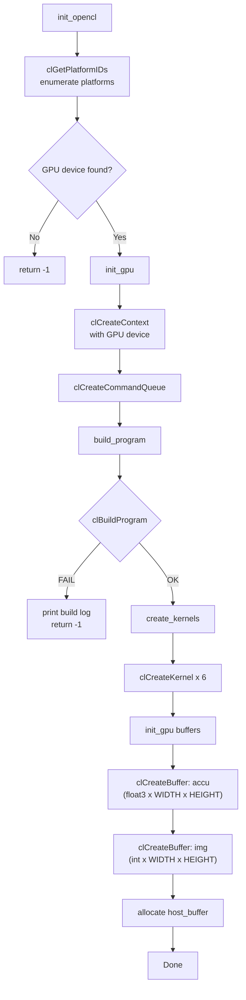
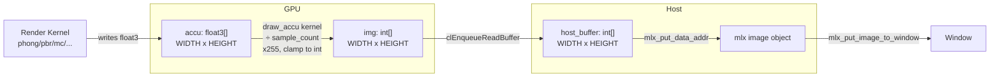
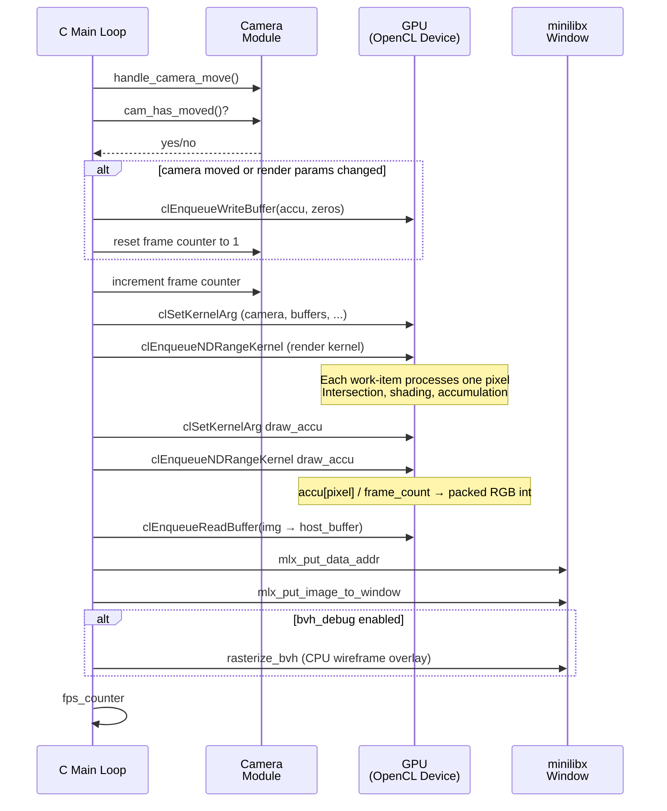

# OpenCL Integration

## Overview

miniRT uses OpenCL for all GPU-accelerated ray tracing. The host (C code)
manages the OpenCL lifecycle — platform enumeration, device selection, kernel
compilation, buffer management, and dispatch — while the device (OpenCL C
kernels) executes the actual intersection and shading computations. The
rendering pipeline is designed for progressive accumulation: each frame adds
one sample per pixel to an accumulation buffer, which is then averaged and
displayed.

---

## Initialization Flow



### Step-by-Step

1. **Platform enumeration:** `clGetPlatformIDs()` finds up to 8 OpenCL
   platforms. Iterates until a platform provides a device matching the
   requested type (typically `CL_DEVICE_TYPE_GPU`).

2. **Device selection:** `clGetDeviceIDs()` on each platform. The first
   platform that has a matching device wins.

3. **Context and queue:** `clCreateContext()` and `clCreateCommandQueue()`
   (in-order queue — kernels execute sequentially per frame).

4. **Program compilation:** `clBuildProgram()` with the embedded kernel
   source string and flags:
   ```
   -Ishader -cl-fast-relaxed-math -cl-mad-enable
   ```
   On failure, the build log is retrieved via `clGetProgramBuildInfo()` and
   printed to stderr.

5. **Kernel creation:** `clCreateKernel()` for each of 6 kernels.

6. **Buffer allocation:** The accumulation buffer (`float3 × WIDTH x HEIGHT`)
   and output image buffer (`int × WIDTH x HEIGHT`) are allocated as
   read-write GPU buffers.

---

## Kernel Source Embedding

The entire OpenCL kernel source is compiled into the binary as a C string
literal. All `.cl` files are `#include`d into a single program using the
OpenCL `#include` mechanism (which resolves relative to the `-I` include
path):

```c
#define KERNEL_SOURCE \
"#include \"phong.cl\"\\n" \
"#include \"calc_rays.cl\"\\n" \
"#include \"draw_accu.cl\"\\n" \
"#include \"intersect.cl\"\\n" \
"#include \"phong_shading.cl\"\\n" \
"#include \"sample_texture.cl\"\\n" \
"#include \"pbr.cl\"\\n" \
"#include \"sample_materials.cl\"\\n" \
"#include \"random.cl\"\\n" \
"#include \"monte_carlo.cl\"\\n" \
"#include \"heat.cl\"\\n" \
"#include \"normal_debug.cl\"\\n"
```

**Benefits:** No file I/O at runtime, no external `.cl` files to ship with
the binary, single compilation unit means cross-file function calls are
resolved at compile time.

**Trade-off:** The kernel source is part of the binary (increases size).

All `.cl` files reside in `shader/` and include `shader/include/gpu.cl` for
shared type definitions (`t_camera_gpu`, `t_ray_gpu`, `t_bvh_gpu`, etc.).

---

## The 6 Kernels

### 1. `phong` — Phong Shading

| Argument | Type | Description |
|----------|------|-------------|
| `cam` | `t_camera_gpu` | Camera state (position, basis, viewport) |
| `spheres` | `__constant t_sphere_gpu *` | Sphere array |
| `sphere_bvh` | `__constant t_bvh_gpu *` | Sphere BVH |
| `triangles` | `__constant t_triangle_gpu *` | Triangle array |
| `triangle_bvh` | `__constant t_bvh_gpu *` | Triangle BVH |
| `planes` | `__constant t_plane_gpu *` | Plane array |
| `planes_count` | `int` | Number of planes |
| `img` | `__global float3 *` | Accumulation buffer output |
| `textures` | `__constant uchar *` | Texture atlas byte array |
| `mats` | `__constant t_mat_gpu *` | Material array |
| `lights` | `__constant t_light_gpu *` | Light array |
| `lights_count` | `int` | Number of lights |
| `ambient` | `rgb3` | Ambient light color |

**Operation:** For each pixel, casts one ray, finds the nearest hit via BVH,
samples materials (including textures/normal maps), then computes Phong
shading (ambient + diffuse + specular + emissive) against all lights.

### 2. `pbr` — Physically Based Rendering

| Argument | Type | Description |
|----------|------|-------------|
| (same as `phong` + lights_count + ambient) | | |

**Operation:** Multi-bounce ray tracing with Fresnel reflection/refraction,
Schlick approximation, roughness-based glossy factor, and up to `MAX_BOUNCE`
(4) bounces. Accumulates color through reflected rays with `through_power`.

### 3. `monte_carlo` — Monte Carlo Path Tracing

| Argument | Type | Description |
|----------|------|-------------|
| (same as `phong`, without `ambient`) | | |
| `skybox` | `t_texture_data` | Skybox texture descriptor (offset, width, height, channels) |
| `random` | `int` | Random seed offset |

**Operation:** Full path tracing with GGX/Trowbridge-Reitz microfacet
importance sampling, chromatic dispersion (wavelength-dependent IOR),
emissive surfaces, and rainbow-colored refractions. Each frame accumulates
into the buffer for progressive denoising.

### 4. `normal_debug` — Normal Visualization

| Argument | Type | Description |
|----------|------|-------------|
| `cam` | `t_camera_gpu` | Camera state |
| `spheres` | `__constant t_sphere_gpu *` | Sphere array |
| `sphere_bvh` | `__constant t_bvh_gpu *` | Sphere BVH |
| `triangles` | `__constant t_triangle_gpu *` | Triangle array |
| `triangle_bvh` | `__constant t_bvh_gpu *` | Triangle BVH |
| `planes` | `__constant t_plane_gpu *` | Plane array |
| `planes_count` | `int` | Number of planes |
| `img` | `__global float3 *` | Accumulation buffer output |
| `textures` | `__constant uchar *` | Texture atlas |
| `mats` | `__constant t_mat_gpu *` | Material array |

**Operation:** Maps the shading normal to RGB: `img[pixel] = normal * 0.5 + 0.5`.

### 5. `heat` — BVH Traversal Depth Heat Map

| Argument | Type | Description |
|----------|------|-------------|
| `cam` | `t_camera_gpu` | Camera state |
| `sphere_bvh` | `__constant t_bvh_gpu *` | Sphere BVH |
| `triangle_bvh` | `__constant t_bvh_gpu *` | Triangle BVH |
| `img` | `__global float3 *` | Accumulation buffer output |
| `max_depth` | `int` | Maximum BVH depth |
| `color_offset` | `int` | Color palette index (0-9) |

**Operation:** Traverses both BVHs counting intersection tests, then maps
the count to a color from one of 10 built-in palettes (2-4 gradient stops).

### 6. `draw_accu` — Accumulation Buffer to Image

| Argument | Type | Description |
|----------|------|-------------|
| `accu` | `__global float3 *` | Accumulation buffer (input) |
| `img` | `__global int *` | Output image buffer (packed RGB integer) |
| `sample_count` | `int` | Frame count for averaging |

**Operation:** Divides each pixel's accumulated float3 color by `sample_count`,
multiplies by 255, clamps to [0, 255], and packs into a 32-bit integer for
minilibx display.

---

## NDRange Dispatch

Every kernel is dispatched with a 2D global work size equal to the screen
dimensions:

```c
size_t global_size[2] = {width, height};
clEnqueueNDRangeKernel(queue, kernel, 2, NULL, global_size, NULL, ...);
```

Each work item processes exactly one pixel:

```c
pos.x = get_global_id(0);
pos.y = get_global_id(1);
pixel = pos.y * get_global_size(0) + pos.x;
```

The local work size is `NULL` (OpenCL picks it automatically based on device
capabilities). No explicit work-group sizing is used.

---

## Accumulation Buffer Architecture

The project uses a two-buffer progressive accumulation scheme:



### Flow per Frame

1. **Camera/render check:** If camera position, rotation, FOV, lens radius,
   or focus distance changed (`cam_has_moved()`), or if render parameters
   changed (`render_changed()`), the accumulation buffer is **zeroed out**
   (via `clEnqueueWriteBuffer` with zeros) and `camera.frame` is reset to 1.

2. **Increment frame:** `camera.frame++` — tracks the number of accumulated
   samples.

3. **Render kernel:** One of 5 GPU kernels runs, writing float3 values into
   the accumulation buffer (`accu`). Each frame adds one more sample.

4. **Accumulation kernel:** `draw_accu` divides each pixel's accumulated
   value by `camera.frame`, multiplies by 255, clamps, and writes to `img`
   (packed integer).

5. **Readback:** `clEnqueueReadBuffer` reads `img` into `host_buffer`.

6. **Display:** The host buffer is copied into the minilibx image and
   displayed via `mlx_put_image_to_window`.

The result: progressive rendering. After N frames, each pixel has N samples
and noise is reduced by √N.

---

## Host-to-GPU Data Transfer

Scene data is transferred to the GPU via `clCreateBuffer` with
`CL_MEM_COPY_HOST_PTR`, which allocates GPU memory and copies the host data
in a single call:

```c
cl_mem buffer = clCreateBuffer(context, CL_MEM_READ_ONLY | CL_MEM_COPY_HOST_PTR,
    size, host_ptr, &err);
```

### Data Categories

| Data | GPU Memory | Size | Frequency |
|------|------------|------|-----------|
| Sphere array | `__constant t_sphere_gpu *` | `sizeof(t_sphere_gpu) × count` | Once (scene load) |
| Sphere BVH | `__constant t_bvh_gpu *` | `sizeof(t_bvh_gpu) × nodes` | Once (BVH build) |
| Triangle array | `__constant t_triangle_gpu *` | `sizeof(t_triangle_gpu) × count` | Once (scene load) |
| Triangle BVH | `__constant t_bvh_gpu *` | `sizeof(t_bvh_gpu) × nodes` | Once (BVH build) |
| Plane array | `__constant t_plane_gpu *` | `sizeof(t_plane_gpu) × count` | Once (scene load) |
| Texture atlas | `__constant uchar *` | total texture byte size | Once (scene load) |
| Material array | `__constant t_mat_gpu *` | `sizeof(t_mat_gpu) × count` | Once (scene load) |
| Light array | `__constant t_light_gpu *` | `sizeof(t_light_gpu) × count` | Once (scene load) |

All buffers use `CL_MEM_READ_ONLY` except the accumulation and image buffers
which use `CL_MEM_READ_WRITE`.

The texture atlas is a single flat byte array containing all loaded texture
pixels concatenated. Each `t_texture_data` struct (inline in `t_mat_gpu`)
contains an `offset` field pointing into this atlas, plus `width`, `height`,
and `channels` for sampling.

---

## Render Frame Sequence



### Cumulative Rendering

The accumulation buffer is never cleared unless camera/render state changes.
This means:

- **Frame 1:** 1 sample/pixel (noisy)
- **Frame 10:** 10 samples/pixel (reduced noise)
- **Frame 100:** 100 samples/pixel (clean)
- **Camera move:** Buffer cleared, restart from 1 sample/pixel

This gives instant feedback when moving the camera while gradually converging
to a noise-free image when stationary.