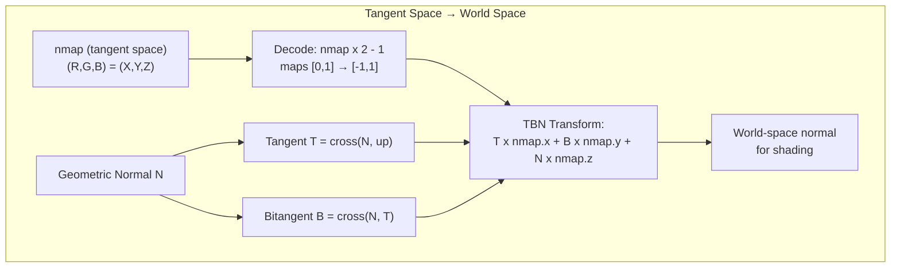

# Materials and Textures

## Overview

miniRT supports a full physically based material system with texture maps.
Materials are parsed from standard Wavefront MTL files with 42 School
extensions for PBR properties. Textures are loaded as PPM files and stored
in a flat byte atlas on the GPU for per-pixel sampling during ray tracing.

---

## Material Structure (`t_mat`)

```c
typedef struct s_mat {
    char           *name;        // Material name (from newmtl)
    cl_float       ns;           // Shininess (specular exponent)
    cl_float3      kd;           // Diffuse color
    cl_float3      ks;           // Specular color
    cl_float3      ke;           // Emissive color
    cl_float       opacity;      // Opacity (d)
    t_texture_data kd_id;        // Diffuse texture map
    t_texture_data normal_id;    // Normal/bump map
    t_texture_data roughness_id; // Roughness map (Pr)
    t_texture_data ambient_id;   // Ambient occlusion map (Ka)
    t_texture_data opacity_id;   // Opacity map (map_d)
    t_texture_data metalness_id; // Metalness map (Pm)
    cl_float       ni;           // Index of refraction
} t_mat;
```

### MTL Keyword Reference

For the full MTL keyword reference with field descriptions and example `.mtl`
files, see [03-scene-format.md](../03-scene-format.md#4-mtl-material-format).
This document focuses on how materials are used during rendering rather than
the file format.

---

## PBR Properties

The material system extends the classic MTL model with physically based
rendering parameters. These properties flow into the shading kernels to
control reflection, refraction, and surface appearance:

| Property | Field | Source | Effect |
|----------|-------|--------|--------|
| **Roughness** | `Pr` (in texture) | `map_Pr` / scalar `Pr` | Controls microfacet distribution width. 0 = mirror-perfect, 1 = fully diffuse. Used in GGX sampling and glossy factor: $\text{glossy} = 1 - \text{roughness}^2$ |
| **Metalness** | `Pm` (in texture) | `map_Pm` / scalar `Pm` | Blends between dielectric and metallic Fresnel. $\text{F0} = \text{mix}(\text{F0}_{\text{dielectric}}, k_s, \text{metalness})$ |
| **IOR (Ni)** | `ni` | `Ni value` | Index of refraction. Used in Snell's law for refraction and Schlick Fresnel: $\text{F0} = ((n_i - 1) / (n_i + 1))^2$ |
| **Opacity (d)** | `opacity` | `d value` | Controls transmission. If random < opacity: reflect; otherwise: refract. 1 = fully opaque, 0 = fully transparent |
| **Emissive (Ke)** | `ke` | `Ke r g b` | Emitted light color. Added directly to accumulated color when hit. Enables self-illuminating materials |

### Fresnel Computation

From `sample_materials.cl`:

```math
\begin{aligned}
\text{F0}_{\text{dielectric}} &= \left(\frac{n_i - 1}{n_i + 1}\right)^2 \\
\text{F0} &= \text{mix}(\text{F0}_{\text{dielectric}}, k_s, \text{metalness}) \\
\cos\theta &= |\text{dot}(\text{ray\_dir}, \text{normal})| \\
F &= \text{F0} + (1 - \text{F0}) \cdot (1 - \cos\theta)^5 \quad (\text{Schlick approximation})
\end{aligned}
```

### Roughness Glossy Factor

```math
\begin{aligned}
\text{glossy} &= 1 - \text{roughness}^2 \\
\text{reflectivity} &= \text{clamp}(F \cdot \text{glossy}, 0, 1)
\end{aligned}
```

---

## Texture Map Types

Each texture type serves a specific role in the shading pipeline:

| Map Type | MTL Keyword | Field | Channels | Purpose |
|----------|-------------|-------|----------|---------|
| Diffuse | `map_Kd path.ppm` | `kd_id` | 3 (RGB) | Base color/albedo texture |
| Normal | `map_bump path.ppm` | `normal_id` | 3 (RGB) | Per-pixel normal perturbation for surface detail |
| Roughness | `map_Pr path.ppm` | `roughness_id` | 1 (grayscale) | Per-pixel roughness (0 = smooth, 255 = rough) |
| Ambient | `map_Ka path.ppm` | `ambient_id` | 1 (grayscale) | Ambient occlusion (0 = fully occluded, 255 = fully lit) |
| Opacity | `map_d path.ppm` | `opacity_id` | 1 (grayscale) | Per-pixel opacity (0 = transparent, 255 = opaque) |
| Metalness | `map_Pm path.ppm` | `metalness_id` | 1 (grayscale) | Per-pixel metalness (0 = dielectric, 255 = metal) |

---

## Texture Atlas System

All loaded textures are concatenated into a single flat byte array (the
"texture atlas") and uploaded to the GPU as a `__constant uchar *` buffer.
Each texture descriptor (`t_texture_data`) stores the metadata needed to
sample from the atlas:

```c
typedef struct s_texture_data {
    int index;      // Material-internal index
    int offset;     // Byte offset into the atlas
    int width;      // Texture width in pixels
    int height;     // Texture height in pixels
    int channels;   // Number of channels (3 for RGB, 1 for grayscale)
} t_texture_data;
```

### Texture Layout in Atlas

```
offset → [R][G][B]...[R][G][B]  (for 3-channel RGB)
          └──── width × 3 bytes ────┘
          ↑ height rows ↑
```

For grayscale textures (roughness, metalness, ambient, opacity):

```
offset → [G][G]...[G]
          └── width bytes ─┘
```

### PPM Loading

Textures are loaded in PPM format via the `mlx_wrapper`'s PPM parser
(`pnm_parser/`). The parser handles:
- PPM binary format (P6)
- PPM ASCII format (P3)
- Comment stripping
- RGB and grayscale variants

---

## Normal Map TBN Transformation

Normal maps store surface normals in **tangent space** — where the Z-axis
points outward from the surface. To use them in world space, a TBN
(tangent-bitangent-normal) frame is constructed per hit.

### Tangent Vector Construction

From `sample_materials.cl`, `get_tangent()`:

```c
static float3 get_tangent(float3 n)
{
    float3 t;
    // Branchless up-vector selection
    float3 up = (float3)(
        (n.y == 0 && n.z == 0) ? 0 : 1,  // if normal is (1,0,0), use a different up
        0,
        (n.y == 0 && n.z == 0) ? -n.x : 0 // if normal is (1,0,0), tangent is (0,0,-1)
    );
    if (up.x != 0 || up.z != 0) {
        // Special case: normal faces exactly along X
        t = cross(n, up);
    } else {
        up = (float3)(0, 1, 0);
        t = cross(n, up);
    }
    return normalize(t);
}
```

This handles the edge case where the geometric normal is exactly $(1, 0, 0)$
— if we used a fixed $(0, 1, 0)$ up vector, the cross product would produce
a zero tangent.

### Bitangent

The bitangent is computed as:

```math
\text{bitangent} = \text{cross}(\text{geometric\_normal}, \text{tangent})
```

### Normal Map Sampling

From `sample_materials.cl`:

```c
// Sample the normal map
float3 nmap = sample_texture(textures, hit->uv, ...);
// Convert from [0,1] to [-1,1] range
nmap = nmap * 2.0f - 1.0f;
// Transform from tangent space to world space using TBN
float3 world_normal = normalize(
    nmap.x * tangent +
    nmap.y * bitangent +
    nmap.z * geometric_normal
);
```

### TBN Visualization



---

## Per-Pixel Texture Sampling in OpenCL

Textures are sampled in the `sample_texture.cl` kernel. Two sampling
functions are available:

### RGB Texture Sampling

```c
rgb3 sample_texture(__constant uchar *textures, float2 uv,
                    __constant t_texture_data *data)
{
    int x = (int)(uv.x * (float)(data->width - 1));
    int y = (int)(uv.y * (float)(data->height - 1));
    int offset = data->offset
        + y * (data->width * data->channels)
        + x * data->channels;
    return (rgb3)(
        textures[offset] / 255.0f,
        textures[offset + 1] / 255.0f,
        textures[offset + 2] / 255.0f
    );
}
```

### Grayscale Texture Sampling

```c
float sample_gray_level_texture(__constant uchar *textures, float2 uv,
                                __constant t_texture_data *data)
{
    int x = (int)(uv.x * (float)(data->width - 1));
    int y = (int)(uv.y * (float)(data->height - 1));
    int offset = data->offset + y * data->width + x;
    return textures[offset] / 255.0f;
}
```

Both use nearest-neighbor sampling (no interpolation). UV coordinates come
from the intersection process:
- **Spheres:** Spherical projection mapping (fill_sphere_uv_normal)
- **Triangles:** Barycentric interpolation of vertex UVs (fill_triangle_uv_normal)
- **Planes:** Planar projection with texture_scaling (fill_plane_uv_normal)
- **Skybox:** Direction-to-UV mapping (fill_skybox_uv)

---

## Material Property Flow into the Shader

```mermaid
graph TD
    MTL[MTL File] --> PARSE[MTL Parser]
    PARSE --> MAT[t_mat struct]
    
    MAT --> TEX_DIFF[Diffuse map_Kd]
    MAT --> TEX_NORM[Normal map_bump]
    MAT --> TEX_ROUGH[Roughness map_Pr]
    MAT --> TEX_METAL[Metalness map_Pm]
    MAT --> TEX_AO[Ambient map_Ka]
    MAT --> TEX_OPAC[Opacity map_d]
    MAT --> SCALAR["Scalar properties:<br/>Ns, Ni, d, Ke, Kd, Ks"]
    
    TEX_DIFF --> ATLAS["Texture Atlas<br/>flat uchar["] on GPU]
    TEX_NORM --> ATLAS
    TEX_ROUGH --> ATLAS
    TEX_METAL --> ATLAS
    TEX_AO --> ATLAS
    TEX_OPAC --> ATLAS

    ATLAS --> SAMPLE["sample_texture /<br/>sample_gray_level_texture"]
    SCALAR --> SHADER[Shading Kernels]

    SAMPLE --> SAMPLE_MAT[sample_materials.cl]
    SAMPLE_MAT --> SHADER

    SHADER --> PBR["PBR Bounce<br/>Fresnel, reflect/refract"]
    SHADER --> PHONG[Phong Shading]
    SHADER --> MC["Monte Carlo<br/>GGX sampling, dispersion"]
    SHADER --> NORMAL[Normal Debug]
    SHADER --> HEAT[Heat Map]
```

The `sample_materials()` and `sample_refract()` functions in
`sample_materials.cl` are the central entry points: they sample all
applicable textures, construct the full `t_hit_data` struct, compute Fresnel
and reflectivity, and determine whether to reflect or refract based on
opacity. The resulting `t_hit_data` struct contains everything the shading
kernels need: `kd`, `ks`, `ke`, `normal`, `reflectivity`, `metalness`,
`roughness`, `ns`, `ambient`, `opacity`, and `ni`.